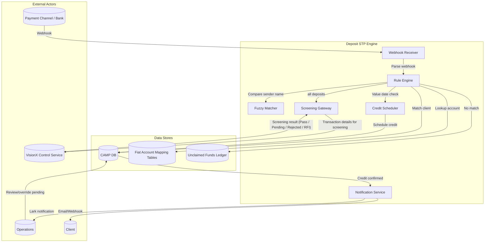

# Fiat Deposit Automation STP — Product Requirements Document

**Version**: 1.13 | **Author**: Rebecca | **Date**: 2026-06-19 | **Status**: DRAFT

---

## 1. Executive Summary

MetaComp Pte. Ltd. (MAS-regulated MPI + DPT licensee) processes fiat deposits from external bank accounts into client ledgers. The current workflow is 100% manual: when funds land in a GLDB, SGB, TransferMate, or Tazapay account, a webhook fires to a Lark channel. Operations staff must manually identify the correct client ledger in CAMP Admin, retrieve missing fields from bank portals, and complete the crediting.

This PRD defines Straight-Through Processing (STP) for fiat deposits — covering automated client identification via Reference Code and Named Virtual Account (VA) matching, 1st/3rd party classification with fuzzy matching, transaction screening via VisionX control service, value-date-based deferred auto-crediting, unclaimed funds management, and multi-channel notifications.

The target outcome: reduce manual-touch deposit processing from 100% to <20% of transactions, with the remaining edge cases routed to Operations via pre-populated pending records and structured Lark notifications.

---

## 2. Context and Background

### 2.1 Company Context

| Attribute | Detail |
|-----------|--------|
| **Company** | MetaComp Pte. Ltd. |
| **Licenses** | MAS MPI (Major Payment Institution) + DPT (Digital Payment Token) |
| **Back-office System** | CAMP Admin (Client Asset Management Platform) |
| **Screening Provider** | Lexis Nexis (TxM) |
| **Notification** | Lark (internal ops), Email / Webhook (client) |
| **Banks / PSPs** | GLDB (Green Link Digital Bank), SGB (Singapore Gulf Bank), TransferMate, Tazapay |

### 2.2 Problem Statement

Fiat deposits are not automated. When funds land in a bank/payment channel account, a webhook fires to Lark. Operations must:

1. Read the webhook notification in Lark
2. Navigate to CAMP Admin
3. Manually identify the correct client ledger
4. Fill in all required fields (sender name, account, SWIFT BIC, value date)
5. If limited-license entity (ALF): route to separate Wealth Ops team
6. If 3rd party deposit: chase client for COBO form, populate LN screening fields
7. Click Credit

This is slow, error-prone, and does not scale. It delays fund availability for clients and increases operational risk.

Beyond the manual effort, the current COBO pre-screening process introduces three structural problems:

1. **Unnecessary data collection** — The COBO form collects sender details (bank account, SWIFT BIC, etc.) before the transaction occurs. Most of this duplicates what arrives in the webhook and serves no independent purpose after the form is removed.

2. **Premature TM screening** — Lexis Nexis screening is run on the COBO form data at form submission, before any funds have arrived. This screens a self-declaration rather than an actual transaction, producing compliance noise with limited value.

3. **Stale data reused at fund receipt** — When funds land and TM is conducted again, the system reuses the original COBO form data rather than the actual transaction details from the back-queried bank API (sender name, account number, SWIFT BIC of the incoming wire). If the actual sender differs from the party declared on the COBO form, the screening will not detect it, creating a compliance gap. The TM process must use live webhook data, not the archived pre-order form.

*Note: Compliance has confirmed elimination of the COBO pre-screening form. TM screening uses transaction details from the bank's API as its data source, not any pre-submitted form. The COBO form is no longer required at any point in the deposit lifecycle. See §12 Risk 3 status.*

### 2.3 Business Objectives

| Objective | Metric | Current | Target |
|-----------|--------|---------|--------|
| Reduce manual deposit processing | % of deposits auto-credited | 0% | >80% |
| Reduce time-to-credit | Hours from webhook to credit | 4-24 hrs | <1 min (auto), <4 business hrs (pending) |
| Eliminate COBO pre-screening form | % of 3rd party deposits requiring a COBO form | 100% | 0% (no pre-order form; screen on receipt) |
| Screen on transaction data, not pre-form data | % of TM screenings using bank API transaction details vs archived form | 0% | 100% |
| Reduce unclaimed funds ageing | Days in unclaimed ledger | Unknown | <30 days for >90% |
| Improve ops efficiency | Deposit FTE capacity | Manual per-txn | 4x uplift |

---

## 3. Stakeholder Analysis

| Stakeholder | Role | Primary Concerns | Success Criteria |
|-------------|------|------------------|-----------------|
| **Operations Officer** | Primary user — Ops team executes deposit crediting | Manual workload, error rates, unclaimed funds ageing | Auto-credit >80% of deposits. Unambiguous pending queue. |
| **Compliance Officer** | TxM screening, regulatory reporting | Screening gaps, audit trail completeness, Travel Rule compliance | Every deposit screened. Audit trail for all state changes. |
| **Finance / Treasury** | Safeguarding, reconciliation, value-date accuracy | Value-date accuracy impacts safeguarding timing. Reconciliation breaks if value date doesn't match bank statement. | Value-date matching bank statement. |
| **Product Manager** | Scope definition, delivery | Unclear requirements, scope creep, missed edge cases | All 10 matching rules implemented. Open items resolved before build. |
| **Engineering Lead** | Implementation | Integration complexity, payment channel variability, testability | Each rule independently testable. Webhook simulation harness. |
| **Client (End Customer)** | Funds availability | Delayed crediting, opaque status | <1 min auto-credit. Notification on landing. |

---

## 4. User Personas

### 4.1 Operations Analyst (Ops)

- **Role**: Primary user who processes incoming deposits
- **Goal**: Credit clients quickly and accurately with minimum manual steps
- **Pain Points**: Lark notification overload, manual client lookup, missing SWIFT BIC retrieval from bank portals, COBO form chasing
- **Technical Proficiency**: MEDIUM — proficient in CAMP Admin, not technical
- **Success**: Most deposits auto-credited. Pending queue shows only exceptions with pre-filled data.

### 4.2 TxM / Compliance Analyst

- **Role**: Reviews 3rd party deposits flagged by Lexis Nexis screening
- **Goal**: Clear flagged deposits within 15-min SLA or escalate
- **Pain Points**: Incomplete sender details, manual COBO form data entry, no auto-population from screening
- **Technical Proficiency**: MEDIUM
- **Success**: All required sender fields auto-populated from webhook. LN screening triggers automatically. Case management in LN tab.

### 4.3 Partner (API Integration)

- **Role**: Third-party integrating with MetaComp's API for deposit notifications
- **Goal**: Receive push notifications when End User funds land.
- **Pain Points**: Partner needs to wait for long time for deposit to be credited and may prone to errors.
- **Technical Proficiency**: HIGH (developer)
- **Success**: Push webhook on fund landing. Pre-save fiat account endpoints available.

---

## 5. Scope Definition

### 5.1 In Scope

| Feature Area | Description |
|-------------|-------------|
| **Payment Channel Webhook Ingestion** | Generic webhook ingestion layer supporting all payment channels (GLDB, SGB, TransferMate, Tazapay, etc.). Each channel's event types and webhook schema are configured via the `payment_channel_config` table (§7.1.2) — no hardcoded per-channel logic. The backbone team identifies the correct field mappings per channel. |
| **ALF Account Exclusion** | Filter webhooks where receiverAcctNm matches Alpha Ladder Finance or acctNo is on exclusion list. Route to Wealth Ops. |
| **Fiat Account Mapping Reference Table** | Unified table mapping payment channel account numbers to client accounts (GLDB, SGB, TransferMate, Tazapay, etc.). Stores client identity (name, participant code) with participant status checks. Bulk upload for GLDB only; individual CRUD via new CAMP Admin page. |
| **Deposit Identification & Matching** | 10-step priority-ordered rule engine (Section 7.1). |
| **1st/3rd Party Fuzzy Matching** | Compare sender account name vs CAMP client registered name with defined classification rules. |
| **Transaction Screening (VisionX)** | Fire sender details to VisionX control service for screening/risk check. Drop COBO pre-screening requirement. Auto-credit on clear screening. |
| **Value Date Deferred Crediting** | Auto-credit immediately unless value date is in the future. If no value date, credit immediately. |
| **Unclaimed Client Funds Ledger** | Suspense ledger for unidentified funds. Operations workflow (candidate review, recipient selection) handled via CAMP Task Center integration (§7.7.3). |
| **Task Center Integration for Deposit Operations** | All deposit records requiring Ops action managed through CAMP Task Center (§7.7.3). Task types: `DEPOSIT_RECIPIENT_MATCHING`, `DEPOSIT_STATUS_EXCEPTION`, `DEPOSIT_3RD_PARTY_CLASSIFICATION`, `DEPOSIT_MISSING_FIELDS_FYI`, `DEPOSIT_WEBHOOK_PARSE_FAILURE`, `DEPOSIT_SYSTEM_ERROR`. *(The previously named "Pending Deposit Queue" concept is deprecated and fully replaced by Task Center integration.)* |
| **Lark Ops Notifications** | Structured notifications for all pending-action triggers. |
| **Client Notifications** | Post-credit notification via email and webhook. Must not reference screening. |
| **CAMP Admin New Transaction Query Page** | New page with two tabs: Full Transaction Query (all historical deposits, multi-dimensional query & export) and Pending Transaction Query (deposits needing Ops action, with links to corresponding CAMP Task Center tasks). Candidate matching and task workflows managed via Task Center (§7.7.3). Existing CAMP Admin pages remain unchanged. |
| **Partner API v2 Enhancement** | Missing Fields Response endpoint (new). Webhook notification and pre-save fiat account endpoints already exist — scope is documentation of existing endpoints plus the new response endpoint. |

### 5.2 Out of Scope

| Item | Rationale |
|------|-----------|
| Withdrawal automation | Covered in separate Withdrawals BRD |
| Intrabank movements (PAYIN - INTRA, PAYOUT) | Already API-connected. Client ledger linking in Withdrawals BRD. |
| ALF deposit automation | Requires separate Wealth Ops decision. Current: flag and route. |
| SGB/GLDB webhook schema changes | MetaComp cannot control bank webhook format. Workaround via mapping tables. |
| Debit card deposit rails | Backbone team scope. Deposit identification rules are the same — no separate flow. |
| Refund processing | Defined in a separate PRD. This PRD only handles triggering the refund flow (Step 8 — VisionX Rejection) — the actual refund execution is outside scope. |
| Payment channel API failure handling | Resilience against individual payment channel API failures (timeout, down, malformed response) is handled at the channel integration layer (backbone team scope). This PRD assumes the backbone layer resolves channel-specific issues before forwarding transaction details. |

### 5.3 Assumptions

1. Compliance has confirmed elimination of the COBO pre-screening form. TM screening uses transaction details from the bank's API as its data source, not any pre-submitted form.
2. Lexis Nexis webhook callback integration — to be confirmed with Engineering.
3. Ops can retrieve missing SWIFT BIC from bank portals when sender bank code is blank.
4. GLDB has no committed timeline for fixing its webhook to return the user-facing (external) channel account number. Currently GLDB webhooks return an internal account number. This does not affect the deposit STP architecture: the Fiat Account Mapping Reference Table (§7.4) always maps the internal channel account number (from the GLDB webhook/API response) to the corresponding User Channel Account Number, regardless of which field GLDB returns. Whether GLDB eventually fixes the field is purely a question of which field path the backbone team reads as the account identifier — the mapping table configuration selects the source field per channel, so no pipeline logic changes are required either way. The STP pipeline is fully reliant on this mapping table for GLDB account resolution.

### 5.4 Dependencies

| Dependency | Owner | Status |
|------------|-------|--------|
| Complete ALF exclusion list | Ops / Finance | Open |
| Channel-specific mapping file/API availability (per channel, identified during integration) | Ops / Tech | Open |
| Compliance sign-off on COBO form elimination and webhook-based TM data source | Compliance | ✅ Done |
| Lexis Nexis webhook callback integration confirmation | Engineering | Open |
| CAMP Engineering capacity | Engineering | TBD |
| Reference code format definition | Product / Engineering | Open |

---

## 6. Payment Processing Architecture (fintech_payments)

### 6.1 Payment Flow

The deposit STP pipeline follows: Webhook Receipt → Identification → Classification → Screening → Value-Date Check → Crediting → Notification. Each step is independently auditable. Failed steps produce a pre-populated pending record rather than blocking the pipeline.

The comprehensive end-to-end fiat deposit flow is illustrated below across six system swimlanes, covering the complete lifecycle from user login through crediting and notification.


*Figure 6.1: Fiat Deposit STP — Comprehensive End-to-End Process Flow*

*An editable draw.io version is available at [fiat-deposit-automation-stp-flowchart.drawio](fiat-deposit-automation-stp-flowchart.drawio) in the outputs directory.*

**Swimlane Overview**:

| Swimlane | System | Responsibility |
|----------|--------|----------------|
| **AgentX Portal Frontend** | User-facing UI | Login/KYC/KYB, currency and deposit type selection, VA application, deposit instruction display, RFI flow, transaction view |
| **AgentX Payment Backend** | Core processing engine | KYC/access validation, account setup (reference code generation, VA retrieval), webhook processing, transaction detail reconciliation, deposit order creation, recipient identification, screening trigger, credit execution, notification dispatch. Decision nodes: KYC status, deposit type, VA eligibility, recipient identification, screening result |
| **MetaComp Backbone** | Middleware/Orchestration | Webhook forwarding from payment channel to payment backend, transaction detail retrieval from payment channel API |
| **Payment Channel** | Payment Channel Gateway | Raw webhook receipt from GLDB/SGB/TransferMate, transaction detail lookup endpoint |
| **VisionX Control** | Compliance/Screening | Transaction screening/risk check for all fiat deposits, result return (Pass / Pending Review / Rejected / RFI) |
| **User's Bank** | External Banking | End-user's bank initiating the wire transfer per deposit instruction |

**Flow Stages**:

1. **Entry & Validation** (Portal Frontend + Payment Backend): User logs in and completes KYC/KYB. The backend validates KYC status and fiat deposit access. If either check fails, the user is returned to the appropriate prior step. On success, the system retrieves available currencies and the user selects a deposit type.

2. **Account Setup & Instruction** (Payment Backend → Portal Frontend): Based on deposit type (Omnibus vs. VA):
   - **Omnibus**: First-time users generate a reference code; returning users retrieve their existing bank account and reference code directly.
   - **VA**: A VA can only be opened for the same entity (corporate user) or personnel (retail user). However, the same entity or personnel can be under different parent members. If the current entity/personnel already has a VA under another parent member, the system checks whether another VA can be opened under the same payment channel. If not, a reference code is generated for the current member node (consistent with the system-generated Reference Code used in the rule engine). Users without a VA are routed to the VA Application process.
   - Deposit instructions are displayed to the user.

3. **Funds Transfer** (User's Bank): The user initiates a wire transfer from their bank according to the displayed deposit instruction (bank account number, reference code, beneficiary details).

4. **Webhook Processing** (Payment Channel → Backbone → Payment Backend): When funds land, the payment channel sends a webhook notification. Backbone validates and forwards it to Payment Backend. The backend then queries the backbone for full transaction details, which are retrieved from the payment channel and returned through the chain. After receiving the transaction details, the system performs a **duplicate check**: if a `channel_transactions` record already exists for this transaction (identified by `payment_channel` + `channel_transaction_id` composite key) and has been linked to a processed deposit order, the system skips further processing — the webhook is a duplicate or has already been handled. If no existing record is found, the system proceeds to create a `channel_transactions` record and continue to the rule engine.

5. **Deposit Order creation** (Payment Backend): The deposit order (`orders` table) is created later in the pipeline — at Step 1 (Account Exclusion) for excluded internal transactions, or at Steps 2-3 (Matching) for client transactions. Two cronjobs operate in parallel to ensure transaction completeness:
   - **Cronjob A — Single Transaction Back-Query**: For each webhook-received transaction, retries the channel API back-query if the initial attempt failed (max 3 attempts, every 10 minutes), then continues polling every 10 minutes until the transaction reaches a terminal state.
   - **Cronjob B — Channel Transaction List Pull**: Every 10 minutes, pulls the channel's transaction list for the past 1 hour. Missed webhooks detected by the list are immediately written to `channel_transactions` with the list API data. If the returned status is non-terminal (in-flight), the transaction is queued for Cronjob A to continue polling until terminal. See §8.2 for details.
   On successful recipient identification, the system identifies the recipient member from transaction details.

6. **Recipient Identification & Manual Review** (Payment Backend): If the recipient is identified, the system first checks whether all required fields for compliance review are present (Missing fields for compliance review?). If any fields are missing, the transaction is set to a pending state for information collection. If all required fields are present, the system proceeds to screening. If the recipient is not identified, the transaction is marked pending manual review: the system generates a list of potential matches and alerts the Ops team via Lark. Ops logs into the admin portal to identify the correct recipient (but cannot directly credit — the system handles crediting after screening).

7. **Compliance & Risk Check** (Payment Backend → VisionX Control): After passing the compliance fields check, all fiat deposits, regardless of 1st party or 3rd party classification, are sent to the VisionX control service for transaction screening/risk check. Results determine the next action:
   - **Pass** → auto-credit to recipient's account.
   - **Pending Review** → transaction held for compliance/manual review. Compliance reviews the transaction in VisionX. On approval: proceed with crediting (auto-credit to recipient's ledger, no re-screening needed). On rejection: proceed to refund flow. The deposit status updates according to the final outcome.
   - **Rejected** → refund flow initiated.
   - **RFI** → request for information sent via the Portal Frontend; response triggers re-screening.

8. **Crediting & Notification** (Payment Backend): Cleared deposits are credited to the recipient's ledger ("Credit to recipient's account"), with the transaction status updated to success. A corresponding credit is then recorded to the client's account ledger ("Credit fund to client's account"), and notifications are dispatched to the client (Email/Webhook).

Each stage produces an audit trail and, if any step fails, a pre-populated pending record for Ops review rather than blocking the pipeline.

### 6.2 Value Date & Crediting Timing

The system determines credit timing based solely on the value date from the payment channel's transaction details. No bank operation cut-off configuration is used.

| Condition | Action |
|-----------|--------|
| valueDate = today | Auto-credit immediately |
| valueDate > today | Schedule at 00:00 SGT on value date |
| valueDate < today (past) | Credit immediately — previously unprocessed deposit |
| valueDate missing | Credit immediately — treat as received now |

> **Refund Flow Remark**: The refund process (triggered by VisionX rejection) is specified in a **separate PRD** outside this document. This PRD only defines the trigger: when VisionX returns Rejected, the system initiates the refund flow via an existing refund webhook notification. The actual refund execution, including the mechanism (Task Center task vs automatic) and the refund timeline, is defined in the Refund PRD. See §5.2 Out of Scope — Refund Processing.

### 6.3 Reconciliation

**Note**: This section covers the Channel-Order auto-reconciliation between `channel_transactions` and `orders` tables. The detailed specification is in §7.13.

- **Channel-Order Reconciliation**: Hourly automated reconciliation between `channel_transactions` (payment channel source of truth) and `orders` (processed deposit orders), covering amount, fee, currency, counterparty, and presence discrepancies. See §7.13 for the full specification.
- **EOD reconciliation** (separate process): bank statement balance vs CAMP ledger balance (incl. Unclaimed Funds) + in-flight pending deposits
- Each deposit has a unique Transaction ID traceable from webhook → CAMP record → journal entry

### 6.4 AML/CFT Compliance

- All fiat deposits screened via VisionX control service
- Screening triggered automatically on deposit identification (no manual step)
- Client notifications must not reference screening process
- Audit trail preserves: webhook payload, rule engine decisions, classification result, screening status, credit timestamp

---

## 7. Feature Specifications

### 7.1 Deposit Identification & Matching Rule Engine

**Description**: A priority-ordered, deterministic rule engine that processes every incoming deposit webhook through a sequence of configurable checks. Each step either resolves the deposit (proceed to crediting) or escalates to the next rule. Rules are generic and not tied to specific payment channels — channel-specific behaviour is achieved through configuration. Ops intervention only where rules cannot deterministically resolve.

**Rule Sequence**:

| Step | Rule | True Action | False / Fallback |
|------|------|-------------|------------------|
| **0** | **Webhook Validation & Event Type Filter**: First validates the webhook payload is parseable (JSON structure, mandatory fields). Duplicate webhooks are filtered before Step 0 — see §8.2 for deduplication by composite key (payment_channel, transaction_id, event_type). If unparseable → log error with full payload, send Lark Tech Alert with raw payload embedded. If valid: Is the incoming event a supported deposit type? (Configurable per payment channel — each channel defines which event types represent incoming deposits. Non-deposit or unrecognised events excluded from STP.) | Valid & supported → Continue to Step 1 | Unparseable → Log error with full payload. Send Lark alert to Tech Alert group with raw payload embedded (see §7.8 — Webhook Parse Failure template). Create a DEPOSIT_WEBHOOK_PARSE_FAILURE task in the Task Center (§7.7.3) with the raw payload embedded for tracking. No deposit record is created (no structured data available). Development team investigates via the Task Center task. After resolution, any resulting transactions are manually processed via CAMP Admin outside the STP pipeline. Ops can close the task directly if the payload is determined to be non-actionable (e.g. test/garbage webhook). Valid but unsupported event → Route deposit record to Task Center with classification flag for Ops review. No auto-crediting. |
| **1** | **Account Exclusion**: Is the receiving account on the system exclusion list? (Configurable list of account identifiers to exclude from STP. Each entry specifies notification recipients (email and/or Lark groups). See §7.1.3 for configuration.) | Route transaction to Task Center. Send notifications to configured recipients. No auto-crediting. | Continue to Step 2 |
| **2** | **Named VA / Account Match**: Does the transaction contain an identifiable Named VA or mapped account (via Fiat Account Mapping Reference Table) that resolves to a client? VA match is attempted first. If VA matches, check for multiple-parent scenarios (see Step 2 sub-rules below). | See Step 2 sub-rules below | Continue to Step 3 |
| **3** | **Reference Code Match** (omnibus accounts): For non-VA / omnibus accounts, is a reference code found in the designated fields (configurable per payment channel, identified by backbone team) and matched to a client record in CAMP? Search limited to designated fields only — no wildcard search across all webhook fields. **Partial match handling**: If the reference code is found as a substring within a larger string rather than a 100% exact match (e.g. reference code "ABCDEFG" appears within "transfer to ABCDEFG" or "INV-ABCDEFG-001"), the system routes the deposit to the Task Center for Ops manual verification instead of auto-identifying the recipient. | **Exact match** → Client identified → Continue to Step 4. **Partial match** → Route to `DEPOSIT_RECIPIENT_MATCHING` task for Ops verification (same task type as Step 5; if a task already exists for this deposit, update it rather than creating a duplicate). | Continue to Step 5 (no match found) |
| **4** | **Participant Status Check**: Is the identified client's account status **Active**? Checks Participant Status and Member Status from the Fiat Account Mapping Reference Table (§7.4) or CAMP. Uses an allowlist approach: only `Active` passes. All other statuses (Initial, Suspended, Closed, or any unrecognised status) block auto-crediting — ensuring new statuses added to CAMP in the future are automatically treated as blocking without requiring rule engine updates. | Status Active → Continue to Step 6 (1st/3rd Party Classification). | Route to Task Center as **Status Exception** with reason (Initial / Suspended / Closed). Ops sees the blocking status in the task detail and can click "Retry" after account status is resolved to Active — the deposit re-enters the pipeline at Step 6. |
| **5** | **Unidentified Deposit Fallback**: No exact Named VA match, no account match, no exact reference code match. Execute Potential Match Discovery (§7.1.4) to identify candidate recipients using similar reference codes, VA parent context, saved sender details, and/or payment reference context. Sender name fuzzy matching (Strategy 3) depends on the `NameMatchService` module — see §7.2 for implementation details. **Phase 1 applicability**: The `NameMatchService` module is included in Phase 1 primarily to power Step 6 automated 1st/3rd party classification (required for PSN04 regulatory reporting — see §7.2). Strategy 3 in Potential Match Discovery reuses the same module as an operational convenience — the Phase 1 inclusion is driven by Step 6, not by Strategy 3 itself. | Route to Unclaimed Funds Ledger and create Task Center task. Attach structured candidate list from Potential Match Discovery (§7.1.4) for Ops review and selection. | — |
| **6** | **1st/3rd Party Classification**: Compare sender name against identified client's registered name in CAMP using deterministic fuzzy matching (Section 7.2). Classification is based solely on sender name vs registered name — no other context sources are used. | 1st or 3rd Party → Step 7. Ambiguous → Route to Task Center for manual classification. | — |
| **7** | **Mandatory Fields Validation**: Are all mandatory fields present? (See §7.1.1 for the complete mandatory fields list per deposit classification.) ⚠️ **Missing Fields bypass**: Certain transfer types (e.g. FAST transfers) may be configured to bypass the Missing Fields Request and route directly to Compliance review even when mandatory fields are missing. This is pending Compliance confirmation — see OQ #16. | All present → Step 8. Missing fields → Issue **Missing Fields Request** (or bypass per OQ #16 if configured). | — |
| **8** | **Transaction Screening**: Send transaction details to VisionX control service for screening/risk check. All deposits screened regardless of 1st/3rd party classification. | Pass → Step 9. Pending Review → Pending Compliance Review. Rejected → Refund flow — refund process specified in separate requirements; see §6.2 Refund Flow Remark. RFI (Screening RFI) → handled by VisionX integration module (separate scope — not covered in this PRD). | — |
| **9** | **Value Date Check**: Is valueDate = today or in the past? Past value dates (valueDate < today) indicate previously unprocessed deposits — credit immediately. valueDate missing → credit immediately (treat as received now). | Yes (today or past) → auto-credit immediately. valueDate missing → credit immediately. | No (valueDate > today) → schedule at 00:00 SGT on value date. |

**Step 2 Sub-Rules — Named VA / Account Match Detail**:

| Condition | Action |
|-----------|--------|
| **VA match — unique parent**: The VA belongs to a single client node. No shared-parent scenario. | Recipient identified → Continue to Step 4 (Participant Status Check). |
| **VA match — multiple parent**: The same entity/personnel (merchant/subsidiary) may be added under different PSPs' or parent companies' account structures, sharing the same KYB information. Some banks only issue one VA for such entities, so different reference codes are used to distinguish which PSP/parent company the incoming funds belong to. Funds are credited to the sub-node under the corresponding PSP/parent company, not to the parent company directly. Check the reference code accompanying the transfer. | **Reference code matches the sub-node's assigned code** → Recipient identified (sub-node under the corresponding PSP/parent) → Continue to Step 4 (Participant Status Check). **Wrong reference code** → Route to Potential Match Discovery (§7.1.4) → create `DEPOSIT_RECIPIENT_MATCHING` task (or append to existing task if one already exists for this deposit). Ops reviews to determine correct recipient. |
| **Omnibus account identified** (not a VA; resolved via account number or Fiat Account Mapping Reference Table) — has reference code. Account Type (Fiat / Investment Fiat) is carried in the mapping table entry alongside the reference code. | Continue to Step 3 for reference code matching. The matched Account Type determines the destination ledger for crediting (§7.4). |
| **Omnibus account identified** — no reference code. | Continue to Step 5 (Unclaimed Funds Ledger / `DEPOSIT_RECIPIENT_MATCHING` task) — no reference code to search in Step 3, no client identified to validate in Step 4. |
| **VA match — multi-parent, no reference code**: Multiple sub-nodes share the same VA account but neither has an assigned reference code (data inconsistency). The system cannot determine which sub-node the incoming funds belong to. | Route to Potential Match Discovery (§7.1.4) → create `DEPOSIT_RECIPIENT_MATCHING` task (same task type). Ops manually determines correct recipient. No auto-crediting. |
| **No account match** | Continue to Step 3. |

> **GLDB Omnibus Account Mapping (Illustrative Example)**: Channel-specific account number resolution is achieved through the **Fiat Account Mapping Reference Table** (§7.4), not hardcoded per-channel logic. The following illustrates how this applies to GLDB: For GLDB omnibus accounts, the account number received in the webhook is a GLDB-internal identifier that typically differs from the real, user-facing channel account number. The mapping table entry links the GLDB internal account number to the correct User Channel Account Number and client record (identified via Participant Code). The same mechanism applies to any channel — the mapping table provides the resolution layer, and Step 2 (Account Match) queries the table before Step 3 (Reference Code Match).

> **Multiple-Parent VA — Matching Logic Only**: This section documents the **matching logic** for multi-parent VA deposits within the rule engine. The reference code assignment policy (ensuring multi-parent VAs always carry a reference code) is a **VA application requirement** — handled in the VA opening flow, outside the scope of this PRD. This PRD assumes reference codes are already assigned where applicable. The matching rules are:
> - **Single-parent VA** (only one parent/PSP relationship): No reference code needed. The VA itself is the unique identifier.
> - **Multi-parent VA + reference code matches**: Recipient identified under the corresponding sub-node.
> - **Multi-parent VA + no reference code or wrong reference code**: Route to Potential Match Discovery (§7.1.4) → Ops review. No auto-crediting without a valid reference code.

**Acceptance Criteria**:
- [ ] Each rule is independently testable with mock webhook payloads
- [ ] Rule engine processes a webhook end-to-end in <2 seconds
- [ ] State transitions recorded in audit log with rule-match reason
- [ ] Failed/ambiguous resolutions generate structured Lark notification
- [ ] Admin can inspect which rule matched for any processed deposit
- [ ] Reference code field mapping is configurable per payment channel via CAMP Admin without deployment
- [ ] Participant Status Check (Step 4) blocks auto-credit for non-Active statuses (Initial / Suspended / Closed) and routes deposit to Task Center as a Status Exception with the blocking status clearly displayed
- [ ] After account status is resolved to Active, Ops can click "Retry" in the Task Center to re-process the deposit from Step 6 onward (including Step 7 — Mandatory Fields Validation)

**Business Rules**:
- Rules execute in strict priority order. "No rule skips ahead" means the pipeline cannot jump from an earlier step to a later step without passing through all intermediate steps (e.g., Step 2 cannot directly proceed to Step 6). However, any step can terminate the pipeline as a terminal outcome (auto-credit, Task Center task, refund, etc.) — this is not considered "skipping ahead." **Exception**: Step 2 sub-rules may route directly to Step 5 when the omnibus account has no reference code, because Step 3 (Reference Code Matching) would be logically impossible (no reference code to search for) and Step 4 (Participant Status Check) has no client to validate. This optimized routing skips unreachable steps only — it does not bypass determinable outcomes.
- Step 2 (Named VA match): VA match is attempted first. Reference code matching (Step 3) applies to omnibus accounts and for disambiguation in multiple-parent VA scenarios (see Step 2 sub-rules).
- Step 5 (unidentified deposit): must NOT auto-credit even if fuzzy match is confident — intentionally conservative.
- Reference code is only searched in the designated fields per payment channel configuration. No wildcard search across all webhook fields.
- Reference code values are **system-generated** when the client first views an omnibus account or during VA application, and must NOT be editable in CAMP Admin. The field mapping (which field in the channel's transaction details API response to search for the reference code) is configurable per payment channel by the backbone team, but the reference code value itself is read-only in CAMP Admin.
- For multiple-parent VA scenarios:
  - If the VA has a reference code assigned and the transaction reference matches → recipient identified under the corresponding sub-node.
  - If the VA has a reference code assigned but the transaction reference is wrong or missing → route to Ops manual processing with Potential Match Discovery (§7.1.4) candidate list. Never auto-assign to a default parent.
  - If the VA has no reference code assigned, behavior depends on the VA structure:
    - **Single-parent VA**: the VA itself is the unique identifier. Proceed to Step 4 (Participant Status Check). No disambiguation needed.
    - **Multi-parent VA** (data inconsistency — reference code should have been assigned per the VA application flow): route to Task Center as exception. Ops manually determines correct recipient. No auto-crediting without a valid reference code. See Step 2 sub-rules edge case row.
- A mandatory field is "present" if it contains a non-empty, non-whitespace value. Fields with only whitespace or zero-length strings are treated as missing.
- Reference code matching (Step 3) distinguishes between **exact match** (the designated field equals the reference code exactly) and **partial match** (the reference code appears as a substring within a larger string, e.g. "ABCDEFG" found within "transfer to ABCDEFG"). Only exact matches proceed to auto-identification. Partial matches require Ops verification in the Task Center to prevent misidentification from incidentally matched strings.

**Concurrent Processing Consideration**: The rule engine processes each webhook independently, so concurrent deposits for the same client may race on participant status reads, ledger updates, or Task Center task creation. The implementation should apply appropriate transaction isolation at the database layer (e.g. row-level locking or optimistic concurrency control when updating `orders.status` per `transaction_id`) to prevent:
- Two concurrent pipelines both reading the same participant status and both passing Step 4 when one should have seen an updated status.
- Duplicate Task Center tasks of the same type for the same deposit (already addressed by the "One Deposit, One Task Per Root Cause" principle in §7.7.3 — the `sourceRecordId` + `taskType` uniqueness check is the concurrency safety net here).
- Double-crediting if two pipelines both pass Step 9 for the same deposit (addressed by idempotency key design in §7.5.1).

#### 7.1.10 Pipeline Execution Exception Handling

**Description**: Catches unexpected runtime exceptions (system-level errors, not business-logic fallthroughs) at any point during the rule engine pipeline. Business-logic fallthroughs (no match, ambiguous classification, status exception, etc.) are defined in Steps 0-9 above — this section covers unforeseen technical failures that don't follow any defined branch.

**Problem**: Each rule engine step defines specific True/False branches for known outcomes, but the pipeline has no defined behavior for unexpected technical exceptions (e.g., null pointer dereference in VA resolution, data type conversion error in reference code parsing, database query timeout during participant status lookup, internal dependency failure). Without a catch-all, such exceptions would either crash the deposit or leave it in an indeterminate state with no notification.

**Catch-All Behaviour**:

| Trigger | Action |
|---------|--------|
| Any step in the rule engine pipeline (Steps 0-9) throws an unhandled runtime exception | 1. Log the full exception with stack trace, deposit context (transaction_id, rule engine step, webhook payload reference), and timestamp to the system error log. 2. Set deposit status to `processing.manual_review` with internal reason `system_error`. For webhooks that have not yet created a `channel_transactions` or `orders` record (exception occurs before record creation), no deposit record is created — the webhook metadata is logged with the error, and the exception is surfaced via Tech Alert notification and Task Center task only. 3. Create a Task Center task (`DEPOSIT_SYSTEM_ERROR`) with the exception details, deposit context, and rule engine step embedded for Engineering investigation. 4. Send a Tech Alert notification (Pipeline System Error template, §7.8) to the Engineering team immediately. |
| Step completes but returns an unrecognised/unexpected result value | Treated as an unexpected exception — same catch-all behaviour as above. The unrecognised result may indicate a configuration change or data migration that introduced values the rule engine code cannot interpret. |

**Coverage**: This catch-all wraps the entire rule engine pipeline, including:
- Steps 0-9 execution (webhook validation through value date check)
- Fiat Account Mapping Reference Table lookup (Step 2)
- NameMatchService call (Step 6)
- VisionX API call (Step 8) — timeout and retry exhaustion have their own defined fallback (§7.3) and are NOT caught by this catch-all; this covers exceptions that occur *before* or *after* the VisionX call proper (e.g., payload serialization failure, callback parsing error)
- Task Center API call failures when creating a deposit task
- Cronjob A and B execution errors (unless a retry cycle is defined — see §8.2 for retry boundaries)

**What this does NOT cover** (these have their own defined handling):
- VisionX API timeout / retry exhaustion — see §7.3
- Deferred credit execution failure — see §7.5
- Outbox relay failure — see §7.5.1
- Channel back-query failure — handled by Cronjob A retry cycle, see §8.2
- Reconciliation cronjob failure — see §7.13.1 fallback

**Acceptance Criteria**:
- [ ] All pipeline step code is wrapped in a generic try-catch that routes to the catch-all handler on unexpected exceptions
- [ ] Tech Alert notification includes: transaction_id (if available), rule engine step number, exception class and message, stack trace snippet, timestamp
- [ ] Task Center task `DEPOSIT_SYSTEM_ERROR` is created with full exception context for Engineering investigation
- [ ] Notification and task are created even if the exception occurs before `channel_transactions` or `orders` record creation (no deposit record exists)

#### AI Consideration <!-- REQUIRED per feature -->
- **AI Applicability**: NO
- **AI Approach**: Deterministic rule engine. No AI/ML required — all rules are priority-ordered boolean checks.
- **Data Requirements**: Webhook payload fields, CAMP client database, Fiat Account Mapping Reference Table.
- **Fallback Strategy**: Task Center task with Ops manual review for any rule that cannot resolve. Additionally, a catch-all exception handler (§7.1.10) routes any unexpected runtime exception to Tech Alert with full context — no undefined state is left unhandled.
- **Rationale**: Deposit identification must be fully deterministic and auditable. Every rule outcome must be explainable to Ops, Compliance, and regulators. AI/ML would introduce non-determinism unacceptable for financial transaction processing.


#### 7.1.1 Fiat Deposit Mandatory Fields

The following mandatory fields apply for fiat deposit processing. Validation is performed at Step 7 of the rule engine.

> **Important**: Field sources are the payment channel's transaction details API response (back-queried after webhook receipt), not the webhook payload itself. The webhook serves as a notification trigger only — the system must call the channel's transaction details endpoint to retrieve the actual transaction data. Different channels provide different fields, and the mapping from channel response fields to the deposit record is configured per channel.

| # | Field | Classification | Source | Notes |
|---|-------|---------------|--------|-------|
| 1 | Sender Name | 1st & 3rd Party | Channel transaction details API | Name of the account holder initiating the transfer. |
| 2 | Sender Country | 1st & 3rd Party | Channel transaction details API or channel portal | Country of the sender's bank or registered address. |
| 3 | Transaction Amount | 1st & 3rd Party | Channel transaction details API | Amount of the incoming fiat deposit. |
| 4 | Transaction Currency | 1st & 3rd Party | Channel transaction details API | ISO currency code (e.g. SGD, USD). |
| 5 | Sender Bank Name | 1st & 3rd Party | Channel transaction details API or channel portal | **TBC**: Confirm whether SWIFT BIC alone is sufficient, or sender bank name is separately required. |
| 6 | Sender Bank Country | 1st & 3rd Party | Channel transaction details API or channel portal | Country of the sender's bank. |
| 7 | Payment Reference | **3rd Party only** | Channel transaction details API | **TBC with Compliance**: Whether payment reference/purpose is mandatory for 3rd party deposits. If confirmed mandatory and sender does not provide a payment reference, the system should issue a Missing Fields Request to request the reference/purpose before proceeding. |

> **Note**: Sender Account Number and SWIFT BIC are not mandatory fields for deposit validation. They are captured where available from the channel's transaction details but are not required to proceed. Beneficiary Name is determined from the recipient identification steps (rule engine Steps 2-3), not treated as an input field for validation.
> 
> Fields 5 (Sender Bank Name) and 7 (Payment Reference) have pending clarifications with the Compliance team (see §13 Open Questions). The implementation should treat these as conditionally mandatory based on Compliance's final determination.
>
> **Channel Limitation**: If a payment channel structurally cannot provide a mandatory field (e.g. the channel's API does not return sender bank country), the system treats the field as missing and issues a Missing Fields Request (§7.1 Step 7). The channel limitation should be escalated to the channel provider for resolution — there is no blanket waiver of mandatory fields without Compliance approval.

#### 7.1.2 Rule Engine Configuration per Payment Channel

> **Note**: The configuration table below is designed generically — it is not limited to fiat deposit flows and can be extended to other transaction types in the future. Reference code field mapping is configured per channel and supports an ordered list of possible field paths (not limited to a maximum number), since the reference code may appear in different fields depending on the channel's API response. The system will search each listed field in order until a match is found.

**Database Table Schema** (`payment_channel_config`):

| Column | Type | Description | Example |
|--------|------|-------------|---------|
| id | UUID (PK) | Primary key | |
| channel_name | VARCHAR | Payment channel identifier | GLDB, SGB, TransferMate, Tazapay |
| config_type | VARCHAR | Configuration type/category | `deposit`, `withdrawal`, `transfer` |
| event_type_included | JSONB | List of event types treated as incoming transactions for this config type | `["PAYIN - REMITTANCE"]` |
| event_type_excluded | JSONB | List of event types explicitly excluded from processing | `["PAYIN - INTRA", "PAYOUT"]` |
| ref_code_field_mapping | JSONB | Ordered list of field paths (JSON Path or dot notation) where reference code may be found in the channel's transaction details API response. System searches each path in order. | `["$.paymentRef", "$.remark", "$.reference"]` |
| rules_override | JSONB | Per-rule enable/disable flags for this channel | `{"step2_va": true, "step3_ref_code": true}` |
| metadata | JSONB | Additional channel-specific configuration | `{"timezone": "Asia/Singapore"}` |
| created_at | TIMESTAMP | Row creation timestamp | |
| updated_at | TIMESTAMP | Last update timestamp | |
| created_by | VARCHAR | Ops Admin identity who created the row | |

**Validation Rules**:
- `event_type_included` and `event_type_excluded` are mutually exclusive — an event type must not appear in both lists for the same configuration. A configuration violating this is rejected at save time.
- Each payment channel configuration should populate either `event_type_included` (explicitly listing supported event types — safer for channels with a known small set of deposit event types) or `event_type_excluded` (listing known non-deposit event types to filter out), but not both simultaneously.

**UI Requirements**:
- Display as a table with each payment channel as a row, grouped by payment channel
- Ops Admin can add new payment channel configurations for new PSPs
- Reference code field mapping entries are configured by the backbone team and are read-only for general Ops
- Rule toggles are simple on/off switches with a confirmation dialog before disabling
- All changes logged in audit trail with timestamp and Ops Admin identity

#### 7.1.3 Account Exclusion List Configuration

Ops maintains a configurable exclusion list of accounts that should be excluded from STP. Each entry can specify notifications to email addresses and/or Lark groups. This extends the current ALF-specific exclusion (see §7.6) to a generic per-account exclusion mechanism.

**Usage Scope**: This exclusion list is currently consumed by the **fiat deposit STP pipeline**. The schema is designed to be generic — future transaction pipelines (withdrawals, transfers, other currencies) can read the same table and apply their own matching logic. When adding a new transaction pipeline, the implementation team should assess whether pipeline-specific exclusion fields are needed or whether the current schema suffices.

**Table Schema**:

| Column | Type | Description | Example |
|--------|------|-------------|---------|
| Account Identifier | Text | Receiving account identifier to exclude (e.g. account number, account name — depending on channel). Match is performed against the channel's transaction details response. | `11020000473` |
| Payment Channel | Select | Payment channel the exclusion applies to (or "All") | GLDB |
| Transaction Type | Select | Transaction pipeline type the exclusion applies to (or "All"). Used for cross-pipeline compatibility — allows the same exclusion list to serve deposit, withdrawal, transfer, and other transaction pipelines. | Fiat Deposit |
| Notification Email(s) | Text | Comma-separated email addresses to notify when a matching transaction is excluded | `ops@company.com, finance@company.com` |
| Notification Lark Group(s) | Text | Comma-separated Lark group chat IDs or names to notify | `wealth-ops-chat`, `finance-alerts` |
| Status | Toggle | Active / Inactive | Active |
| Notes | Text | Optional notes for reference | Separate CMS+RMA licensee |

**Match Logic**: A transaction matches an exclusion list entry if the channel's transaction details contain the configured **Account Identifier** (exact or pattern match, configurable per entry). A single webhook may match multiple exclusion entries; the first match (by entry order) determines routing.

**Notification Format** (sent to configured email recipients and Lark groups):

| Channel | Format | Content |
|---------|--------|---------|
| Email | Plain text | Subject: `[Fiat Deposit] Excluded Transaction — {account_identifier}`. Body: Transaction ID, channel, amount, currency, timestamp, account identifier, exclusion notes. |
| Lark | Interactive card | Header: red card `[Fiat Deposit] Excluded Transaction`. Fields: Transaction ID, channel, amount, currency, timestamp, account identifier, exclusion notes. Action: "View in CAMP Admin" button with direct link. |

**UI Requirements**:
- CAMP Admin table with add/edit/delete capabilities
- Search/filter by Account Identifier, Payment Channel, or notification recipient
- Status toggle to temporarily deactivate an exclusion entry without deleting it
- Audit log tracks all changes with timestamp and Ops Admin identity
- Duplicate Account Identifier + Payment Channel combinations rejected with error message

**Operations**:
- Ops/Finance Admin: full CRUD access
- Ops Analyst: view-only access
- New exclusion entries take effect immediately upon save
- Existing matched webhooks already in the pipeline are not retroactively affected

#### 7.1.4 Potential Match Discovery Logic

**Trigger**: When Steps 1-3 of the rule engine fail to identify a unique recipient (Step 3 fallthrough and Step 2 multiple-parent sub-rule fallthrough). The system executes a multi-strategy search to generate a structured candidate list for Ops review.

**Strategy 1 — Similar Reference Code Search**:
- If a reference code is present in the transaction but did not match any client record (Step 3 fallthrough), search all client reference codes using edit distance (Levenshtein distance with configurable threshold, default ≤ 2).
- **Example**: Transaction reference "ABCD1234" has no exact match. The system finds "ABCE1234" (distance 1), "ABCD1235" (distance 1), "ABCD124" (distance 1). All are returned as candidates ranked by edit distance (lower = higher priority).
- Candidates with identical edit distance are sub-ranked alphabetically.

**Strategy 2 — VA Parent Context**:
- If a VA was identified (Step 2) but the reference code did not match any sub-node for the multiple-parent scenario, list all sub-nodes under the same VA parent entity as candidates.
- **Example**: VA resolves to Parent Co., which has sub-nodes Sub-A (reference: REF-A) and Sub-B (reference: REF-B). Transaction reference is "REF-C" (no match). Both Sub-A and Sub-B are returned as candidates with match reason "VA parent match".
- If the VA has no reference code assigned (single-parent scenario), the VA itself is the unique identifier — no candidate list is needed. See Multiple-Parent VA — Reference Code Requirement note after Step 2 sub-rules table.

**Strategy 3 — Sender Name Fuzzy Match** (depends on the NameMatchService module from §7.2; see phasing note below):
- Compare sender name (from transaction details) against all registered client names in CAMP.
- Apply the same fuzzy matching algorithm defined in §7.2 but with a lower threshold for discovery (configurable, default ≥0.6) than for 1st/3rd party classification.
- **Example**: Sender "John Lim Tech" matches "John Lim Technology Pte Ltd" (score 0.82), "Lim John Trading" (score 0.65), "John Lim Consultancy" (score 0.60). All three are returned as candidates with match reason and similarity score.
- This strategy runs against ALL CAMP clients, not just the already-identified entity.

> **Phase 1 Note**: This strategy depends on the `NameMatchService` module (§7.2), which is included in Phase 1. The module's Phase 1 inclusion is driven by the Step 6 automated classification requirement for PSN04 regulatory reporting (see §7.2) — Strategy 3 benefits from the same module at no additional build cost.

**Strategy 4 — Saved Sender Details Match**:
- If the sender name partially matches any previously saved sender details on record for a CAMP client (e.g. known senders previously submitted by the client or recorded by Ops during manual processing), include that client as a candidate.
- Saved sender details can be entered through: (1) **Partner API**: API-integrated partners can pre-save known sender details via the existing Pre-save 3rd Party Fiat Account API endpoint (§7.11). (2) **Client self-service**: the client can pre-save known sender names via the AgentX Portal page.
- This strategy covers scenarios where a regular sender's name differs materially from the client's legal registered name, and is not intended for 1st/3rd party classification (which uses only registered name vs sender name per §7.2).
- **Example**: Client "ABC Pte Ltd" regularly receives deposits from "John Lim" (a known payer on record). The sender name "John Lim" appears in the transaction. Strategy 3 match score against "ABC Pte Ltd" is low (different names), but Strategy 4 returns "ABC Pte Ltd" as a candidate with match reason "saved sender match".
- This strategy searches against all CAMP clients with saved sender records.

**Strategy 5 — Payment Reference Context Match**:
- If the payment reference/remark field contains a known client identifier or reference code that was not already matched in Steps 2-3, use the reference content to identify candidate recipients.
- This is a secondary search path — it only fires when the payment reference holds identifiable information that the primary reference code field mapping (Step 3) did not capture (e.g. if the reference code appeared in a non-designated field).
- **Example**: Transaction has no reference code match in the designated fields (Step 3 fallthrough), but the payment reference field contains "INV-ABC123" which matches a reference code on record for a client. That client is returned as a candidate with match reason "payment reference match".

**Candidate Ranking**:
Candidates are assigned to priority tiers using the following absolute thresholds (all configurable without deployment):

| Priority | Condition |
|----------|-----------|
| Highest | Candidate appearing in 2+ strategies |
| High | Single-strategy match with score ≥ 0.85 |
| Medium | Single-strategy match with score between 0.50 and 0.85 (exclusive upper bound) |
| Low | Single-strategy match with score < 0.50 |

- For Strategy 1 (Similar Reference Code): score is normalized edit distance similarity (`1.0 - edit_distance / max_code_length`). Max code length is the length of the transaction reference code. Example: edit distance 1 on an 8-character code = score 0.875 (High).
- For Strategy 2 (VA Parent Context): all candidates have default score 0.9 (High).
- For Strategy 3 (Sender Name Fuzzy Match): score is name similarity per §7.2 algorithm.
- For Strategy 4 (Saved Sender Details Match): score is name similarity against the saved sender name on record.
- For Strategy 5 (Payment Reference Context): default score 0.9 (High).
- Default threshold floors: Strategy 3 ≥ 0.60, Strategy 1 ≥ 0.50, Strategy 4 ≥ 0.50. Candidates below their strategy's floor are excluded from the candidate list entirely.

**Tie-breaking & Display Rules**:
- Candidates are grouped by **Participant Code** (the unique client identifier). If the same participant is matched by multiple discovery strategies, they appear as a **single row** with all match strategies and scores listed together (e.g. `Strategy 3 (0.82) | Strategy 4 (0.90)`). The overall priority tier is determined by the highest-priority strategy for that client.
- When candidates share the same priority tier, they are displayed in alphabetical order by Client Name (ascending).
- This is display-only — Ops must independently verify and select the correct recipient regardless of display order.

**Output**:
- The candidate list is attached to the Task Center task (see §7.7.3), displayed as: `Client Name | Parent Node | Match Strategies & Scores | [Select]`. Match Score is a strategy-specific relevance indicator (0.0–1.0, higher = more relevant) — see per-strategy interpretation below. It is a reference for Ops, not a system endorsement.

  | Discovery Strategy | Match Score Meaning |
  |-------------------|-------------------|
  | Similar Reference Code (Strategy 1) | Normalized edit distance similarity: `1.0 - (edit_distance / max_code_length)`. Higher = closer reference code match. |
  | VA Parent Context (Strategy 2) | All sub-nodes under the same VA parent have default score `0.9`. Score is informational — all candidates from this strategy are equally valid. |
  | Sender Name Fuzzy Match (Strategy 3) | Name similarity score per §7.2 algorithm. Higher = closer name match to the candidate's registered name. |
  | Saved Sender Details Match (Strategy 4) | Name similarity score against the saved sender name on record. Higher = closer name match to a known sender of the candidate. |
  | Payment Reference Context (Strategy 5) | Default score `0.9`. Indicates the payment reference field contained a known identifier matching the candidate. |
- The same candidate list is included in the Lark notification to Ops.
- Ops selects the correct recipient from the list in the Task Center, which triggers the deposit pipeline to re-enter at Step 4 (Participant Status Check) → Step 6 (Classification) → Step 7 (Mandatory Fields Validation) → Step 8 (Screening) → Step 9 (Credit).
- If Ops cannot identify the recipient from the candidate list, the deposit remains in the Unclaimed Funds Ledger for further investigation.

**Performance Consideration**: Strategies 3 (Sender Name Fuzzy Match, Phase 1) and 4 (Saved Sender Details Match) execute against all CAMP client records. To ensure acceptable response times:
- Client name data should be indexed in the application's search layer (e.g. Elasticsearch or equivalent full-text search index) for real-time name matching, rather than scanning the full client table at query time.
- The fuzzy matching module (§7.2) should operate on indexed top-N search results rather than computing similarity against every client record.
- Strategy 5 (Payment Reference Context Match) can leverage existing database indexes on reference code fields.
- If the CAMP client base exceeds 50,000 records, consider a pre-computed phonetic index for Chinese pinyin name matching.
- **Target**: Complete Potential Match Discovery execution (all 5 strategies) within 3 seconds for up to 100,000 client records. This target requires architectural validation via PoC before final commitment.

---

### 7.2 1st/3rd Party Fuzzy Matching

**Description**: Compares the sender name (retrieved from the payment channel's transaction details API response) against the **already-identified client's** registered name in CAMP. By the time this step executes, the receiving client has been identified via Named VA, Account Match, or Reference Code (Steps 2-3 of the rule engine). The purpose is purely classification: is the sender the client themselves (1st party) or someone else paying on their behalf (3rd party)?

**Algorithm**: Name match score calculation — see detailed design at `design/name-match-score-algorithm.md`. This section defines the business rules and integration points.

**Score-based Classification**: The system computes a normalized match score **S ∈ [0.0, 1.0]** between `sender_name` and `client_registered_name`, then classifies as follows:

| Score Range | Classification |
|-------------|---------------|
| **S ≥ 0.85** (configurable) | 1st Party |
| **0.5 ≤ S < 0.85** (configurable) | Ambiguous — Route to Task Center for Ops manual classification |
| **S < 0.5** (configurable) | 3rd Party |

1st vs 3rd party classification affects mandatory fields only (see §7.1.1 — 3rd party requires Payment Reference). Both classifications proceed to Step 8 (Transaction Screening). If the score falls in the ambiguous range, the deposit is routed to Task Center for Ops manual classification — ensuring correct mandatory field requirements are applied based on Ops determination. Thresholds configurable via Apollo / database without deployment.

The scope of this comparison is strictly sender name vs client's registered legal name in CAMP. Additional context sources (saved sender details, payment reference content) are not used for classification — they are employed earlier in the pipeline for recipient identification (see §7.1.4 Potential Match Discovery Logic — Strategies 4 and 5).

**Acceptance Criteria**:
- [ ] Name match score correctly handles: exact match, case-insensitive, subset/token containment, token reordering, and edit-distance typos
- [ ] Accented/special characters (é, ñ, ü, ł, ß, etc.) are normalized to ASCII equivalents via transliteration before matching
- [ ] Chinese personal names: CAMP Chinese name (e.g. "张三") matched against SWIFT pinyin name ("Zhang San") via pinyin conversion. See `design/name-match-score-algorithm.md` §2.1 for details.
- [ ] Chinese personal name matching limitation acknowledged: pinyin conversion cannot resolve polyphonic characters (多音字, e.g. 行 in 银行 vs 行走) or Hong Kong/Taiwan pinyin variants (e.g. "Tsoi" vs "Cai"). Where the pinyin conversion cannot produce a deterministic match across all plausible readings, the match score falls below the 1st party threshold and the sender is classified as Ambiguous (sent to Ops manual classification) or 3rd Party — the system does not attempt to guess which reading is correct.
- [ ] Enterprise Chinese names: pinyin matching disabled — only registered English name is used
- [ ] Match score recorded in audit log
- [ ] Algorithm threshold configurable via Apollo (without deployment)

**Implementation Guidance**: Implement as an independent `NameMatchService` module (see `design/name-match-score-algorithm.md` §1 for interface). The module returns a normalized score — the caller decides threshold and classification. Transliteration (ICU-level) and pinyin conversion are handled inside the module. The module has no external dependencies; it is a pure function.

> **Phase 1 Requirement — PSN04 Reporting**: The `NameMatchService` module (automated Step 6 classification) is a **Phase 1 requirement**, regardless of whether 1st and 3rd party deposits share identical mandatory fields. PSN04 (MAS Notice on Reporting of Payment Transactions) regulatory reporting requires distinguishing 1st party from 3rd party deposits in regulatory submissions. This classification must be captured at the transaction level, which requires automated name fuzzy matching — routing all deposits to Task Center for Ops manual classification would leave PSN04 reporting without a systematic classification data source. The output of Step 6 classification feeds the PSN04 reporting field in the deposit record. Even if mandatory fields validation (Step 7) does not need the distinction, the classification is recorded for regulatory reporting purposes. See §10.1 and OQ #9/#15 regarding mandatory field differences, which are now decoupled from the Step 6 automation decision.

#### AI Consideration <!-- REQUIRED per feature -->
- **AI Applicability**: NO
- **AI Approach**: Fully deterministic pipeline: normalization → tokenization → similarity matrix → score calculation. No AI/ML involved.
- **Data Requirements**: Sender name from webhook, client registered name from CAMP.
- **Fallback Strategy**: Low-score matches (S < 0.5) are classified as 3rd Party (more mandatory fields). Matches in the ambiguous range (0.5 ≤ S < 0.85) are routed to Task Center for Ops manual classification. All classifications proceed to screening.
- **Rationale**: Name matching for financial classification must be fully deterministic and explainable. The pipeline uses Unicode transliteration, edit distance, and token-matching — all deterministic algorithmic steps. Misclassification has regulatory implications and every match outcome must be attributable to specific token-level comparisons.

---

### 7.3 TxM Screening — Lexis Nexis Integration

**Description**: All fiat deposits are sent to VisionX control service for transaction screening/risk check. VisionX control service integrates with Lexis Nexis — what kind of transactions are fired to Lexis Nexis is determined by the VisionX control service and managed by the VisionX team. LN integration is handled by the VisionX team and is not within our scope. Drop the current COBO pre-screening form entirely — funds land first, screening triggers after using **actual transaction details from the bank's API** (sender name, account number, SWIFT BIC from the incoming wire), never stale pre-order form data.

**Screening Flow**:

| Step | Actor | Action |
|------|-------|--------|
| 1 | System | Deposit record created (pre-populated from webhook or manually) |
| 2 | CAMP → VisionX | Send transaction details to VisionX control service for screening/risk check |
| 3a | VisionX → CAMP | Pass → Auto-credit client immediately. No Ops action. |
| 3b | VisionX → CAMP | Pending Review → Transaction held for compliance review. Compliance determines acceptance in VisionX. On approval → CAMP proceeds to auto-credit. On rejection → refund flow initiated. Deposit status updated based on final outcome. |
| 3c | VisionX → CAMP | Rejected → Refund flow initiated. (Refund flow is specified in separate requirements — see note below.) |
| 3d | VisionX → CAMP | RFI → Request for Information via Portal Frontend. Client notified via email with instructions to respond in the AgentX Portal. |

**VisionX API Resilience**:

The system implements the following resilience measures for the VisionX screening call (Step 8):

| Measure | Detail |
|---------|--------|
| **Timeout** | Maximum wait time of 10 seconds per VisionX API call (configurable). If no response within timeout → log timeout event, send Tech Alert (see §7.8), proceed to fallback. |
| **Retry on failure** | On API call failure (network error, timeout, 5xx server error): retry with exponential backoff — 1s, 2s, 4s (3 retries, total ~7s backoff + response time). If all retries fail → same as timeout fallback. |
| **Non-retryable errors** | 4xx errors (bad request, authentication failure) are not retried — these indicate a configuration or integration issue requiring Tech intervention. Route to Tech Alert notification. |
| **Fallback on timeout/retry exhaustion** | If the VisionX API does not return a result within the configured timeout or after retry exhaustion, the system treats the deposit as **Pass** (proceeds to auto-credit). **This fallback strategy requires Compliance sign-off** — see Open Question #14. |
| **Tech notification** | Every timeout or retry exhaustion event triggers a Lark notification to the Tech Alert group (§7.8) with full event details for investigation. |

> **Rationale for Pass-on-timeout fallback**: A screening service timeout represents a technical failure, not a compliance determination. Defaulting to "reject" would block legitimate deposits and create client impact, while defaulting to "pass" ensures business continuity. The compliance risk is that deposits which would have been flagged proceed uncleared during the outage. This risk is managed via (1) real-time tech alerts for immediate investigation, (2) post-event remediation if a problematic deposit is later identified.

**Acceptance Criteria**:
- [ ] Sender details from webhook auto-populate screening fields (no re-entry, no pre-form data reuse)
- [ ] Screening trigger is automatic for every deposit (no Ops click)
- [ ] COBO pre-screening form eliminated entirely — no form is required at any point in the deposit lifecycle
- [ ] Screening data sourced from transaction details from the bank's API, never from a pre-submitted form
- [ ] Clear screening → immediate auto-credit without Ops review
- [ ] Client notification must not reference screening process or outcome

> **COBO Form**: Compliance has confirmed elimination of the COBO pre-screening form. No COBO form fallback is needed. See §12 Risk 3 for status.

#### AI Consideration <!-- REQUIRED per feature -->
- **AI Applicability**: NO
- **AI Approach**: Fully deterministic API call. CAMP sends transaction details to VisionX control service. No AI/ML involved in screening trigger or result processing.
- **Data Requirements**: Sender name, Sender Account Number, SWIFT BIC, Amount, Currency, Beneficiary Name from deposit record.
- **Fallback Strategy**: Pending Review routes to Compliance team for manual review. Rejected initiates refund flow.
- **Rationale**: Transaction screening is a regulated compliance process. AI/ML cannot replace compliance review or the screening logic managed by the VisionX control service.

---

### 7.4 Fiat Account Mapping Reference Table

**Description**: A unified reference table that maps payment channel account numbers to corresponding client accounts in CAMP. This table serves as the authoritative data source for the rule engine's account matching (Step 2 of §7.1). It covers all payment channels (GLDB, SGB, TransferMate, Tazapay, etc.) and stores client identification information alongside account status for exception handling.

Table entries are populated through three mechanisms: (1) Ops maintenance via Admin UI or bulk upload, (2) auto-creation when a user opens a new Named VA, and (3) auto-creation or update when a user generates a new reference code for omnibus accounts. This ensures the table is always in sync with client account setups without requiring separate Ops action.

Unlike a payment channel-specific mapping table, this table provides a comprehensive view of all fiat accounts across channels, enabling the system to:

1. Resolve channel-specific account numbers (as received in webhooks) to the user's real channel account number and CAMP client identity
2. Display client identity details (name, participant code) for Ops verification
3. Enforce account-level status checks to prevent crediting to non-active accounts
4. Surface exceptions when participant or member status prevents automated crediting

**Table Schema**:

| Column | Type | Description |
|--------|------|-------------|
| Payment Channel | Select | Payment channel identifier (GLDB, SGB, TransferMate, Tazapay, etc.) |
| Channel Account Number (Internal) | Text | Account number as sent in the payment channel's webhook. This may be a channel-internal identifier (e.g. GLDB internal account number) that differs from the user-facing account number. Primary lookup key for deposit matching. |
| User Channel Account Number | Text | The real, user-facing channel account number — the account number the client actually sees and uses (e.g. the real bank account number printed on the client's deposit instruction). For channels like GLDB where the webhook returns an internal account number, this field stores the corresponding external account number. This is a channel-level identifier and is distinct from any internal MetaComp ledger account. |
| Account Type | Select | Type of account: **Fiat** (regular fiat deposit account) or **Investment Fiat** (investment-specific fiat account). The same user may have both account types with different reference codes under the same payment channel. |
| Reference Code | Text (read-only) | Reference code associated with this account mapping. System-generated — populated automatically when a VA is opened or a reference code is generated. **Note**: The same user's fiat account and investment fiat account have different reference codes (distinguished by Account Type). Null for Named VAs where the VA itself identifies the client. Not editable via Admin UI or bulk upload. |
| Currency | Text | Account currency (USD, SGD, etc.) |
| Client Name | Lookup | Client name auto-populated via CAMP lookup against Participant Code. Read-only. |
| Participant Code | Lookup | Client participant code auto-populated from CAMP. Read-only. |
| Participant Status | Lookup | Status of the client participant (Active / Initial / Suspended / Closed). Auto-populated from CAMP. Read-only. |
| Member Status | Lookup | Status of the member (Active / Initial / Suspended / Closed). Auto-populated from CAMP. Read-only. |
| Mapping Status | Toggle | Active / Inactive — controls whether this mapping is used by the rule engine. |

**Status Exception Handling**:

The rule engine uses an allowlist approach (see §7.1 Step 4): only **Active** status (or semantically equivalent statuses) permits crediting. All other statuses — whether known (Initial, Suspended, Closed) or unrecognised — block auto-crediting. This ensures that any new statuses added to CAMP in the future are automatically treated as blocking without requiring rule engine updates.

When the rule engine resolves a deposit to a mapping entry, it checks both Participant Status and Member Status before proceeding to crediting:

| Condition | Result |
|-----------|--------|
| Both Participant Status and Member Status are **Active** (or equivalent) | ✅ Proceed (rule engine Step 4 — Participant Status Check — passes, continuing to 1st/3rd Party Classification). |
| **Either** status is non-Active (Initial / Suspended / Closed, or any unrecognised status) | ❌ Cannot credit. Route to Task Center as exception. Status display depends on the specific blocking status (see below). |

- The deposit is routed to the Task Center as a **status exception** with a dedicated exception type tag.
- If both statuses are non-Active, the exception display shows both blocking statuses with individual badges.
- An auto-generated action description explains what Ops needs to do based on the status combination.
- Ops can only resolve the exception after fixing the underlying account status in CAMP. The mapping table refreshes statuses from CAMP in near-real-time (on each lookup/view).

**Bulk Upload**:

Bulk upload is currently limited to **GLDB** channel mappings only. Other payment channel mappings must be added individually via the Admin UI.

| Feature | Detail |
|---------|--------|
| Scope | GLDB only — bulk upload is for GLDB channel account mappings. |
| Upload Mode | Append/update — does NOT replace the entire table. Existing non-GLDB entries are unaffected. Supports adding new rows and updating existing GLDB rows. **Update rule**: if (Payment Channel + Channel Account Number (Internal) + Account Type) matches an existing row, the row is **updated** with new values for the remaining columns (User Channel Account Number, Currency, Participant Code). If no match, a **new row** is inserted. Uniqueness is enforced at insert time — if a duplicate key combination would be created by an update, the update is rejected with an error. **Duplicate handling**: Before upload, Ops selects a duplicate handling mode — **Ignore** (skip duplicate rows, keep existing data unchanged) or **Overwrite** (update existing rows with new values). |
| Template | Excel template with columns: Payment Channel, Channel Account Number (Internal), User Channel Account Number, Currency, Account Type (Fiat / Investment Fiat), Participant Code. Reference Code is **not** included in the bulk upload — it is a system-generated field. Participant Code must be provided for client identification. Client identity fields (Client Name, Statuses) are auto-populated on upload via CAMP lookup. |
| Validation | All rows validated before commit. Participant Code must be resolvable in CAMP. Invalid or unresolvable rows rejected with error messages. Valid rows committed together. No partial commits. |
| Error Handling | Upload result report shows: rows added, rows updated, rows ignored (if Ignore mode), rows rejected (with reason per row). |
| **GLDB SFTP Auto-Sync (Next Phase)** | GLDB can already transmit the mapping file via SFTP on a daily basis. A future phase (post v1.9) will implement a scheduled daily task to automatically pull the file from SFTP and update the mapping table. This feature is **not in scope for the current release** — marked for next phase planning. |

**Admin UI (New CAMP Admin Page)**:

This is a **new standalone page** in CAMP Admin, not an extension of an existing page.

- **Page Title**: "Fiat Account Mapping Reference Table"
- **Layout**: Full-width table view with top search/filter bar, action buttons, and paginated results

**Search & Filter Bar**:
| Filter | Type | Description |
|--------|------|-------------|
| Payment Channel | Dropdown (multi-select) | GLDB, SGB, TransferMate, Tazapay, All |
| Account Type | Dropdown | Fiat / Investment Fiat / All |
| Channel Account Number (Internal) | Text input | Partial match — channel-internal account number as received in webhooks |
| User Channel Account Number | Text input | Partial match — user-facing channel account number |
| Reference Code | Text input | Partial match |
| Client Name | Text input | Partial match |
| Participant Code | Text input | Exact or partial match |
| Participant Status | Dropdown (multi-select) | Active / Initial / Suspended / Closed / All |
| Member Status | Dropdown (multi-select) | Active / Initial / Suspended / Closed / All |
| Mapping Status | Dropdown | Active / Inactive / All |

**Table Display Columns**:
| Column | Display Format |
|--------|---------------|
| Payment Channel | Channel label with colour-coded badge |
| Account Type | Fiat / Investment Fiat badge |
| Channel Account Number (Internal) | Text, truncated with full-value tooltip on hover |
| User Channel Account Number | Text, truncated with full-value tooltip on hover |
| Reference Code | Text |
| Currency | Currency code badge |
| Client Name | Text |
| Participant Code | Text |
| Participant Status | Colour-coded badge (see below) |
| Member Status | Colour-coded badge (see below) |
| Mapping Status | Active / Inactive toggle switch |
| Actions | Edit / View Detail / Delete buttons |

**Status Colour Coding**:
| Status | Badge | Row Background |
|--------|-------|----------------|
| Active | Green badge with checkmark | Normal |
| Initial | Yellow/Amber badge with clock icon | Highlighted (light yellow) + exception icon |
| Suspended | Orange badge with warning icon | Highlighted (light orange) + exception icon |
| Closed | Red badge with stop icon | Highlighted (light red) + exception icon |

Exception row tooltip: "Status exception — deposits to this account will be routed to Task Center. Current status: [Status]."

**Detail View (click row or "View Detail")**:
- Read-only form layout displaying all schema fields
- Exception section at top (if applicable): blocking statuses as prominent colour-coded banners with auto-generated action description
- Rule Engine Impact indicator: blocked or active behaviour when a deposit matches this entry
- Link to view related pending records for this account
- Audit log section at bottom: all changes with timestamp, actor, and change summary

**Operations**:
| Action | Behaviour |
|--------|-----------|
| **Add New Entry** | Form with all schema fields including Account Type (Fiat / Investment Fiat) except Reference Code (system-generated, populated automatically). Client identity fields (Client Name, Statuses) auto-populate on Participant Code entry via CAMP lookup (debounced). |
| **Edit Entry** | For GLDB entries: Channel Account Number (Internal) and User Channel Account Number are editable to allow account info corrections (GLDB webhooks return an internal account number that must be mapped to the user-facing channel account number — so Ops may need to correct mappings after initial upload). For non-GLDB entries: account number fields are read-only. Mapping Status (Active/Inactive toggle) is always editable. Client identity fields (Client Name, Participant Code, Statuses) are always read-only after creation. |
| **Delete Entry** | Soft delete (archived). Excluded from rule engine but preserved for audit. Confirmation dialog before deletion. |
| **Bulk Upload (GLDB only)** | Button opens upload dialog. Template download link. Upload result report after processing. |
| **Export** | Export current filtered view to CSV / Excel. |

**Functional Rules**:
- Duplicate (Payment Channel + Channel Account Number (Internal) + Account Type) combinations are rejected on add or upload. Since reference codes are system-generated and not user-editable, each internal channel account number maps to at most one active reference code per Account Type for the same payment channel. For Named VAs (where Reference Code is null), uniqueness is still enforced on Payment Channel + Channel Account Number (Internal) + Account Type. The same user may have separate entries for Fiat vs Investment Fiat accounts with different reference codes.
- Client identity fields are auto-populated from CAMP (via Participant Code lookup) and are read-only.
- Any record with Participant Status or Member Status non-Active is automatically flagged in the UI and blocked in the rule engine.
- The rule engine does **not** auto-credit any deposit matching an account with non-Active status.
- Bulk upload for non-GLDB channels is rejected with a clear error message. Non-GLDB entries must be added individually.
- Account Type (Fiat vs Investment Fiat) determines the destination ledger for crediting after recipient identification. All preceding rule engine steps (Steps 0-8) treat both types identically — the type only affects which ledger the credited funds land in.
- Table entries are populated through three mechanisms:
  1. **Ops maintenance** — manual add/edit/bulk upload via Admin UI.
  2. **VA application** — a new mapping entry is created when a user opens a new Named VA.
  3. **Reference code generation** — a new mapping entry is created or updated when a user generates a new reference code (omnibus accounts).

**Acceptance Criteria**:
- [ ] Webhook channel account number (internal) → table lookup → user channel account number + client identification (including participant code)
- [ ] Account Type (Fiat / Investment Fiat) correctly distinguishes same user's accounts with different reference codes
- [ ] Participant status and member status checked before auto-crediting
- [ ] Status exception (Initial / Suspended / Closed) correctly blocks auto-credit; deposit routes to Task Center with clear status and action description
- [ ] Bulk upload (GLDB only) validates all rows before committing; no partial updates
- [ ] Bulk upload duplicate handling: Ops can select Ignore (skip) or Overwrite (update existing) mode before upload
- [ ] Non-GLDB bulk upload attempts rejected with clear error message
- [ ] Duplicate (Payment Channel + Channel Account Number + Account Type) rejected with error message
- [ ] Table change audit trail with timestamp and Ops Admin identity
- [ ] Status colour coding displayed in all relevant views (table, detail, pending queue exception)
- [ ] Exception indicator and tooltip on rows with non-Active status
- [ ] Soft delete preserves record for audit while excluding from rule engine

#### AI Consideration <!-- REQUIRED per feature -->
- **AI Applicability**: NO
- **AI Approach**: Deterministic key-value lookup with status validation. No AI/ML required.
- **Data Requirements**: Channel account number from webhook, Fiat Account Mapping Reference Table, CAMP client status data.
- **Fallback Strategy**: No match → fall through to next rule (Reference Code matching in Step 3). No match across all rules → Unclaimed Funds Ledger. Table entries are populated by Ops, VA application, and reference code generation — ensuring coverage without manual entry in most cases.
- **Rationale**: Account mapping and status validation are straightforward configuration lookups with compliance-critical consequences. AI/ML would add risk of incorrect mappings or missed status checks with no benefit over deterministic matching.

---

### 7.5 Value Date Deferred Auto-Crediting

**Description**: The system determines credit timing based solely on the value date from the payment channel's transaction details. No bank operation cut-off configuration is used. Credits are processed immediately unless the value date is in the future, in which case they are deferred to 00:00 SGT on the value date. If a payment channel does not provide a value date, the system credits immediately.

**Credit Timing Logic**:

| Value Date | Action |
|------------|--------|
| < today (past) | Credit immediately — previously unprocessed deposit, no scheduling needed |
| = today | Auto-credit immediately |
| > today | Schedule at 00:00 SGT on value date |
| Missing / null | Credit immediately — treat as received now |

**Deferred Credit Execution Failure**:

If the scheduled auto-credit fails at execution time (e.g. database write error, ledger service temporary outage, system crash during processing), the system retries on each subsequent scheduled job cycle. If the credit remains unexecuted after **3 consecutive retries**, the deposit status is set to `processing.manual_review` with internal reason `system_error`, a Task Center task is created for Ops investigation, and a Tech Alert notification is dispatched. Once the system issue is resolved and the deposit is manually credited via CAMP Admin, the Task Center task is closed.

The persistent job scheduler (see §8.2) ensures scheduled credits survive restart and are not lost on application crash.

**Acceptance Criteria**:
- [ ] Value date correctly parsed from the payment channel's transaction details API response (field mapping configured per channel via `payment_channel_config`)
- [ ] Deferred credit scheduled and executed at 00:00 SGT on value date
- [ ] Missing value date handled by crediting immediately
- [x] ~~Lark notification sent when deferred credit record created (§7.8 — Value Date Deferred template)~~ — **Deactivated**: notification not sent in practice due to volume; Ops queries via Order page instead
- [ ] Ops can manually override value date (near-term fix before full STP)
- [ ] Deferred credit failure triggers retry on next job cycle; after 3 consecutive failures, deposit routed to Task Center as `system_error` with Tech Alert notification

#### AI Consideration <!-- REQUIRED per feature -->
- **AI Applicability**: NO
- **AI Approach**: Deterministic date comparison against value dates. Pure calendar logic.
- **Data Requirements**: Webhook valueDate/tradeDate.
- **Fallback Strategy**: Missing value date → credit immediately. Default deferred credit time 00:00 SGT on value date.
- **Rationale**: Credit timing must be fully predictable and explainable. AI/ML would introduce uncertainty into financial settlement timing.

> **Weekend & Public Holiday Handling**: When the "next day" for deferred crediting falls on a weekend or public holiday, the behaviour is TBD per OQ #11 (candidates: skip to next business day using a configurable holiday calendar, or proceed on the calendar day). The implementation must account for this dependency — see §13 Open Question #11.

#### 7.5.1 Credit Execution Consistency & Idempotency Control

**Problem Statement**: The crediting operation spans two subsystems — the ledger/accounting system (journal entry) and the order status update (`orders.status` in the deposit pipeline). If the two updates are not coordinated, the system can enter inconsistent states:

| Failure Scenario | Inconsistent State | Impact |
|:----------------|:-------------------|:-------|
| Credit succeeds → order status write fails (system crash, DB timeout) | Funds credited to client, but `orders.status` remains `processing.auto` | No record of the credit in the deposit pipeline. Retry would attempt to credit again → double-crediting. |
| Order status updated to `Successful` → ledger write fails | Order shows credited, but funds never reached client ledger | Ops/Compliance see a completed deposit with no actual balance change. Reconciliation detects the gap but with delay. |
| Same idempotency key submitted twice due to network retry | Duplicate journal entry | Client receives double the intended amount. Recovery requires manual reversal. |

**Design Approaches** (ordered by recommendation — implementation team chooses based on ledger system architecture):

**Approach A — Transactional Outbox with Idempotent Ledger Integration (Recommended)**:

The system writes a `credit_outbox` record within the same database transaction as the order status update, then an async relay process pushes the credit request to the ledger system:

| Step | Action | Consistency Guarantee |
|------|--------|---------------------|
| 1 | Within the same DB transaction: update `orders.status = 'processing.credit_pending'` + INSERT `credit_outbox(transaction_id, amount, currency, participant_code, status='pending')` | Atomic — both succeed or neither succeeds. If the transaction commits, a credit instruction is guaranteed to exist and the order is recorded as pending ledger execution. |
| 2 | Async relay picks up `credit_outbox` records where `status='pending'`, calls ledger system with `transaction_id` as idempotency key | At-least-once delivery. The ledger system deduplicates by `transaction_id`. |
| 3 | Ledger system checks: journal entry for `transaction_id` already exists? If yes → return existing result (no-op). If no → create journal entry, commit. | Ledger system implements idempotency on the credit API. The `transaction_id` serves as the idempotency key — passing it multiple times produces the same result as calling it once. |
| 4 | Relay receives success response → UPDATE `credit_outbox.status = 'completed'` + UPDATE `orders.status = 'Successful'` | Progress tracking. Status progression is: `processing.credit_pending` → `Successful` (monotonic). Failed relay attempts retry on next cycle. |
| 5 | Relay failure handling (ledger unreachable after N retries): `orders.status` remains `processing.credit_pending` (set in Step 1) — the credit instruction is recorded and the outbox relay will retry automatically. If the credit remains unexecuted beyond a configurable threshold (default 1 hour), a Tech Alert and Task Center task are dispatched for investigation. | Ensures credit execution failure does not go unnoticed. `orders.status` never regresses — it stays at `processing.credit_pending` until the relay succeeds and advances it to `Successful`. |

**Idempotency Key Design**:
- **Primary key**: `transaction_id` (the system-generated UUID from §7.12). This uniquely identifies the deposit and is generated once at webhook receipt.
- **Ledger API contract** (recommended): The ledger credit endpoint accepts a required `X-Idempotency-Key` header or request field containing `transaction_id`. The ledger system persists this key with the journal entry and rejects duplicate keys with HTTP 409 Conflict, returning the previous result. This makes the credit operation safe to retry — at-most-once from the order side, exactly-once from the ledger side.
- **Scope**: The idempotency key covers the entire credit of a specific deposit to a specific participant ledger. It does not cover partial-credit scenarios (the deposit amount is always credited in full in a single operation).
- **Idempotency key retention**: The ledger system must retain the idempotency key mapping for at least **90 days** after the journal entry is created, covering the full reconciliation and audit window. After 90 days, the mapping may be archived or purged.

**Consistency recovery after system crash**:
- On application restart, the relay scans `credit_outbox WHERE status = 'pending'`. These are credits that were prepared but not confirmed pushed to the ledger.
- For each pending outbox record, the relay calls the ledger's idempotent credit endpoint with the same `transaction_id`. If the ledger already has the journal entry (write succeeded but response was lost), the duplicate call is safely rejected (409 or no-op). If the ledger does not have the entry, it is created now.
- This guarantees crash recovery without double-crediting.

**Approach B — Database-Backed Atomic Credit (if ledger shares the same database)**:

If the ledger system and the deposit pipeline share the same operational database, the credit and order status update can be wrapped in a single database transaction:

```sql
BEGIN;
  -- 1. Credit the client's ledger balance
  INSERT INTO ledger_journal(transaction_id, participant_code, amount, currency, type, created_at)
  VALUES (:transaction_id, :participant_code, :amount, :currency, 'credit', NOW());
  
  UPDATE ledger_balance
  SET balance = balance + :amount, updated_at = NOW()
  WHERE participant_code = :participant_code AND currency = :currency;
  
  -- 2. Update order status atomically
  UPDATE orders
  SET status = 'Successful', credited_amount = :amount, updated_at = NOW()
  WHERE transaction_id = :transaction_id AND status != 'Successful';
COMMIT;
```

**Key detail**: The `UPDATE orders` includes `AND status != 'Successful'` to make the entire transaction idempotent — if retried, the UPDATE matches zero rows (status already `Successful`), but the INSERT detects the duplicate `transaction_id` in `ledger_journal` via the primary/unique key constraint. The transaction either: (a) if completely unprocessed — both INSERT and UPDATE succeed; (b) if already fully processed — INSERT hits duplicate-key error (caught and handled as success), UPDATE matches zero rows (acceptable); (c) if partially processed (e.g. only journal entry was committed but order update failed) — INSERT detects duplicate key → treat as success, UPDATE sets status to `Successful`.

This approach eliminates the outbox relay and provides strong consistency but couples the deposit pipeline to the ledger database schema.

**Dual-Write Detection & Reconciliation**:

Regardless of which approach is chosen, post-hoc reconciliation catches any dual-write inconsistencies that escape the primary mechanism:

| Check | Frequency | Detection |
|-------|-----------|-----------|
| **Orphaned outbox records** | Per cronjob cycle | `credit_outbox WHERE status = 'pending' AND created_at < NOW() - INTERVAL '1 hour'` — records stuck pending beyond expected processing time. Triggers Tech Alert. |
| **Ledger vs order cross-check** | Hourly (§7.13) | `orders WHERE status = 'Successful' AND credited_amount IS NOT NULL` checked against ledger journal entries by `transaction_id`. A `Successful` order without a matching journal entry is flagged as **Critical**. |
| **Double-credit detection** | Hourly (§7.13) | Multiple `orders` records with the same `transaction_id` (detected by orphan check in §7.13.2). Also: ledger journal entries where the same `transaction_id` appears more than once (if ledger idempotency was bypassed or failed). |

**Acceptance Criteria**:
- [ ] Credit operation is idempotent: calling the credit endpoint with the same `transaction_id` multiple times produces the same result as calling it once (no double-crediting)
- [ ] Ledger system rejects duplicate idempotency keys with HTTP 409 Conflict (or safe no-op if same-DB approach)
- [ ] Outbox records survive application restart: crash during Step 2 does not lose the credit instruction; crash recovery processes pending outbox records on restart
- [ ] If ledger credit succeeds but order status update fails, the recovery process detects and resolves the inconsistency without manual intervention
- [ ] Ledger-order cross-check (hourly reconciliation) catches any escaped inconsistencies within 1 hour
- [ ] Outbox relay processes records in FIFO order within each payment channel to maintain expected credit sequencing (optional — for audit traceability)
- [ ] Credit operation transitions `orders.status` monotonically: `processing.credit_pending` (set at outbox write) → `Successful` (set on relay confirmation). Relay failures leave status at `processing.credit_pending` — never reverted to `processing.manual_review`

---

### 7.6 ALF Account Exclusion

**Description**: GLDB webhooks for Alpha Ladder Finance Pte. Ltd. (separate CMS + RMA licensee) must be excluded from MetaComp deposit automation. ALF accounts are a specific instance of the generic Account Exclusion List (see §7.1.3). This section documents the known ALF accounts for reference; the exclusion mechanism is managed via the Account Exclusion List configuration in §7.1.3.

**Known ALF Accounts**:

| Internal GLDB Account | User Channel Account Number | Notes |
|----------------------|------------------|-------|
| 11020000473 | 11020000457 | |
| 11020018976 | 11020018941 | Confirmed in sample webhook |
| 11020073535 | 11020073519 | |
| 11020055871 | 11020055855 | Sailor Investment Scheme 001 |
| 11020024798 | 11020000457 | |

**Acceptance Criteria**:
- [ ] ALF exclusion list is configurable via CAMP Admin
- [ ] Match on receiverAcctNm OR acctNo → excluded and flagged to Wealth Ops
- [ ] Open action: Ops/Finance to provide complete ALF exclusion list

#### AI Consideration <!-- REQUIRED per feature -->
- **AI Applicability**: NO
- **AI Approach**: Deterministic account number and name matching against a static exclusion list. No AI/ML.
- **Data Requirements**: receiverAcctNm and acctNo from webhook, ALF exclusion list.
- **Fallback Strategy**: ALF detection acts as a hard filter (Step 1 in rule sequence). A false negative (missed ALF) credits funds to the wrong entity. A false positive incorrectly excludes a MetaComp deposit. Deterministic matching reduces both risks.
- **Rationale**: License separation between MetaComp (MPI+DPT) and ALF (CMS+RMA) is regulatory. Exclusion must be 100% deterministic with zero false negatives.

---

### 7.7 Unclaimed Client Funds Ledger & Deposit Operations Task Management

**Description**: This section covers two interrelated concepts: (1) the **Unclaimed Client Funds Ledger** — a financial suspense account holding deposits where client identity cannot be determined, ensuring funds are accounted for in EOD reconciliation; and (2) how unclaimed deposits are surfaced to Ops for review and resolution. 

**Design Summary**: All unidentified deposits are attributed to the Unclaimed Funds Ledger when the rule engine cannot determine the recipient. Recipient matching (identifying the correct client for an unclaimed deposit) is handled via the CAMP Task Center (see CAMP-Task-Center-PRD.md) — Ops reviews Potential Match Discovery candidates and selects the correct recipient. For deposits that remain unresolved beyond a configurable ageing threshold, Ops receives a Lark notification. In this phase, Ops handles aged unclaimed deposits through the Pending Transaction Query tab (§7.10.2) with manual refund marking capability. Task Center tasks for the refund workflow of prolonged unclaimed deposits are planned for a future phase.

#### 7.7.1 Unclaimed Client Funds Ledger — Financial Construct

| Item | Detail |
|------|--------|
| **Ledger Name** | "Unclaimed Client Funds" |
| **Ledger Type** | Internal suspense account (CAMP ledger, no external bank account) |
| **Currency Support** | Multi-currency — follows existing CAMP multi-currency ledger structure. Separate sub-ledger per currency per existing system behavior (not expanded in this PRD). |
| **GL Impact** | Part of CAMP's liability-side safeguarding ledger. Unclaimed funds are a liability to clients, not company revenue. |
| **Record per Deposit** | Each unclaimed deposit is a **line item** within this ledger, identified by its original Transaction ID, not aggregated into a single balance. |

#### 7.7.2 Placement Trigger & Data Capture

When the rule engine lands in any of these terminal fallthrough states, the deposit's status is set to `processing.manual_review` with internal reason `unidentified`, and funds are attributed to the Unclaimed Client Funds Ledger. Simultaneously, a Task Center task is created for recipient matching (`DEPOSIT_RECIPIENT_MATCHING`, see §7.7.3).

| Rule Engine Entry Point | Trigger Condition |
|------------------------|-------------------|
| Step 2 → Step 3 → Step 5 | No Named VA match, no account match, no reference code match |
| Step 2 sub-rule (multi-parent VA) | VA identified but reference code is wrong or absent |
| Omnibus account (shared/large account) — no reference code | The webhook's receiving account number resolves to a **shared omnibus account** (MetaComp's own large bank account used by multiple clients), not to any individual client's VA or dedicated account. Because the account belongs to MetaComp rather than a specific client, the Fiat Account Mapping Reference Table has no client-level entry for it. Without a reference code from the sender, there is no mechanism to determine which client the funds belong to. This includes GLDB and other channels where MetaComp holds an omnibus account. |

**Data captured on placement** (reuses the existing deposit record — no separate table required):

| Data Field | Required |
|-----------|----------|
| Transaction ID (system-generated) | ✓ |
| Payment Channel | ✓ |
| Channel Account Number | ✓ |
| Amount | ✓ |
| Currency | ✓ |
| Sender Name | When available |
| Sender Account Number | When available |
| Sender Bank / SWIFT BIC | When available |
| Reference Code (if any, unmatched) | When available |
| Value Date | When available |
| Payment Reference / Remark | When available |

The deposit record's `status` field is set to `processing.manual_review` with internal reason `unidentified` and `recipient_identified` flag is set to `false`. This is a status assignment on the existing deposit record, not a separate data entry.

**Ageing-based Lark Notification for Prolonged Unclaimed Deposits**: If an unclaimed deposit remains in the Unclaimed Funds Ledger beyond a configurable ageing threshold and has not been resolved via the Task Center recipient matching flow, the system sends a **single** Lark notification to the Ops Action Group to prompt review. The notification is informational only — Ops determines the appropriate action (continue investigation, initiate refund, etc.). The system does not enforce mandatory review deadlines or auto-escalation. No Task Center task is created for ageing notifications. The ageing threshold is **to be confirmed by Ops** (configurable without deployment). Task Center tasks for the refund workflow of prolonged unclaimed deposits are planned for a future phase; in the current release, Ops handles these via the Pending Transaction Query tab (§7.10.2) with manual refund marking capability. See §7.7.8 for the manual refund marking flow.

#### 7.7.3 Task Center Integration for Deposit Operations

**Design Decision**: All deposit records requiring Ops action are managed through the CAMP Task Center (see CAMP-Task-Center-PRD.md). The Task Center provides a unified inbox with function-access-based routing, time-lapse grouping, colour-coded urgency indicators, filtering, and audit trail — capabilities needed for deposit operations that would otherwise require reimplementation. This eliminates the need for a separate Pending Queue module.

**Deposit Task Types**:

| Task Type | Trigger | Description | Eligible Role (Function Access Key) |
|-----------|---------|-------------|--------------------------------------|
| `DEPOSIT_RECIPIENT_MATCHING` | Rule engine Step 3 partial match (reference code found as substring but not exact) or Step 5 fallthrough (unidentified deposit) | Ops reviews Potential Match Discovery candidate list (§7.1.4) or uses manual CAMP client search to select the correct recipient | `PROCESS_DEPOSIT` (Ops Analyst) |
| `DEPOSIT_STATUS_EXCEPTION` | Rule engine Step 4 (Participant Status Check) failure | Account status is Initial/Suspended/Closed. Ops must resolve underlying status or escalate. "Retry" action re-enters pipeline at Step 6. | `PROCESS_DEPOSIT` (Ops Analyst) / `MANAGE_ACCOUNT_STATUS` (Ops Admin) |
| `DEPOSIT_3RD_PARTY_CLASSIFICATION` | Rule engine Step 6 ambiguous match | Ops reviews sender name and classifies as 1st or 3rd party | `PROCESS_DEPOSIT` (Ops Analyst) |
| `DEPOSIT_MISSING_FIELDS_FYI` | Rule engine Step 7 (missing mandatory fields) | FYI-only. Created in CAMP Task Center so Ops can search/view the record and optionally fill in missing fields if the client contacts Ops directly. No action required from Ops unless client requests assistance. No SLA, no escalation. | `PROCESS_DEPOSIT` (Ops Analyst) |
| `DEPOSIT_WEBHOOK_PARSE_FAILURE` | Rule engine Step 0 (webhook parse failure) | Webhook payload could not be parsed. No deposit record created. Raw payload embedded for investigation. Task is closed when root cause is resolved. | `PROCESS_DEPOSIT` (Ops Analyst) |
| `DEPOSIT_SYSTEM_ERROR` | §7.1.10 catch-all exception handler — unexpected runtime exception at any pipeline step | Engineering investigates root cause via embedded exception class, message, stack trace, and rule engine step. No automated pipeline re-entry — affected deposit is manually processed via CAMP Admin after the issue is resolved. Ops closes the task once investigation is complete. | `PROCESS_DEPOSIT` (Ops Analyst) for task closure; Engineering investigates via Lark Tech Alert (§7.8 — Pipeline System Error template) |

> **Missing Mandatory Fields (Step 7) — FYI Task in CAMP Task Center**: When Step 7 finds missing mandatory fields, the system issues a **Missing Fields Request**. The deposit is visible in the client's **AgentX Task Center** (the client-facing portal Task Center, distinct from the CAMP Task Center used by internal Ops) — the client logs in to view and provide the missing information. Email notification is sent to the client's registered email address as a heads-up; the specific email content format is covered by separate notification requirements and is not expanded in this PRD. For partners registered with API webhook, additionally send webhook notification with the missing field details (the partner receives a real-time push notification that fields are needed).
>
> A **FYI-type task** is also created in the **CAMP Task Center** (task type `DEPOSIT_MISSING_FIELDS_FYI`) so Ops can optionally view and fill in the missing fields if the client contacts Ops directly. This task is informational only — it does not require Ops action and has no SLA. Ops can fill in the missing fields from the CAMP Admin Pending Transaction Query page (§7.10.2) or via the Task Center task detail view, both of which provide the same field-editing UI. Once all mandatory fields are provided (either by the client, partner, or Ops), the deposit proceeds to Step 8 (Transaction Screening). Ops also receives a Lark awareness notification (§7.8, informational group) for monitoring.
>
> **Concurrent Update Handling**: Since both the client/partner and Ops can submit missing field updates, the system applies a last-write-wins strategy at the individual field level. Each field update is timestamped independently; if the same field is provided by both parties, the later submission takes precedence. Partial updates are supported — one party may fill in some fields while the other fills in others. Once all mandatory fields are present (aggregated across all sources), the deposit proceeds. A field that has already been provided cannot be overwritten to empty (null/blank) by a subsequent submission — only non-empty values are accepted as updates, preventing accidental clearing of populated fields.

> **One Deposit, One Task Per Root Cause**: A deposit must never have more than one Task Center task of the same root cause type. If a deposit reaches the same fallthrough state from different rule engine paths (e.g. Step 2 multi-parent VA → Potential Match Discovery, Step 3 partial match, or Step 5 unidentified deposit), the system checks whether a `DEPOSIT_RECIPIENT_MATCHING` task already exists for that deposit:
> - If no task exists → create a new task with the candidate list.
> - If a task already exists → **update** the existing task with the latest candidate list and rule engine context (e.g. append matches from the new path). Never create a duplicate.
>
> The same principle applies to all deposit task types: a deposit should have at most one `DEPOSIT_STATUS_EXCEPTION`, one `DEPOSIT_3RD_PARTY_CLASSIFICATION`, etc.
>
> **Serial Processing Order — Status Exception Before Missing Fields**: When a deposit is blocked at Step 4 (Participant Status Check) due to a non-Active status, it never reaches Step 7 (Mandatory Fields Validation). This means a deposit with both a status exception and missing fields will initially only produce a `DEPOSIT_STATUS_EXCEPTION` task. The Missing Fields Request is only triggered after Ops clicks "Retry" in the Task Center and the pipeline re-enters at Step 6 → Step 7. If any mandatory fields are still missing at that point, the Missing Fields Request and `DEPOSIT_MISSING_FIELDS_FYI` task are created at that time — never before. This serial order is inherent in the pipeline design: Steps 4 → 6 → 7 are sequential, and a Step 4 block prevents downstream validation. No separate handling is needed.

**Task Creation Flow**:

When the Rule Engine reaches a fallthrough state, the deposit module calls the Task Center creation API:

```json
POST /task-center/tasks
{
  "taskType": "DEPOSIT_RECIPIENT_MATCHING",
  "sourceModule": "FIAT_DEPOSIT_STP",
  "sourceRecordId": "{deposit_transaction_id}",
  "organizationNodeId": "{node_id}",
  "priority": "NORMAL",
  "slaDeadline": "{timestamp}",
  "metadata": {
    "amount": "{amount}",
    "currency": "{currency}",
    "paymentChannel": "{channel}",
    "senderName": "{sender_name}",
    "candidateCount": "{number_of_unique_client_candidates}",
    "ruleEngineStep": "5",
    "depositRecordUri": "camp-admin://deposits/{transaction_id}",
    "candidateList": "{Potential Match Discovery results}"
  },
  "description": "Unidentified deposit: {amount} {currency} from {sender_name} via {channel}. Review candidate list and select recipient.",
  "eligibleFunctionAccessKeys": ["PROCESS_DEPOSIT"]
}
```

**Task Action Lifecycle & Deposit Pipeline Re-entry**:

| Task Center Action | Deposit Module Response |
|-------------------|------------------------|
| **Ops selects recipient** from candidate list or manual search | Deposit module validates account status (Active?), then advances from Step 4 (Participant Status Check) → Step 6 (1st/3rd Party Classification) → Step 7 (Mandatory Fields Validation) → Step 8 (Screening) → Step 9 (Credit) |
| **Ops resolves status exception** (clicks "Retry") | Deposit module re-checks account status. If Active, re-enters from Step 6 (1st/3rd Party Classification) → Step 7 (Mandatory Fields Validation) → Step 8 (Screening) → Step 9 (Credit). Step 7 runs because mandatory fields have not yet been validated — deposits blocked at Step 4 bypassed Step 7 originally. If still non-Active, task remains open. |
| **Ops classifies 1st/3rd party** | Deposit module updates classification, proceeds to Step 7 (Mandatory Fields Validation) → Step 8 (Screening) → Step 9 (Credit). Step 7 must run after classification because mandatory field requirements differ between 1st and 3rd party deposits (3rd party requires Payment Reference — §7.1.1 Field #7). |
| **Ops rejects/refunds** | Deposit module routes to refund flow (defined in separate Refund PRD — see §5.2 Out of Scope), closes task |
| **Developer resolves parse failure** (for `DEPOSIT_WEBHOOK_PARSE_FAILURE`) | No deposit module interaction — developer investigates the raw payload embedded in the task, fixes the root cause (e.g. schema change, integration issue). After resolution, any resulting transactions are manually processed via CAMP Admin outside the STP pipeline. Task is closed when investigation is complete. |
| **Ops closes parse failure** (for `DEPOSIT_WEBHOOK_PARSE_FAILURE`) | Ops assesses the raw payload and determines no action is needed (e.g. test/garbage webhook, non-transactional payload). Ops adds a closing note with reason, then closes the task. If the payload appears to be a legitimate transaction, Ops leaves the task open — engineering has already been notified via Lark Tech Alert (§7.8) and will investigate and resolve independently. |

**Task Detail View Data** (displayed within Task Center task card):

When Ops opens a deposit task in the Task Center, the detail view includes:

1. **Transaction Details** (read-only): Transaction ID, Payment Channel, Amount, Currency, Sender Name, Sender Account, Value Date, Reference Code. All fields are read-only. If the webhook source is incorrectly tagged (e.g. GLDB tagged as SGB), this is a system bug — Ops should not correct it manually.

2. **Potential Match Candidates** (§7.1.4): `Client Name | Parent Node | Match Strategies & Scores | [Select]`. Match Score is a strategy-specific relevance indicator (0.0–1.0, higher = more relevant) — see §7.1.4 Output for per-strategy interpretation. It is a reference for Ops, not a system endorsement. Ops must independently verify and select the correct recipient. If multiple candidates share the same client name but differ in parent node, the parent node difference is visually highlighted. A caution prompt is displayed at top: *"Please verify the recipient carefully before confirming. Matching to the wrong entity may result in incorrect fund crediting."*

3. **Manual Search Fallback**: Search-as-you-type dropdown across all CAMP clients. Search matches against client name (partial) and participant code (partial). Results are paginated (max 20 per page) and displayed as `Client Name — {parent node} — {participant code}` for disambiguation. If the target client is not found, Ops can search again with different terms. No option to proceed without a recipient — the deposit stays in Unclaimed Funds Ledger if no match found. Search is real-time against CAMP's client index; no pre-loading of the full client list.

4. **Action Buttons**: "Confirm Recipient & Proceed" (enabled only after recipient selected), "Reject/Refund", **"View in Order Center"** (link to the deposit record in CAMP Admin Full Transaction Query page — always available regardless of task state). Confirmation dialog on proceed: *"Are you sure this is the correct recipient? This action will proceed to compliance screening and crediting."*

5. **Status Exception Banner** (if applicable): Shows blocking statuses with colour-coded badges and auto-generated action description.

> **Webhook Parse Failure Task Detail**: `DEPOSIT_WEBHOOK_PARSE_FAILURE` tasks do not have an associated deposit record. The detail view displays the raw webhook payload, payment channel, and receipt timestamp. No transaction details, candidate list, or credit-related action buttons (Confirm/Reject) are available. Available action: **"Close — No Action Needed"** (Ops closes with a required reason note if the payload is determined to be non-actionable, e.g. test/garbage webhook). If the payload appears to be a legitimate transaction that failed to parse, Ops leaves the task open — engineering has already been notified via Lark Tech Alert (§7.8) and will investigate.

**Task Status Mapping**:

Deposit status and CAMP Task Center task status are independent lifecycles. Task Center tasks are created for the following deposit states: `processing.manual_review` (action-required tasks), `pending.rfi_missing_fields` (FYI task for Ops visibility), and webhook parse failures (no deposit record — task created at ingest time). The task's lifecycle (PENDING → IN_PROGRESS → COMPLETED / CANCELLED) is independent of the deposit's ultimate outcome. See [CAMP-Task-Center-PRD.md](../../../camp-prd/outputs/CAMP-Task-Center-PRD.md) for the full Task Center specification.

**Deposit Status Reference**:

`pending` is used exclusively for states stuck on the **client side** (e.g., awaiting Missing Fields Request response). All states on **MetaComp's side** — system processing or awaiting Ops action — are classified as `processing`.

| Deposit Status | Sub-Status | Meaning |
|---|---|---|
| `processing` | `auto` | System auto-processing — rule engine, screening, crediting, or deferred scheduling |
| `processing` | `credit_pending` | Ledger credit pending execution via outbox relay — order is being processed. Advances to `Successful` once the relay confirms. No Ops action needed — outbox relay retries automatically. If unresolved beyond configurable threshold (default 1h), triggers Tech Alert. |
| `processing` | `manual_review` | Ops action needed — internal reason `unidentified` / `status_exception` / `system_error` / `screening_review` (compliance) etc. |
| `processing` | `deferred` | Value date deferred, awaiting scheduled credit |
| `pending` | `rfi_missing_fields` | Awaiting client/partner response to **Missing Fields Request** (Step 7) |
| `pending` | `rfi_screening` | Handled by VisionX integration module — the screening RFI response flow is outside this PRD's scope. |
| `Successful` | — | Deposit credited (terminal) |
| `failed` | *(reason)* | Deposit failed (terminal) |
| `Refunding` | — | Refund in progress |
| `Refunded` | — | Refund completed (terminal) |

**Task Center Task Lifecycle** (deposit ops perspective):

| TC Status | Meaning |
|---|---|
| `PENDING` | Task created, not yet assigned |
| `IN_PROGRESS` | Ops assigned, working on it |
| `COMPLETED` | Action completed |
| `CANCELLED` | Task no longer needed |

**When a Task is Created**:

| Deposit Status | Task Created? | Notes |
|---|---|---|
| `processing.auto` / `processing.deferred` / `processing.credit_pending` | No | System handles automatically |
| `processing.manual_review` | **Yes** | Task type determined by internal reason (e.g. `DEPOSIT_RECIPIENT_MATCHING`, `DEPOSIT_STATUS_EXCEPTION`, `DEPOSIT_3RD_PARTY_CLASSIFICATION`) |
| `pending.rfi_missing_fields` | **Yes** (`DEPOSIT_MISSING_FIELDS_FYI`) | Client task created in AgentX Task Center (client-facing) for client/partner to provide fields. A FYI-type task is also created in CAMP Task Center for Ops visibility — Ops can search and view, or optionally fill in fields if client contacts Ops directly. No Ops action required by default. |
| `pending.rfi_screening` | No | Handled by VisionX integration module (separate scope — not covered in this PRD). |
| `Successful` / `failed` / `Refunded` | No | Terminal state |
| `Refunding` | No | System-initiated refund |

> **Webhook Parse Failure (No Deposit Record)**: When Step 0 cannot parse the webhook payload, no deposit record is created. A `DEPOSIT_WEBHOOK_PARSE_FAILURE` task is created directly in the Task Center (without an associated deposit record) for tracking and investigation. This task type is not tied to any deposit status.

**Integration with Unclaimed Funds Ledger**:
- When a `DEPOSIT_RECIPIENT_MATCHING` task for an unclaimed deposit is completed (recipient confirmed → funds credited), the deposit module records the intra-ledger transfer: `Unclaimed Funds Ledger → {amount} → Client {participant_code}`, linked by the original Transaction ID.
- See §7.7.4 for the complete resolution audit trail.

#### 7.7.4 Resolution & Intra-Ledger Transfer

**Workflow**: Ops identifies the correct recipient for an unclaimed deposit via the Task Center task.

| Step | Actor | Action |
|------|-------|--------|
| 1 | Ops | Opens the `DEPOSIT_RECIPIENT_MATCHING` task in Task Center |
| 2 | System | Displays Potential Match Discovery candidates (§7.1.4) |
| 3a | Ops | **Candidate found**: selects from candidate list, clicks "Confirm Recipient & Proceed" |
| 3b | Ops | **No correct candidate**: uses manual search fallback to find CAMP client |
| 4 | System | Validates selected recipient's account status (Participant + Member Status) |
| 4a | System | **Active**: proceeds to Step 6 (1st/3rd Party Classification) → Step 7 (Mandatory Fields Validation) → Step 8 (Screening) → Step 9 (Credit) |
| 4b | System | **Non-Active**: displays status exception. Ops must resolve account status first. |
| 5 | System | On successful credit: funds moved **out of** Unclaimed Funds Ledger **into** identified client's ledger. Original Transaction ID is traceable link. Task Center task status set to `COMPLETED`. |

**Intra-Ledger Transfer Audit Trail**:

| Field | Value |
|-------|-------|
| Source Ledger | Unclaimed Client Funds |
| Source Transaction ID | Original deposit Transaction ID |
| Destination Client | {Participant Code} - {Client Name} |
| Destination Ledger | Client ledger for {Participant Code} |
| Amount | Original deposit amount |
| Transfer Timestamp | System timestamp of credit execution |
| Ops Actor | Ops user who confirmed the recipient (from Task Center) |
| Matching Method | Candidate selection / Manual search |
| Rule Engine Path | Step 5 → Ops resolution (via Task Center) → Step 4 → Step 6 → Step 7 → Step 8 → Step 9 |

#### 7.7.5 Wrong Recipient Recovery

If Ops credits an unclaimed deposit to the wrong client and the error is subsequently detected:

1. **Detection**: Identified by reconciliation, client complaint, or Compliance review.
2. **Recovery**: Ops/Finance determines the appropriate recovery process based on the specific circumstances, applicable regulations, and internal policies (e.g. contacting the incorrectly-credited client for voluntary return, initiating a manual reversal if permitted by the account terms, or booking an operational loss). The original Transaction ID traceability supports the investigation and any corrective actions.
3. **Loss recognition**: The incorrectly-credited amount is recorded as an operational loss if it cannot be recovered.
4. **Correction path**: The correction does NOT pass back through the Unclaimed Funds Ledger — it goes directly from wrong-client to correct-client (or is booked as a loss). The Unclaimed Funds Ledger balance was already reduced at the time of the original resolution.

#### 7.7.6 EOD Reconciliation

Unclaimed Funds Ledger balance per currency is included in EOD reconciliation:
- `bank statement balance == CAMP client ledgers total + Unclaimed Funds Ledger total + in-flight pending deposits`
- Each unclaimed deposit has a unique Transaction ID traceable from webhook → deposit record → Unclaimed Funds line item → resolution transfer

#### 7.7.7 Integration with System Components

| Component | How it interacts |
|-----------|-----------------|
| **Rule Engine (§7.1)** | Step 5 fallthrough sets deposit status to `processing.manual_review` (internal reason `unidentified`) and creates Task Center task of type `DEPOSIT_RECIPIENT_MATCHING`. Potential Match Discovery Logic (§7.1.4) generates candidate list. |
| **CAMP Task Center** | All deposit operations tasks managed through the CAMP Task Center. Task Center handles task routing, time-lapse grouping, filtering, notifications, and audit trail. |
| **CAMP Admin Transaction Query Page (§7.10)** | The Full Transaction Query tab (§7.10.1) remains as the historical data query surface for all deposits. The Pending Transaction Query tab (§7.10.2) provides a read-only monitoring and ageing surface — all operational actions are handled through the CAMP Task Center (§7.7.3). |
| **Fiat Account Mapping Reference Table (§7.4)** | No direct interaction. Unclaimed deposits have no mapping entry. If Ops discovers correct mapping during resolution, they update the mapping table separately. |
| **Lark Ops Notifications (§7.8)** | Task creation (unidentified deposits, status exceptions, etc.) triggers red-card Lark notification via the deposit module. Subsequent task reminders and priority notifications follow the Task Center's own notification framework. |
| **Client Notifications (§7.9)** | No notification sent for unclaimed deposits — recipient is unknown. |

**Acceptance Criteria**:
- [ ] Unidentified deposits (Steps 2-3 fallthrough) automatically set deposit status to `processing.manual_review` (internal reason `unidentified`) and create a Task Center task
- [ ] Each deposit task type (`DEPOSIT_RECIPIENT_MATCHING`, `DEPOSIT_STATUS_EXCEPTION`, `DEPOSIT_3RD_PARTY_CLASSIFICATION`) maps to the correct rule engine fallthrough state
- [ ] Task creation payload includes all metadata: amount, currency, channel, sender name, candidate count (for matching tasks), rule engine step
- [ ] Task detail view fetches deposit data from deposit module via internal API at display time
- [ ] "Confirm Recipient & Proceed" action triggers deposit pipeline re-entry from Step 4 → Step 6 → Step 7 → Step 8 → Step 9
- [ ] "Retry" on status exception tasks re-checks account status and advances pipeline if Active
- [ ] SLA configuration per task type is editable in CAMP Admin without deployment
- [ ] Escalation configuration per level is editable in CAMP Admin without deployment
- [ ] SLA breach changes Task Center card colour to red and emits notification event
- [ ] Escalation chain notifications sent at configured intervals after SLA breach, with escalation reason captured
- [ ] Unclaimed funds ageing threshold for prolonged unclaimed notification is configurable without deployment (default TBD by Ops)
- [ ] At a configurable ageing threshold (exact value TBD by Ops), the system sends a single Prolonged Unclaimed Deposit Lark notification (§7.8) to the Ops Action Group. Notification is informational only — no system-enforced escalation, no Task Center task created for ageing.
- [ ] Intra-ledger transfer audit trail includes Task Center task ID and Ops actor identity
- [ ] EOD reconciliation includes Unclaimed Funds Ledger balance per currency
- [ ] Wrong-recipient correction bypasses the Unclaimed Funds Ledger (direct client-to-client journal entry)

#### 7.7.8 Manual Refund Marking for Prolonged Unclaimed Deposits

**Description**: For unclaimed deposits that have remained unresolved beyond the ageing threshold and where Ops determines that a refund is needed (e.g. sender cannot be identified after investigation), Ops can manually process the refund outside the system and mark the deposit as refunded in the Pending Transaction Query tab.

**Current Phase Limitation**: The refund execution itself is a manual process outside the system (Ops processes the refund through the bank portal). The system only tracks the refund status. A future phase will introduce direct system-initiated refunds and Task Center task creation for the refund workflow.

**Mark as Refunded Flow**:

1. Ops locates the unclaimed deposit in the Pending Transaction Query tab (§7.10.2).
2. Ops investigates the deposit manually (checks bank portal, contacts sender, etc.).
3. If a refund is warranted, Ops executes the refund manually through the bank channel.
4. After completing the manual refund, Ops clicks the **"Mark as Refunded"** button on the deposit record.
5. A dialog appears requiring the following input:
   - **Refund Order Number** (required) — the reference or transaction number from the bank confirming the refund.
   - **Refund Date** (required) — date the refund was executed.
   - **Refund Notes** (optional) — additional context about the refund reason.
6. On confirmation, the deposit status is set to `Refunded` and the refund information is recorded in the audit trail. The corresponding funds are removed from the Unclaimed Funds Ledger — the ledger balance is reduced by the refunded amount, and the line item is marked as resolved. This ensures the Unclaimed Funds Ledger reflects only funds still awaiting resolution.

**UI Requirements**:
- "Mark as Refunded" button is available only for deposits in `processing.manual_review` with internal reason `unidentified`.
- A confirmation dialog with refund information fields (Refund Order Number, Refund Date, Refund Notes).
- After marking, the deposit status changes to `Refunded` and the button is no longer available.
- The refund information is visible in the deposit detail view in both Full and Pending Transaction Query tabs.
- Audit trail records: Ops actor identity, refund order number, refund date, refund notes, timestamp.

**Acceptance Criteria**:
- [ ] "Mark as Refunded" button visible on unresolved unclaimed deposits in Pending Transaction Query tab
- [ ] Clicking button opens dialog requiring Refund Order Number and Refund Date
- [ ] On confirmation, deposit status set to `Refunded` and refund info recorded in audit trail
- [ ] "Mark as Refunded" not available for deposits already in `Refunded` or other terminal status

#### AI Consideration <!-- REQUIRED per feature -->
- **AI Applicability**: NO
- **AI Approach**: Deterministic ledger accounting and task state machine. Unclaimed routing is based on rule engine fallthrough. Task creation is triggered by deterministic rule outcomes. SLA and escalation are time-based and configuration-driven. Resolution is Ops-driven selection from pre-computed candidate list.
- **Data Requirements**: Deposit record fields, Potential Match Discovery candidate list, Task Center API payload, SLA configuration parameters, escalation configuration parameters.
- **Fallback Strategy**: Intra-ledger transfer with Transaction ID traceability remains the fundamental audit trail.
- **Rationale**: Deposit operations involve regulated financial transactions. Routing tasks, calculating SLA breaches, and triggering escalations must be fully deterministic and auditable. All threshold parameters must be explainable to regulators during examinations.

---

### 7.8 Lark Ops Notifications

**Description**: Lark notifications serve as alerts only — all detail and actions are in CAMP Admin Task Center. Each notification is a plain-text message with key identifiers and the action needed, followed by a system notice.

> **Field Data Sources**: The following fields in Lark notifications are sourced from the payment channel's transaction details API response (bank transaction information), not from the CAMP system:
> - **Recipient Account No**: The receiving account number as carried in the incoming bank transfer (the account that received the funds).
> - **Payment Rail**: The transfer method or payment scheme used (e.g. SWIFT, FAST, SEPA, INTRABANK), as reported by the payment channel. Extensible to cover any rail the channel supports.

**Notification Groups**: Lark notifications are routed to one of two groups to distinguish awareness-only messages from action-required alerts:

| Group | Purpose | Includes |
|-------|---------|----------|
| **Informational Group** | Ops awareness only — no action required | Missing Mandatory Fields |
| **Action Group** | Ops action required — follow the Action instructions in the notification | Ambiguous Classification, No Client Identified, Account Status Exception, Compliance Pending Review, Prolonged Unclaimed Deposit, Transaction Not Found After Webhook |
| **Tech Alert Group** | Engineering team notification — system-level issues requiring investigation | VisionX API timeout / retry exhaustion, Pipeline system errors (catch-all for unexpected runtime exceptions — see §7.1.10), Rule Engine system errors |

**Message Templates**:

---

**Missing Mandatory Fields** — *Informational Group*

```
Fiat Deposit - Missing Mandatory Fields
Transaction ID: <transaction ID>
Payment Channel: <GLDB / SGB / TransferMate / Tazapay>
Amount: <amount> <currency>
Date/Time: <YYYY-MM-DD HH:MM:SS SGT>
Client Name: <client name>
Participant Code: <participant code>
Recipient Account No: <recipient account number>
Payment Rail: <payment rail>
Missing: <field names>
Action Required: No action required — Missing Fields Request sent. Client or Partner can provide fields via Task Center or API. Monitor in Pending Transaction Query tab if unresolved.

System message, please do not reply.
```

> Missing Fields Request is dispatched as follows: (1) All affected deposits are visible in the client's **Task Center** — the client logs in to view and provide missing information. (2) For partners registered with API webhook: additionally send webhook notification. Ops resolution is optional — the client or partner providing the missing fields is the primary resolution path.

---

**Ambiguous 1st/3rd Party Classification** — *Action Group*

```
Fiat Deposit - Ambiguous Classification
Transaction ID: <transaction ID>
Payment Channel: <GLDB / SGB / TransferMate / Tazapay>
Amount: <amount> <currency>
Date/Time: <YYYY-MM-DD HH:MM:SS SGT>
Sender Name: <sender name>
Client Name: <client name>
Participant Code: <participant code>
Recipient Account No: <recipient account number>
Payment Rail: <payment rail>
Action Required: Go to Admin Task Center → review and classify as 1st or 3rd party

System message, please do not reply.
```

---

**No Client Identified — Unclaimed Funds** — *Action Group*

```
Fiat Deposit - No Client Identified
Transaction ID: <transaction ID>
Payment Channel: <GLDB / SGB / TransferMate / Tazapay>
Amount: <amount> <currency>
Date/Time: <YYYY-MM-DD HH:MM:SS SGT>
Sender Name: <sender name>
Recipient Account No: <recipient account number>
Payment Rail: <payment rail>
Action Required: Go to Admin Task Center → identify recipient from candidate list

System message, please do not reply.
```

---

**Account Status Exception** — *Action Group*

```
Fiat Deposit - Account Status Exception
Transaction ID: <transaction ID>
Payment Channel: <GLDB / SGB / TransferMate / Tazapay>
Amount: <amount> <currency>
Date/Time: <YYYY-MM-DD HH:MM:SS SGT>
Client Name: <client name>
Participant Code: <participant code>
Recipient Account No: <recipient account number>
Payment Rail: <payment rail>
Blocking Status: <status>
Action Required: Go to Admin Task Center → fix account status, then click Retry

System message, please do not reply.
```

**Prolonged Unclaimed Deposit** — *Action Group*

```
Fiat Deposit - Prolonged Unclaimed Deposit
Transaction ID: <transaction ID>
Payment Channel: <GLDB / SGB / TransferMate / Tazapay>
Amount: <amount> <currency>
Date/Time: <YYYY-MM-DD HH:MM:SS SGT>
Sender Name: <sender name>
Recipient Account No: <recipient account number>
Payment Rail: <payment rail>
Days in Unclaimed Ledger: <days>
Ageing Threshold: <configured threshold> days
Action Required: Go to Admin Pending Transaction Query tab → view deposit record. Investigate and process refund if needed. After manual refund, use "Mark as Refunded" to record the refund order number.

System message, please do not reply.
```

> **Ageing Threshold**: This notification is dispatched once when an unresolved unclaimed deposit reaches the configurable ageing threshold (exact value TBD by Ops). Notification is informational only — the system does not enforce mandatory reviews or auto-escalation. Ops determines the appropriate action based on the deposit's circumstances. The `<days>` field in the template reflects the deposit's current age at the time of notification.

---


**Recipient Confirmed, Awaiting Value Date** — *Informational Group*

> **Deactivated**: This notification is not sent in practice. High transaction volume would flood the group chat. Ops queries deferred/confirmed deposits directly via the Order page.

```
Fiat Deposit - Recipient Confirmed, Awaiting Value Date
Transaction ID: <transaction ID>
Payment Channel: <GLDB / SGB / TransferMate / Tazapay>
Amount: <amount> <currency>
Date/Time: <YYYY-MM-DD HH:MM:SS SGT>
Recipient: <client name>
Participant Code: <participant code>
Recipient Account No: <recipient account number>
Payment Rail: <payment rail>
Value Date: <YYYY-MM-DD>
Scheduled Credit: <YYYY-MM-DD 00:00 SGT>
Action Required: No action required — recipient identified and all checks passed. Funds will auto-credit at 00:00 SGT on the value date.

System message, please do not reply.
```

---

**Funds Credited** — *Informational Group*

> **Deactivated**: This notification is not sent in practice. High transaction volume would flood the group chat. Ops queries credited deposits directly via the Order page.

```
Fiat Deposit - Funds Credited
Transaction ID: <transaction ID>
Payment Channel: <GLDB / SGB / TransferMate / Tazapay>
Amount: <amount> <currency>
Date/Time: <YYYY-MM-DD HH:MM:SS SGT>
Client: <client name>
Participant Code: <participant code>
Recipient Account No: <recipient account number>
Payment Rail: <payment rail>
Action Required: No action required — funds credited automatically

System message, please do not reply.
```

---

**Compliance Pending Review** — *Action Group*

```
Fiat Deposit - Compliance Pending Review
Transaction ID: <transaction ID>
Payment Channel: <GLDB / SGB / TransferMate / Tazapay>
Amount: <amount> <currency>
Date/Time: <YYYY-MM-DD HH:MM:SS SGT>
Sender Name: <sender name>
Client Name: <client name>
Participant Code: <participant code>
Recipient Account No: <recipient account number>
Payment Rail: <payment rail>
Action Required: [To be confirmed after VisionX integration requirements are finalized — see §5.4 Dependency: Lexis Nexis webhook callback integration.]

System message, please do not reply.
```

> **Note**: The action instruction for Compliance Pending Review is marked TBD because VisionX integration requirements are not yet finalized. Once VisionX confirms the review interface (whether within CAMP Admin or a separate VisionX portal), this notification template will be updated accordingly.

---

**Webhook Parse Failure** — *Tech Alert Group*

```
[Fiat Deposit] Webhook Parse Failure
Payment Channel: <GLDB / SGB / TransferMate / Tazapay>
Date/Time: <YYYY-MM-DD HH:MM:SS SGT>
Raw Payload:
<full webhook body — included directly in the alert message for immediate inspection>

Action Required: Go to Admin Task Center → view DEPOSIT_WEBHOOK_PARSE_FAILURE task. The raw payload is embedded in the task for investigation. Development team resolves the root cause; after resolution, any resulting transactions are manually processed via CAMP Admin outside the STP pipeline. Close the task when investigation is complete.

System message, please do not reply.
```

> **Note**: This alert fires when the webhook payload cannot be parsed (Step 0 of the rule engine). A `DEPOSIT_WEBHOOK_PARSE_FAILURE` task is created in the Task Center with the raw payload embedded for tracking. The alert serves as an immediate notification; the Task Center task is the system of record for investigation. After the root cause is fixed and any pending transactions are manually processed, the task is closed.
---

**Webhook Transaction Not Found** — *Action Group*

```
Fiat Deposit - Transaction Not Found After Webhook
Webhook ID: <webhook ID>
Recipient Account No: <recipient account number>
Payment Channel: <GLDB / SGB / TransferMate / Tazapay>
Payment Rail: <payment rail>
Date/Time: <YYYY-MM-DD HH:MM:SS SGT>
Webhook Received: <YYYY-MM-DD HH:MM:SS SGT>
Retry Duration: 30 minutes (3 attempts)
Action Required: Manual investigation — webhook received but transaction details could not be retrieved from the payment channel after 30 minutes of retries. Check the payment channel portal for the transaction and verify its status.

System message, please do not reply.
```

---

**VisionX API Timeout / Retry Exhaustion** — *Tech Alert Group*

```
[Fiat Deposit] VisionX Screening Timeout
Transaction ID: <transaction ID>
Payment Channel: <GLDB / SGB / TransferMate / Tazapay>
Amount: <amount> <currency>
Date/Time: <YYYY-MM-DD HH:MM:SS SGT>
Client Name: <client name>
Participant Code: <participant code>
Recipient Account No: <recipient account number>
Payment Rail: <payment rail>
Failure Type: <timeout / retry exhaustion / non-retryable error>
Error Detail: <error message from VisionX API>
Fallback: <Pass / N/A — see note>
Action Required: Investigate VisionX API availability and connectivity. Check VisionX service health and CAMP-VisionX integration. If the issue persists, escalate to infrastructure team.

System message, please do not reply.
```

> **Note**: This alert fires when the VisionX API fails to return a screening result within the configured timeout (default 10s, see §7.3). The deposit is processed under the configured fallback strategy (Pass-on-timeout, pending Compliance sign-off — see Open Question #14). A single timeout may indicate transient network issues; repeated timeouts indicate a systemic problem requiring immediate investigation.

---

**Pipeline System Error** — *Tech Alert Group*
	
```
[Fiat Deposit] Pipeline System Error
Transaction ID: <transaction ID — or "N/A" if exception occurred before record creation>
Rule Engine Step: <step where the exception occurred / N/A>
Payment Channel: <GLDB / SGB / TransferMate / Tazapay / N/A>
Date/Time: <YYYY-MM-DD HH:MM:SS SGT>
Exception Type: <exception class name>
Exception Message: <exception message>
Stack Trace (first 10 lines): <truncated stack trace>
Webhook Payload: <raw webhook payload — included directly in the alert message for immediate inspection>
Failure Type: <unexpected_runtime_exception / unrecognised_step_result>
Action Required: Engineering investigates immediately. Go to Admin Task Center → view DEPOSIT_SYSTEM_ERROR task for full context. Check system logs for the complete stack trace. After root cause is resolved, any affected deposits are processed manually via CAMP Admin outside the STP pipeline.
	
System message, please do not reply.
```

> **Note**: This alert fires when the rule engine pipeline encounters an unexpected runtime exception that no specific business-logic branch handles (§7.1.10). This is the catch-all safety net — any exception that reaches this handler indicates an oversight in the pipeline design that should be addressed. Unlike business-logic fallthroughs (which have defined outcomes like "route to Task Center"), unexpected exceptions mean the system cannot continue processing the deposit through the STP pipeline at all. The deposit record (if one was created) is set to `processing.manual_review` with internal reason `system_error` and is not auto-processed further — manual intervention is required.

---

**Channel API Error — Transaction Status Polling** — *Tech Alert Group*

```
[Fiat Deposit] Channel API Error — Transaction Status Polling
Transaction ID: <transaction ID>
Channel Transaction ID: <channel_transaction_id>
Payment Channel: <GLDB / SGB / TransferMate / Tazapay>
Date/Time: <YYYY-MM-DD HH:MM:SS SGT>
Error Type: <5xx server error / timeout / connection refused>
HTTP Status: <status code — or "N/A" for connection-level errors>
Error Detail: <error message from channel API>
Current Channel Status: non-terminal — system will retry automatically
Action Required: Investigate channel API availability. The system will retry automatically on the next polling cycle (every 10 minutes). If this alert recurs on the same transaction, check channel API health and connectivity. Escalate to the channel provider if the service is unreachable. No deposit record has been altered.

System message, please do not reply.
```

> **Note**: This alert fires when the system previously retrieved a transaction successfully (so a `channel_transactions` record already exists) but a subsequent status polling call returns an API error (5xx, timeout, or connection refused) rather than a valid response. Unlike the "Webhook Transaction Not Found" scenario (where the transaction has never been retrieved), this indicates an intermittent channel API failure during an in-progress polling cycle. The system will retry automatically on the next cycle — no data loss occurs. Repeated alerts on the same `channel_transaction_id` indicate a persistent channel API issue requiring escalation.

---

**Acceptance Criteria**:
- [ ] Each trigger generates a uniquely identifiable Lark notification
- [ ] Notification includes actionable information (not merely "check CAMP")
- [ ] Notifications are non-blocking (do not require acknowledgement in Lark)

#### AI Consideration <!-- REQUIRED per feature -->
- **AI Applicability**: NO
- **AI Approach**: Template-based structured notifications. Content determined by trigger type and deposit record fields.
- **Data Requirements**: Trigger type, deposit record fields, CAMP links.
- **Fallback Strategy**: Notifications are informational only. Ops should not rely on Lark as the sole channel — the CAMP Task Center (see §7.7.3) is the system of record for deposit operations tasks.
- **Rationale**: Ops notifications are deterministic event-driven messages. AI-generated notification content could obscure actionable information.

---

### 7.9 Client Notifications

**Description**: Upon successful crediting, CAMP notifies the client. Must not reference screening.

> **Screening RFI**: Transaction screening RFI (triggered by VisionX at Step 8) is handled by the VisionX control service module and is outside this PRD's scope. This PRD only covers client notifications for missing mandatory fields (Step 7 — Missing Fields Request) and for successful credit.

| Feature | Detail |
|---------|--------|
| Trigger | Deposit successfully credited (auto or manual) |
| Channels | Email, Webhook |
| Content | **Credit notification**: Amount, currency, value date, deposit reference, updated balance. No screening reference. |
| Future | Role/designation-based recipient configurability (CFO, Finance Manager, etc.) — covered by separate notification infrastructure requirements, outside this PRD's scope for MVP |

**Acceptance Criteria**:
- [ ] Notification sent automatically on credit confirmation
- [ ] Notification does not reference TxM screening or compliance review
- [ ] Email delivery mechanism (delivery confirmation, retry, bounce handling) is outside this PRD's scope — covered by the existing notification infrastructure

#### AI Consideration <!-- REQUIRED per feature -->
- **AI Applicability**: NO
- **AI Approach**: Template-based multi-channel dispatch. Content is deterministic — amount, currency, date, reference, balance.
- **Data Requirements**: Client contact details (email, webhook endpoint), deposit confirmation data.
- **Fallback Strategy**: Failed delivery on one channel does not block others. Email as primary channel.
- **Rationale**: Client communications must not reference screening. AI-generated content could inadvertently include prohibited references or vary messaging in ways that confuse clients.

---

---

### 7.10 CAMP Admin New Transaction Query Page

**Description**: Add a new transaction query page in CAMP Admin with two tabs — **Full Transaction Query** and **Pending Transaction Query**. Existing CAMP Admin pages remain unchanged.

#### 7.10.1 Full Transaction Query Tab

Allows Ops to query all historical fiat deposit transaction records with multi-dimensional filtering and export capability.

**Query Conditions**:

| Condition | Type | Source Field | Description |
|-----------|------|--------------|-------------|
| Transaction ID | Text | `orders.transaction_id` | Exact match or partial match |
| Client Name | Text | Client lookup table (`clients.legal_name`, `clients.display_name`) | Search by client legal name or registered display name |
| Participant Code | Text | `orders.participant_code` | Exact match or partial match |
| Channel Transaction ID | Text | `orders.channel_transaction_id` | **Payment channel's own transaction ID** (渠道交易订单号). Exact or partial match. Maps to `channel_transactions.channel_transaction_id`. See Note on adding `channel_transaction_id` to `orders`. |
| Payment Channel | Dropdown | `orders.payment_channel` | GLDB, SGB, TransferMate, Tazapay, etc. |
| Bank Transfer Type | Dropdown | `orders.bank_transfer_type` | SWIFT, FAST, ACH, SEPA, FPS, etc. |
| Channel Account No | Text | `orders.channel_account_no` | Receiving channel account number — the VA or bank account assigned to the user on the payment channel side. Primary query key for channel-side account lookup. |
| Account Type | Dropdown | `orders.account_type` | Fiat / Investment Fiat |
| Sender Name | Text | `orders.counterparty_name` | Sender name from transaction details |
| Sender Account No | Text | `orders.counterparty_account_no` | Sender's bank account number |
| Sender Bank SWIFT BIC | Text | `orders.counterparty_bank_swift_bic` | Sender bank SWIFT BIC |
| Sender Bank Name | Text | `orders.counterparty_bank_name` | Sender bank name |
| Payment Reference | Text | `orders.payment_reference` | Payment reference / remark from transaction |
| Sender Amount Range | Range | `orders.amount` | Min / Max — original transaction amount (what the sender sent) |
| Sender Currency | Dropdown | `orders.currency` | Currency of the sender's transfer, e.g. SGD, USD |
| Credited Amount Range | Range | `orders.credited_amount` | Min / Max — amount credited to the recipient (what the receiver received; may differ from sender amount due to FX conversion or fee deduction) |
| Credited Currency | Dropdown | `orders.credited_currency` | Currency of the credited amount, e.g. SGD, USD |
| Date Range | Date picker | `orders.value_date` / `orders.created_at` | Webhook receipt date or value date range |
| Status | Dropdown | `orders.status` + `orders.sub_status` | Auto-credited, Pending Ops, Pending Compliance, Refunded, RFI, Unclaimed, etc. |
| Classification | Dropdown | `orders.classification` | 1st Party / 3rd Party / Ambiguous |
| Screening Result | Dropdown | `orders.screening_result` | Pass / Pending Review / Rejected / RFI |
| Reference Code | Text | Fiat Account Mapping Reference Table or `orders` | Reference code carried in the transfer |
| Matched Rule Step | Dropdown | `orders.matched_rule_step` | Which rule engine step resolved the deposit (Step 1-9) |
| Credit Date Range | Date picker | `orders.credit_date` | Date range for when the credit was executed |
| Sender Bank Country | Text | `orders.counterparty_bank_country` | Sender's bank country — partial match |
| Beneficiary Name | Text | `orders.beneficiary_name` | Beneficiary account holder name as reported by the payment channel (sourced from channel's transaction details API response) — partial match |
| Beneficiary Account No | Text | `orders.beneficiary_account_no` | Recipient's account number — exact or partial match |
| Channel Fee Range | Range | `orders.channel_fee_amount` | Min / Max — fee charged by the payment channel/bank |
| Ops Handler | Text | `orders.ops_handler` | Ops user who last modified the record — partial match |
| Remarks | Text | `orders.remarks` | Ops notes — partial match |

> **Note on `channel_transaction_id`**: Per §7.12.1 design principle, the `orders` table should be self-contained for Ops queries without requiring a JOIN to `channel_transactions`. Currently `channel_transaction_id` only exists on `channel_transactions`. To support filtering by this field in the Transaction Query Page, add `channel_transaction_id VARCHAR` to the `orders` table schema (see §7.12.2). This field is populated from `channel_transactions.channel_transaction_id` at `orders` creation time, matching by `transaction_id` — consistent with the existing field mapping approach described in §7.12.3.

**Display Columns** (all transaction fields must be available for display and export):

| Column | Source |
|--------|--------|
| Transaction ID | System-generated (UUID) |
| Channel Transaction ID | From `channel_transactions.channel_transaction_id` (渠道交易订单号) |
| Payment Channel | Auto-tagged from webhook source |
| Bank Transfer Type | From channel transaction details |
| Sender Amount | From transaction details — `orders.amount` (the amount the sender sent) |
| Sender Currency | From transaction details — `orders.currency` (currency of the sender's transfer) |
| Value Date | From transaction details |
| Credit Date | System timestamp of credit execution |
| Sender Name | From transaction details — `orders.counterparty_name` |
| Sender Account No | From transaction details — `orders.counterparty_account_no` |
| Sender Bank SWIFT BIC | From transaction details — `orders.counterparty_bank_swift_bic` |
| Sender Bank Name | From transaction details — `orders.counterparty_bank_name` |
| Sender Bank Country | From transaction details — `orders.counterparty_bank_country` |
| Channel Account No | Receiving channel account number — `orders.channel_account_no` |
| Beneficiary Name | Channel-reported receiving account holder name (`orders.beneficiary_name` — sourced from channel's transaction details API response) |
| Beneficiary Account No | From recipient identification |
| Account Type | Fiat / Investment Fiat — `orders.account_type` |
| Payment Reference | Payment reference / remark — `orders.payment_reference` |
| Reference Code | From transaction details |
| Credited Amount | Actual credited amount — `orders.credited_amount` (what the receiver received) |
| Credited Currency | Currency of the credited amount — `orders.credited_currency` |
| Channel Fee | Channel/bank fee — `orders.channel_fee_amount` |
| 1st/3rd Party Classification | From fuzzy matching result |
| Status | Current transaction status (status + sub_status + internal_reason) |
| Matching Rule Matched | Which rule engine step resolved the deposit |
| Screening Result | VisionX result (Pass / Pending Review / Rejected / RFI) |
| Ops Handler | Ops user who last modified the record |
| Remarks | Ops notes |

**Functions**:
- Results display in a paginated table
- **Customizable Display Columns**: Ops/Admin users can configure which columns appear in the results table through a column picker UI:
  - All available transaction fields (from the Display Columns list below and any future additions) are selectable
  - Users can show/hide individual columns, reorder them via drag-and-drop, and the selection persists per user/session
  - Default column set is pre-configured but fully customizable
  - Search results render according to the user's column selection — only selected fields are displayed
  - The column configuration applies to both the list view and export output
- Export results to CSV / Excel (with configurable row limit)
- Click a row to view full transaction detail in a side panel or detail page
- All filtering conditions can be combined (AND logic)

#### 7.10.2 Pending Transaction Query Tab

**Purpose**: Query and operational surface for deposits requiring Ops action. Task-management actions (recipient selection, status resolution, 3rd party classification) are performed in the CAMP Task Center (§7.7.3) via the "View in Task Center" link. The only direct action available in this tab is "Mark as Refunded" for prolonged unclaimed deposits (§7.7.8). This tab provides deposit-centric visibility and ageing tracking alongside this targeted action.

> **Design Decision**: Task-management actions (recipient matching, classification, status retry) are performed exclusively via the CAMP Task Center to avoid duplicate entry points. The only deposit-level action available directly in this tab is "Mark as Refunded" for manual refund recording. The tab's primary value is: (1) multi-dimensional query across all pending deposits, (2) ageing tracking, (3) targeted direct action for unclaimed deposit resolution, and (4) export for reconciliation/reporting.

**Query Conditions**: Same multi-dimensional filtering as Full Transaction Query tab (§7.10.1).

**List View**:
- Paginated table with same columns as Full Transaction Query
- Each row shows transaction summary + current pending reason (e.g. "Unidentified deposit — Task Center task created", "Status exception — account Initial")
- Status badge: colour-coded by pending type
- **Ageing indicator**: each row includes the number of days the deposit has been in its current abnormal state (e.g. "15d"), displayed as a simple numeric value. No progress bars, colour thresholds, or milestone markers.
- **Task Center link**: each row includes a "View in Task Center" button that opens the corresponding deposit task, pre-filtered to the relevant task — this is the path for task-management actions (recipient matching, classification, status retry)
- **Mark as Refunded**: available on rows where deposit is `processing.manual_review` (internal reason `unidentified`) — see §7.7.8 for flow and field requirements
**Detail View (Click into a record)**:
- Displays all deposit transaction fields (read-only) — no edit or action controls
- **Task Center Context** section: linked Task Center task ID, current task status, SLA remaining time, escalation level
- "Open in Task Center" action button → navigates to the Task Center task detail view for task-management actions
- **"Mark as Refunded"** button (visible only for unclaimed deposits in `processing.manual_review`) → opens refund recording dialog (§7.7.8)

**Functions**:
- All query conditions can be combined (AND logic)
- Export results to CSV / Excel
- Results ordered by ageing (oldest first)
- Ops can click "Mark as Refunded" on unclaimed deposits (§7.7.8) — changes deposit status and reduces Unclaimed Funds Ledger balance

**UI Requirements**:
- All records in `processing.manual_review` and `pending.rfi_missing_fields` are displayed (those with active Task Center tasks and those without). `pending.rfi_screening` is not shown here — those records are handled by the VisionX integration module (separate scope) and do not require Ops action through this tab.
- Inline editing of deposit fields is not available — only the "Mark as Refunded" action and "View in Task Center" navigation are permitted from this tab

---

### 7.11 Partner API Enhancement

**Note**: The Push Notification and Pre-save Fiat Account capabilities listed below refer to **existing live endpoints** — they are documented here for context, not newly built in this PRD. The Missing Fields Response endpoint is the **new addition** in scope.

| Capability | Description | Status |
|------------|-------------|--------|
| Push Notification — funds landed | Webhook to Partner when End User funds land. Payload: Participant Code, amount, currency. | Existing — no change |
| Pre-save 3rd Party Fiat Account | POST endpoint for Partner/End User to pre-save 3rd party fiat bank account details. | Existing — no change |
| Missing Fields Response | Partner responds to Missing Fields Request (Step 7) via API. | New — in scope |

**Missing Fields Response API Specification**:

| Item | Detail |
|------|--------|
| **Endpoint** | `POST .../deposits/{transactionId}/missing-fields-response` (specific path TBD with Engineering) |
| **Authentication** | API Key (header `X-API-Key`) |
| **Content-Type** | `application/json` |
| **Request Body** | `{ "responses": [ { "field": "paymentReference", "value": "INV-12345" }, ... ], "notes": "optional notes from partner" }` |
| **Success Response (200)** | `{ "status": "received", "transactionId": "{id}" }` |
| **Error Response (400)** | `{ "error": "description", "code": "INVALID_FIELD" }` |
| **Error Response (404)** | `{ "error": "Deposit not found", "code": "NOT_FOUND" }` — transactionId does not exist |
| **Error Response (409)** | `{ "error": "Deposit is not in missing fields state", "code": "WRONG_STATE" }` — deposit status is not `pending.rfi_missing_fields` |
| **Rate Limiting** | Standard API rate limiting applies: 100 requests per minute per API key. Exceeded → HTTP 429 with `Retry-After` header. Rate limit configurable per partner via CAMP Admin. |

**Processing on receipt**:
1. System validates the transactionId exists and deposit status is `pending.rfi_missing_fields`
2. Updates the deposit record's missing fields with provided values
3. Re-runs Step 7 (Mandatory Fields Validation). If all mandatory fields present → proceeds to Step 8 (Transaction Screening)
4. If fields are still missing → deposit remains in `pending.rfi_missing_fields` status; partner can submit additional responses
5. Audit trail records: partner identity (API key), fields updated, timestamp, re-screening trigger

#### AI Consideration <!-- REQUIRED per feature -->
- **AI Applicability**: NO
- **AI Approach**: REST API endpoints for webhook push and CRUD operations. Service orchestration only.
- **Data Requirements**: Partner API keys, End User Participant Code, fiat account details.
- **Fallback Strategy**: Partner can fall back to CAMP Web UI for manual operations until API integration is complete.
- **Rationale**: Partner API enhancements are protocol-level changes (push vs polling, new endpoints). No AI/ML applicability.

---

### 7.12 Transaction Record Storage

**Description**: The system persists channel-returned data using two tables — `orders` (the transaction order, containing commonly queried fields including counterparty info, amount, and currency, plus processing state) and `channel_transactions` (channel reconciliation data, storing the raw API response). The two tables are written at **different points** in the pipeline: `channel_transactions` immediately after successful channel data retrieval, and `orders` during the matching phase (rule engine Steps 2-3). For Step 1 excluded transactions, `orders` is written at the exclusion step with `order_category=internal`.

> **Note on Table Name & Existing Table**: The `orders` table may already exist in the system (e.g., an existing CAMP payment order table). The table was previously referred to as `deposit_orders` in earlier PRD versions, but has been renamed to `orders` to reflect its cross-pipeline design — the same table stores deposit orders, withdrawal orders, and other transaction types (distinguished by `transaction_type`). Implementation teams should verify whether an existing table can be extended with the columns defined in §7.12.2; if so, this is a **modification/extension effort** rather than new table creation.

#### 7.12.1 Design Principles

**Creation Timing**: The two tables are written at different points in the pipeline. `channel_transactions` is written **immediately** after successful channel data retrieval, preserving the raw channel response. `orders` is written **later** — during the matching phase (rule engine Step 2-3) for client deposits, or at Step 1 (Account Exclusion) for excluded internal transactions. The `transaction_id` is a system-generated UUID created at webhook receipt and shared by both records, ensuring cross-table traceability.

**Order Category**: The `orders` table includes an `order_category` field (`client` / `internal`) to distinguish normal client deposits from excluded internal transactions without a separate table. All deposit transactions are stored in `orders` regardless of category — the `order_category` enables Ops to filter at query time (default: `client` only).

**Two-Table Division of Responsibility**:

| Table | Role | Lifecycle | Primary Consumers |
|-------|------|-----------|-------------------|
| `orders` | **Transaction order + counterparty info**. All commonly queried fields: counterparty name, account, bank, amount, currency, value date, bank transfer type, plus all processing state (status, classification, screening, credited info). | Created during matching (Step 2-3) for client transactions, or at exclusion (Step 1) for internal transactions. Status transitions across pipeline. | Ops (daily query/search), Rule Engine (Steps 6-9), Task Center, Full Transaction Query |
| `channel_transactions` | **Channel reconciliation + raw data preservation**. Parses structured fields from the channel's API response (amount, currency, fee, value_date, counterparty info) for automated reconciliation, plus stores the `raw_response` JSONB for audit and future field extraction. | Created immediately after successful channel data retrieval. Updated if Cronjob A re-query returns more complete data. | Reconciliation, audit, raw data reconstruction |

**Why counterparty info is on `orders`**: Ops's daily workflow (searching transactions by sender name, filtering by amount range, checking value date) should not require a JOIN. These are first-class fields on the order record itself. `channel_transactions` is **not** the query surface for daily Ops search — it exists for reconciliation queries (using parsed fields like `amount`, `fee_amount`, `value_date`, `counterparty_name` alongside `channel_transaction_id`) and raw data preservation.

**Transaction Type Reuse**: Both tables include a `transaction_type` field (`'deposit'` for this PRD). Future transaction types (withdrawal, transfer, etc.) can reuse the same table structure, with `transaction_type` distinguishing the flow. Status state machines can differ per type. `counterparty_name` applies to both deposit (sender) and withdrawal (beneficiary) — the generic naming avoids per-type field proliferation.

**Bank Transfer Type**: `bank_transfer_type` on `orders` records the specific transfer method (SWIFT, ACH, SEPA, FPS, FAST, etc.) provided by the payment channel's transaction details API. This is critical for compliance because different transfer types have different mandatory field requirements — e.g., FAST transfers within Singapore may not carry a SWIFT BIC, so the mandatory fields validation (Step 7) must account for the transfer type. The field also enables per-type reporting and operational analytics.

**Relationship**: 1:1 (eventually). `channel_transactions.transaction_id` has a unique constraint (no FK — see §7.12.3 design note). `channel_transactions` is written first (immediately after channel data retrieval); `orders` is written later (during matching or exclusion) and shares the same `transaction_id` value in its `transaction_id` column. Between these two writes, `channel_transactions` exists without a corresponding `orders` record — this is an expected intermediate state. Since `channel_transactions.transaction_id` has no FK constraint, the absence of an `orders` record does not cause referential integrity violations.

**Amount Relationship**:

`channel_transactions.amount` and `orders.amount` represent the same incoming transaction amount — the value is carried over from `channel_transactions` to `orders` at orders creation time. `orders.credited_amount` is the amount actually credited to the client's ledger after MetaComp's service fee deduction: `credited_amount = amount - service_fee_amount`. If FX conversion applies, `credited_amount` reflects the post-conversion amount instead. Channel fees (`channel_fee_amount`) are recorded separately for reconciliation but do not directly reduce `credited_amount` — they are tracked as a cost-of-service line item, not passed through to the credited balance.

**Write Order by Pipeline Stage**:

| Stage | Write |
|-------|-------|
| Channel data retrieval (after Step 0) | `channel_transactions` |
| Step 1 (Exclusion) — hit | `orders` with `order_category=internal` |
| Step 2-3 (Matching) | `orders` with `order_category=client` |

#### 7.12.2 Table Schemas

`orders`:

| Column | Type | Description |
|--------|------|-------------|
| transaction_id | VARCHAR PK | System-generated unique transaction ID |
| channel_transaction_id | VARCHAR | **Channel's own transaction ID** — the unique identifier assigned by the payment channel to this transaction. Populated from `channel_transactions.channel_transaction_id` at `orders` creation time. Enables Ops query by channel transaction ID without requiring a JOIN to `channel_transactions`. See §7.10.1 Note. |
| transaction_type | VARCHAR | **Transaction type for cross-pipeline reuse**: `deposit` (this PRD). Future values: `withdrawal`, `transfer`, etc. |
| order_category | VARCHAR | **Order category**: `client` (normal client deposit — matched or unclaimed) or `internal` (excluded transaction from Step 1, e.g. ALF). Used for query filtering — Ops queries default to `client`. Also enables Full Transaction Query to exclude internal orders without a separate table or JOIN. |
| bank_transfer_type | VARCHAR | **Transfer method** returned by the channel: `SWIFT`, `ACH`, `SEPA`, `FPS`, `FAST`, etc. — used by compliance to determine mandatory field requirements per transfer type (e.g., FAST may not have SWIFT BIC). Null if channel does not provide. |
| payment_channel | VARCHAR | Payment channel identifier (GLDB, SGB, TransferMate, Tazapay) |
| channel_account_no | VARCHAR | Receiving channel account number from channel transaction details API |
| account_type | VARCHAR | Fiat / Investment Fiat |
| counterparty_name | VARCHAR | **Counterparty (sender/beneficiary) name** — for deposit: sender name. For future withdrawal: beneficiary name |
| counterparty_account_no | VARCHAR | Counterparty bank account number |
| counterparty_bank_name | VARCHAR | Counterparty bank name |
| counterparty_bank_swift_bic | VARCHAR | Counterparty bank SWIFT BIC (may be null for non-SWIFT transfers like FAST) |
| counterparty_bank_country | VARCHAR | Counterparty bank country |
| counterparty_country | VARCHAR | Counterparty's country of residence |
| payment_reference | VARCHAR | Payment reference / remark from channel transaction details |
| amount | DECIMAL | **Sender-side transaction amount** — the original amount sent by the sender (before any FX conversion or fee deduction). Carried over from `channel_transactions.amount` at orders creation; the two values are identical. See Amount Relationship note below. |
| currency | VARCHAR | **Sender-side transaction currency** (ISO code) — the currency of the original transfer from the sender. May differ from `credited_currency` when FX conversion applies. |
| value_date | DATE | Value date from channel transaction details |
| status | VARCHAR | Current order status per §7.7.3 status reference |
| sub_status | VARCHAR | auto / manual_review / deferred / rfi_missing_fields |
| internal_reason | VARCHAR | unidentified / status_exception / system_error / etc. |
| matched_rule_step | VARCHAR | Which rule engine step resolved the deposit |
| classification | VARCHAR | 1st_party / 3rd_party / ambiguous |
| screening_result | VARCHAR | Pass / Pending_Review / Rejected / RFI |
| participant_code | VARCHAR | Identified client participant code (nullable — null for unclaimed). Cross-pipeline field — works for any transaction type (deposit: recipient; withdrawal: sender). |
| credited_amount | DECIMAL | **Amount credited to the recipient** (what the receiver receives after MetaComp's service fee deduction and any FX conversion). Relationship: `credited_amount = amount - service_fee_amount` (before FX); if FX conversion applies, `credited_amount` reflects the post-conversion amount. See Amount Relationship note below. |
| credited_currency | VARCHAR | **Currency of the credited amount** (ISO code). May differ from `orders.currency` (sender currency) when FX conversion applies between the sender's transfer currency and the recipient's credit currency. |
| channel_fee_amount | DECIMAL | **Fee charged by the payment channel/bank** (nullable). Sourced from channel transaction details API. Used for reconciliation against `channel_transactions.fee_amount`. |
| channel_fee_currency | VARCHAR | Channel fee currency ISO code (nullable; required if channel_fee_amount is populated) |
| service_fee_amount | DECIMAL | **MetaComp's own service fee** charged to the client (nullable). This fee is MetaComp's charge, distinct from the channel/bank fee — it does not appear in `channel_transactions` and is not part of reconciliation. |
| service_fee_currency | VARCHAR | Service fee currency ISO code (nullable; required if service_fee_amount is populated) |
| beneficiary_name | VARCHAR | **Beneficiary name as reported by the payment channel** — the name of the receiving account holder, sourced from the channel's transaction details API response. This is the channel-side view of who received the funds (e.g. MetaComp's account name or the VA holder name as the channel knows it). Distinct from the identified client (`participant_code`) — the client is resolved via the rule engine, not from this field. Null if the channel does not provide it. |
| beneficiary_account_no | VARCHAR | **Beneficiary account number as reported by the payment channel** — the receiving account number as the channel records it (e.g. the omnibus account number or VA number). Sourced from the channel's transaction details API response. Used for reconciliation and audit. Null if the channel does not provide it. |
| credit_date | TIMESTAMP | **Timestamp when the credit was executed** — set at the moment funds are credited to the recipient's ledger (Step 9). Null until crediting is complete. Distinct from `value_date` (the bank-reported settlement date) and `created_at` (when the order record was created). |
| ops_handler | VARCHAR | **Ops user who last modified this record** — set whenever an Ops user takes action on the deposit (e.g. selects recipient, classifies 1st/3rd party, marks as refunded). Updated on each Ops action; reflects the most recent actor. Null for fully automated deposits with no Ops interaction. |
| remarks | TEXT | **Ops notes** — free-text field for Ops to record investigation context, resolution notes, or any other information relevant to the deposit. Null by default; updated by Ops via CAMP Admin. |
| created_at | TIMESTAMP | Record creation timestamp |
| updated_at | TIMESTAMP | Last update timestamp |

`channel_transactions`:

| Column | Type | Description |
|--------|------|-------------|
| id | BIGSERIAL PK | Auto-generated unique ID |
| transaction_id | VARCHAR | Logical link to `orders.transaction_id`. Set to the system-generated `transaction_id` at `channel_transactions` creation time (before `orders` exists — no FK constraint, see §7.12.3 design note). At most one row per deposit order — **unique constraint on `transaction_id`** at DB level. A second unique constraint on **(payment_channel, channel_transaction_id, transaction_type)** enforces deduplication of true duplicate webhooks (same channel, same channel transaction, same event type — see §8.2). Both constraints coexist. |
| transaction_type | VARCHAR | Matches `orders.transaction_type` — enables cross-pipeline reuse for reconciliation queries |
| payment_channel | VARCHAR | Channel identifier (GLDB, SGB, TransferMate, Tazapay) |
| channel_transaction_id | VARCHAR | **Channel's own transaction ID** — the unique identifier assigned by the payment channel to this transaction. Used for deduplication (with payment_channel as composite key, per §8.2) and as the trace key for reconciliation |
| amount | DECIMAL | **Channel-reported transaction amount** — parsed from channel API response. Used for reconciliation against `orders.amount` to detect discrepancies |
| currency | VARCHAR | Channel-reported currency ISO code |
| fee_amount | DECIMAL | **Channel-reported fee amount** — the fee deducted by the payment channel/bank (nullable). Used for reconciliation against `orders.channel_fee_amount` |
| fee_currency | VARCHAR | Fee currency ISO code (nullable; required if fee_amount is populated) |
| value_date | DATE | Channel-reported value/settlement date |
| channel_status | VARCHAR | **Normalized channel transaction status**: parsed from the channel's API response and mapped to a common enum (`pending` / `success` / `failed` / `refunded`). Used for Status Contradiction detection (Outcome 11, §7.13.2) against `orders.status`. If the channel status cannot be normalized (unknown value), the field is set to `null` and skipped for contradiction checking. |
| counterparty_name | VARCHAR | Channel-reported sender name — for reconciling against `orders.counterparty_name` |
| counterparty_account_no | VARCHAR | Channel-reported sender account number |
| payment_reference | VARCHAR | Channel-reported payment reference / remark |
| raw_response | JSONB | **Full raw JSON response** from the channel transaction details API query. Captures the complete original response verbatim — including any fields not yet mapped to structured columns above. Ensures no channel data is lost and enables future field extraction without re-querying the channel |
| retrieved_at | TIMESTAMP | When this data was retrieved from the channel API |
| created_at | TIMESTAMP | Row creation timestamp |
| updated_at | TIMESTAMP | Last update timestamp |

> **`channel_transactions` design**: This table serves two purposes — reconciliation (via `channel_transaction_id`, `amount`, `fee_amount`, `channel_status`, `value_date` and other parsed fields) and raw data preservation (via `raw_response`). Commonly queried transaction fields are parsed from the channel's API response into structured columns, making the table directly usable for automated reconciliation queries without extracting from `raw_response`. The `raw_response` column preserves the complete original response for audit and future field extraction if new fields are later needed. The `transaction_id` field is set to the system-generated `transaction_id` at write time and serves as the eventual link to the `orders` table.

> **Note**: The `orders` table may extend or replace an existing CAMP table — see §7.12.

#### 7.12.3 Write & Update Behavior

**Standard Flow — Synchronous Back-Query at Webhook Time**:

| Step | Actor | Action |
|------|-------|--------|
| 1 | Payment Channel → Backbone | Webhook received |
| 2 | Backbone | Validates webhook, forwards structured event to Payment Backend |
| 3 | Payment Backend | Validates webhook payload (Step 0). If unparseable → create `DEPOSIT_WEBHOOK_PARSE_FAILURE` task. If parseable, continue. Generate `transaction_id` (UUID) for traceability. |
| 4 | Payment Backend | Queries backbone for transaction details (backbone calls channel's transaction details API) |
| 5a | Channel → Backbone → Payment Backend | **Success** — channel returns transaction details |
| 5b | | **Fail/timeout** — channel not reachable or transaction not yet available. No records created. Cronjob A (§8.2) will retry. |
| 6 | Payment Backend | **On success**: INSERT `channel_transactions` with `transaction_id`, `channel_transaction_id`, full `raw_response` JSONB, and parsed fields (amount, currency, counterparty_name, etc.). No `orders` record yet. |
| 7 | Payment Backend | Proceed to Rule Engine Step 1 (Account Exclusion) |
| 8a | Rule Engine — Step 1 | **Exclusion hit** (e.g. ALF): INSERT `orders` with `transaction_id`, `order_category=internal`, status=`processing.manual_review` (internal reason `excluded`), send notifications to configured recipients, end. |
| 8b | Rule Engine — Step 1 | **No exclusion**: Continue to Step 2-3 (Matching) |
| 9 | Rule Engine — Step 2-3 | **On matching (VA, account, or reference code)**: INSERT `orders` with `transaction_id`, `order_category=client`, `matched_rule_step`, `participant_code` (if found), counterparty fields, `status=processing.auto` (or `processing.manual_review` if unclaimed). Continue to Step 4 — Participant Status Check. |
| 10 | Payment Backend | Continue pipeline to Steps 4 → 6 → 7 → 8 → 9, updating `orders.status` as the pipeline progresses. |

> **Key difference from `channel_transactions`**: `orders` is written later in the pipeline — at Step 1 for excluded transactions, or at Steps 2-3 for client transactions. Between channel data retrieval and the matching step, only `channel_transactions` exists. This avoids creating an empty order record before any business logic has been applied.
>
> **Write order design note**: `channel_transactions` is always written first because the channel transaction data is the source truth — the raw response from the payment channel must be persisted immediately before any business processing begins. Since `channel_transactions.transaction_id` has no FK constraint to `orders.transaction_id`, the two writes are independent — `orders` can be written later without referential integrity concerns. Both records share the `transaction_id` (system-generated UUID) as the linking identifier.
>
> **Field mapping on `orders` write**: When `orders` is created (at Steps 1 or 2-3), counterparty info and amount fields are sourced from `channel_transactions` parsed columns, matched by `transaction_id`. The `payment_reference`, `bank_transfer_type`, `value_date`, and `channel_transaction_id` are similarly carried over from the channel data. This ensures `orders` is a self-contained query record — including the channel's own transaction ID — without needing to JOIN `channel_transactions` for daily Ops operations.

**Cronjob A — Single Transaction Back-Query**:

Triggered when a webhook is received but the initial channel API back-query fails, or when a transaction has been found but has not yet reached a terminal state.

| Scenario | Cronjob A Behaviour |
|----------|-------------------|
| **Initial back-query failed** (channel unreachable / transaction not yet available) | No `channel_transactions` record created. Webhook metadata logged for cronjob tracking (payment_channel, webhook_id, receipt_timestamp, generated `transaction_id`). Cronjob A retries the channel transaction details API every **10 minutes**. **Max 3 retries**: if still not found after 3 consecutive runs (30 minutes), Lark alert sent to Ops Action Group for manual investigation. No `channel_transactions` or `orders` record is ever created for this webhook — without channel transaction data, there is no deposit to process. |
| **Back-query succeeded but status is not terminal** | `channel_transactions` already exists. Cronjob A continues polling every **10 minutes** until the deposit reaches a terminal status (credited/refunded/failed). **No max retry limit** — the deposit is in-flight and will eventually reach a terminal state either automatically or via Ops action. On each cycle, updates `channel_transactions` parsed columns and `raw_response` if the channel returns more complete data (see §7.12.5). |
| **Back-query returned API error** (e.g. 5xx, timeout, connection refused) on a previously found transaction | This is distinct from "status not terminal" — the API call itself failed rather than returning a valid non-terminal status. A Tech Alert is sent to the Engineering team with the error detail. `channel_transactions` already exists; polling **continues every 10 minutes** with no max retry limit (the flow must not break at a transient API error). API errors do not reset the non-terminal polling cycle — the deposit remains queued and polling persists until a valid response is received and the transaction reaches a terminal state. |
| **Initial back-query succeeded** (normal flow) | No cronjob action needed — deposit is already being processed through the rule engine. |

**Cronjob A — Back-Query Succeeds After Initial Failure**:

| Step | Actor | Action |
|------|-------|--------|
| 1 | Webhook | Received, back-query attempted → failed (channel unreachable / transaction not ready) |
| 2 | System | No records created. Webhook metadata logged for cronjob tracking (payment_channel, webhook_id, receipt_timestamp, generated `transaction_id`) |
| 3 | Cronjob A | Queries the channel transaction details API for the pending webhook |
| 4 | Cronjob A | **Success** → INSERT `channel_transactions` with the pre-generated `transaction_id` and channel response data |
| 5 | Payment Backend | Proceed to Rule Engine Step 1 (same flow as standard — orders written at Step 1 or Step 2-3) |
| 6 | Cronjob A (subsequent cycles) | **Optional update**: If re-query returns more complete data than the initial successful retrieval (e.g., value_date was initially null, now provided) → UPDATE `channel_transactions` (`raw_response` JSONB, parsed columns). The `raw_response` always reflects the most recent channel response. |

**Cronjob B — Channel Transaction List Pull**:

Designed to detect webhooks that were missed (payment channel webhook never arrived). Cronjob B periodically pulls the channel's transaction list and cross-references against the system's records to find gaps.

| Step | Actor | Action |
|------|-------|--------|
| 1 | Cronjob B | Runs every **10 minutes**. Calls the channel's transaction list API with a rolling time window of the past **1 hour** (configurable per channel — e.g., `[now - 90min, now]`). The window is intentionally short (1 hour) to match the 10-minute execution frequency, avoiding reprocessing large historical datasets on each run. |
| 2 | System | For each transaction in the channel's response, checks: does a `channel_transactions` record already exist for this transaction (identified by `payment_channel` + `channel_transaction_id`)? |
| 3a | System | **Transaction already exists**: Skip — already being processed or already terminal. |
| 3b | System | **Transaction does not exist**: Missed webhook detected. Generate `transaction_id` (UUID). The transaction list API already returned the transaction data — use it directly. INSERT `channel_transactions` immediately with the list API data (parsed fields + `raw_response`). For channels that provide a separate transaction details API with richer data (e.g. full counterparty details not available from the list API), call the details API **immediately** in this step to supplement the list data before proceeding. If the returned status is **terminal** → proceed to Rule Engine pipeline (same flow as a fresh webhook). If the returned status is **non-terminal** (in-flight) → queue for Cronjob A to continue polling until terminal. |
| 4 | Cronjob A | Picks up queued transactions that were non-terminal (in-flight) after Step 3b — `channel_transactions` already exists. Runs the channel transaction details API to poll for status progression. On each cycle, updates `channel_transactions` parsed columns and `raw_response` if the channel returns more complete data. Continues polling until terminal status is reached. When terminal, proceeds to feed into the rule engine pipeline (same flow as a fresh webhook — starts from Step 1 Account Exclusion). |

> **Design Rationale**: Cronjob B already has the transaction data from the list API, so `channel_transactions` is always created immediately — there is no reason to delay persisting the data. Cronjob A's role for Cronjob B-sourced transactions is solely to poll for terminal status and update `channel_transactions` with progressively richer data. For channels with a separate transaction details API, the immediate call in Step 3b supplements the list data with richer details before proceeding, but does not change whether Cronjob A is involved.

**Cronjob A — Still Not Found After 3 Retries**:

Per §8.2, if the transaction is still not found after 3 consecutive Cronjob A runs (30 minutes), a Lark notification is sent to the Ops Action Group for manual investigation. **No** `channel_transactions` or `orders` record is ever created for this webhook — without channel transaction data, there is no deposit to process.

#### 7.12.4 Data Flow Across the Pipeline

```
Webhook received
  │
  ▼
Back-query channel transaction details API
  │
  ├── Success ──→ Map channel fields to channel_transactions columns
  │                   │   (counterparty_name, amount, currency,
  │                   │    value_date, bank_transfer_type, ...)
  │                   │
  │                   └─ INSERT channel_transactions
  │                         (transaction_id,
  │                          channel_transaction_id, raw_response JSONB)
  │                   │
  │                   ▼
  │               Rule Engine Step 1 (Account Exclusion)
  │                   │
  │              ┌────┴────┐
  │              │         │
  │              ▼         ▼
  │           Hit      No Hit
  │              │         │
  │              │         ▼
  │              │    Rule Engine Step 2-3 (Matching)
  │              │         │
  │              │    ┌────┴────┐
  │              │    │         │
  │              │    ▼         ▼
  │              │  Matched   Unmatched
  │              │    │         │
  │              │    └────┬────┘
  │              │         │
  │              │         ▼
  │              │    INSERT orders
  │              │    (order_category=client,
  │              │     status=processing.auto
  │              │      or processing.manual_review)
  │              │         │
  │              │         ▼
  │              │    Continue to Step 4 → 6 → 7 → 8 → 9
  │              │    (update orders.status as pipeline progresses)
  │              │
  │              ▼
  │         INSERT orders
  │         (order_category=internal,
  │          status=processing.manual_review)
  │         Notify, end
  │
  └── Fail ──→ No records created
                  │
                  ▼
               Cronjob A — single-transaction back-query (§8.2)
                  │
                  ├── Success → INSERT channel_transactions
  │                             then Step 1 → Step 2-3 → INSERT orders
                  │
                  ├── Not terminal → continue polling each cycle
                  │
                  └── 3 retries fail → Lark alert to Ops Action Group

  Cronjob B — channel transaction list pull (§8.2)
    [every 10 min, time window: last 1 hour]
      │
      ├── Transaction already in channel_transactions → skip
      │
      └── Missed webhook detected
              │
              ├── INSERT channel_transactions immediately (from list API data)
              │
              ├── Terminal status → proceed to Rule Engine (Step 1 → Step 2-3 → orders)
              │
              └── Non-terminal status → queue for Cronjob A polling (channel_transactions already exists)
```

#### 7.12.5 Cronjob Re-Query Data Updates

Applies to **Cronjob A** (single-transaction back-query) only. When a subsequent Cronjob A re-query returns more complete data, the system updates the relevant table(s):

| What happens | Detail |
|-------------|--------|
| `channel_transactions` parsed columns and `raw_response` | Overwritten with the latest channel API response JSON |
| `orders` counterparty fields, amount, value_date, etc. (if `orders` already exists) | Updated with new values where the channel now returns data (e.g., `counterparty_name` was null, now populated). If `orders` has not yet been created (pipeline still in early steps), the cronjob update only touches `channel_transactions` — `orders` will be created with the more complete data when the pipeline reaches Step 2-3. |
| `updated_at` on both tables | Refreshed |
| Rule engine re-entry | If `orders` exists and is still in a processing state (e.g., awaiting screening or value date), the rule engine resumes from the point it was waiting. If the deposit has already reached a terminal state (credited/refunded), the cronjob update is informational only — no re-processing occurs |

The update is **optional** — the cronjob only writes if the channel response has new or different data compared to the current `channel_transactions.raw_response` (detected by JSON hash comparison).

#### 7.12.6 Key Usage by Pipeline Stages

| Pipeline Stage | Reads From | Key Field(s) |
|----------------|-----------|--------------|
| Deduplication (§8.2) | Webhook metadata + `channel_transactions` | `payment_channel` + `channel_transaction_id` + `event_type` (webhook layer) / `transaction_type` (DB layer — same concept, translated on persist) composite key |
| Rule Engine Steps 1-3 (matching) | `channel_transactions` (or in-memory during synchronous processing — `channel_transactions` is the persisted source) | `channel_account_no` → lookup Fiat Account Mapping Reference Table. `counterparty_name`, `payment_reference` → matching logic. |
| **Step 2-3 → `orders` created** | — | Match result populates `orders` fields |
| Rule Engine Step 6 (Classification) | `orders` | `counterparty_name` → fuzzy match against client registered name |
| Rule Engine Step 7 (Mandatory Fields) | `orders` | counterparty fields, amount, currency, `bank_transfer_type` (determines which fields are mandatory) |
| Rule Engine Step 8 (Screening) | `orders` | counterparty_name, counterparty_account_no, counterparty_bank_swift_bic |
| Rule Engine Step 9 (Value Date) | `orders` | `value_date` |
| Full Transaction Query (§7.10.1) | `orders` primarily (JOIN `channel_transactions` for reconciliation fields) | All display columns available directly on `orders` |
| Reconciliation | `channel_transactions` | `channel_transaction_id` — trace key between our system and channel records |
| Audit trail reconstruction | `channel_transactions` | `raw_response` — full channel API response preserved verbatim |

> **Note**: Because `orders` carries counterparty info, amount, currency, and value_date, the Full Transaction Query can render most columns without a JOIN — only reconciliation-specific fields (channel transaction ID, raw response access) require joining `channel_transactions`. The `order_category=internal` filter is applied by default in Ops queries so that excluded transactions (ALF, etc.) do not appear in daily views.

#### 7.12.7 Future Transaction Type Reuse

Both tables are designed to be reused for other transaction types (withdrawal, transfer, etc.):

| Aspect | Design Decision |
|--------|----------------|
| **Transaction type distinction** | `orders.transaction_type` (and mirrored on `channel_transactions.transaction_type`) distinguishes the flow. New transaction pipelines create records with their own `transaction_type` value. |
| **Generic counterparty fields** | `counterparty_name`, `counterparty_account_no`, `counterparty_bank_name`, etc. are semantically neutral — deposit: sender; withdrawal: beneficiary. No per-type field suffix needed. |
| **Status state machines** | Different `transaction_type` values may have different allowed status/sub_status transitions. The status field is a string — valid transitions are governed by the pipeline code per type. |
| **Channel reconciliation** | `channel_transactions` structure is transaction-agnostic. Withdrawal confirmations, transfer status updates, etc. all fit the same pattern: a `channel_transaction_id` for traceability + a `raw_response` JSONB for raw data. |
| **Bank transfer type** | `bank_transfer_type` (SWIFT/ACH/SEPA/FPS/FAST) is relevant for all bank-based transactions, not just deposits. The field applies to withdrawals and other bank transfers equally. |
| **Search/query consolidation** | Both deposit and withdrawal orders live in the same `orders` table, making cross-type queries (e.g., "all transactions for client X in date range") a single table scan without UNION. |

When adding a new transaction type, the implementing pipeline defines:
1. Its own `transaction_type` value
2. Its own status state machine (valid status/sub_status transitions for that type)
3. Any type-specific business logic (screening rules, notification templates, etc.)

No schema changes to either `orders` or `channel_transactions` are expected for new transaction types. If a new type introduces genuinely new fields not covered by the existing columns (e.g., a crypto transaction needing wallet_address), those can be added as optional nullable columns to `orders` without affecting existing records.

#### AI Consideration <!-- REQUIRED per feature -->
- **AI Applicability**: NO
- **AI Approach**: Deterministic data capture from channel API response. `channel_transactions` stores raw response immediately on channel data retrieval. `orders` is populated during matching (Steps 2-3), carrying over counterparty and transaction fields from channel data.
- **Data Requirements**: Channel transaction details API response fields (mapped per channel configuration), webhook metadata.
- **Fallback Strategy**: If initial back-query fails, Cronjob A (single-transaction back-query) retries every 10 min; `channel_transactions` created on successful retry; `orders` created later when the pipeline reaches the matching step. If never successful after 3 retries, Lark alert to Ops (no records created). Cronjob B (channel transaction list pull) detects missed webhooks independently.
- **Rationale**: Separating commonly queried transaction data (`orders`) from reconciliation and raw-data-preservation (`channel_transactions`) gives Ops a direct query surface while keeping raw channel responses intact for audit and reconciliation.

---

### 7.13 Channel-Order Auto-Reconciliation

**Description**: Automated hourly reconciliation between `channel_transactions` (payment channel source of truth — written immediately after channel data retrieval) and `orders` (processed deposit orders — written during matching at Steps 2-3 or at Step 1 for excluded transactions). The reconciliation detects data discrepancies, missing records, and processing anomalies, producing a structured report and targeted notifications for Ops and Finance.

#### 7.13.1 Reconciliation Scope & Schedule

The reconciliation is executed by **Cronjob C** — an independent scheduled job that runs hourly, separate from Cronjob A (single-transaction back-query, §8.2) and Cronjob B (channel transaction list pull, §8.2). Cronjob C is read-only: it queries `channel_transactions` and `orders` but never modifies them.

| Attribute | Detail |
|-----------|--------|
| **Schedule** | Runs every hour on the hour across all payment channels (GLDB, SGB, TransferMate, Tazapay, etc.), in **SGT (UTC+8)**. |
| **Time Window** | Scans records from the **last 90 minutes** (1-hour cycle interval + 30-minute overlap buffer for Cronjob processing latency and cross-midnight coverage). **Window overlap guarantee**: Each record stays in the scan window for at least 90 minutes from its creation time, covering a minimum of 2 consecutive reconciliation cycles. For example, a `channel_transactions` record created at T+0min is scanned at T+60min (cycle A, covering 0–90min) and again at T+120min (cycle B, covering 30–120min). If the linked `orders` record is created between T+60 and T+120, the discrepancy auto-resolves at cycle B. If no order is created by T+120, the record is past the grace period (60min) and flagged as a confirmed gap (Outcome 1) at cycle B. This overlap ensures no record passes through without being evaluated in at least one cycle past the grace period. Discrepancies persisting beyond the 90-minute window remain tracked in `reconciliation_results` (idempotent updates apply while the transaction is still within the window); aged unresolved discrepancies are ultimately surfaced by the daily digest cronjob (§7.13.3 Step 8) and handled by the T+1 end-of-day reconciliation (separate PRD). |
| **Scope** | All `channel_transactions` records in the 90-minute time window, across all `orders` statuses. Field-level reconciliation (amount, fee, currency, counterparty, etc.) applies regardless of whether the linked `orders` record is in a terminal or non-terminal state — a field mismatch is a mismatch at any processing stage. Status anomalies are detected independently via a separate query as Status Anomaly (Outcome 10, §7.13.3 Step 6). |
| **Data Source** | `channel_transactions` table (parsed fields: `channel_transaction_id`, `amount`, `fee_amount`, `fee_currency`, `currency`, `counterparty_name`, `counterparty_account_no`, `payment_reference`, `value_date`) joined on `transaction_id` with `orders` (parsed fields: `amount`, `channel_fee_amount`, `channel_fee_currency`, `currency`, `counterparty_name`, `counterparty_account_no`, `payment_reference`, `value_date`, `status`, `credited_amount`). |

#### 7.13.2 Discrepancy Types & Detection Logic

Each reconciliation cycle executes a batch query that joins `channel_transactions` and `orders` on `transaction_id`, then classifies each pair into one of the following outcomes:

| # | Outcome | Detection Condition | Severity |
|---|---------|-------------------|----------|
| **0** | **Match** | All key fields match within tolerance: `amount` (within tolerance, absolute difference ≤0.01 by default — same threshold as Outcome 3), `channel_fee_amount ↔ fee_amount` (both null or within tolerance; `orders.service_fee_amount` is MetaComp's own charge and is not part of reconciliation), `currency` (exact), `counterparty_name` (trim leading/trailing whitespace, then exact match, or both null), `counterparty_account_no` (exact or both null), `value_date` (exact or both null). `orders.status` may be any value — terminal (`Successful`, `failed`, `Refunded`) or non-terminal; field-level matching is independent of processing status. | — |
| **1** | **Unmatched Channel Transaction** | `channel_transactions` exists with no corresponding `orders` record (via LEFT JOIN). If `channel_transactions.created_at` is **older than the grace period (1h)**: confirmed pipeline gap — the transaction never reached the order creation step. If **within the grace period**: classified as Outcome 1 but not notified (logged to `reconciliation_results` and audit trail as awaiting pipeline completion); auto-resolves when the order is eventually created. | **Critical** — Channel recorded a transaction that our system never processed into an order. |
| **2** | **Missing Channel Transaction** | `orders` exists with no corresponding `channel_transactions` record (via LEFT JOIN). This is anomalous because `channel_transactions` is always written first. Possible causes: manual order creation in CAMP Admin bypassing the STP pipeline, data migration artifact, or a system bug where `channel_transactions` was deleted. | **Critical** — Order exists without channel source of truth. Manual intervention may be needed to back-fill channel data. |
| **3** | **Amount Mismatch** | `channel_transactions.amount` ≠ `orders.amount`. Both tables have non-null amounts and the absolute difference exceeds the configurable tolerance (default 0.01 in the minor currency unit, adjustable per channel in `payment_channel_config.reconciliation_tolerance`). | **Critical** — The amount credited differs from what the payment channel recorded. Potential safeguarding or reconciliation breach. |
| **4** | **Fee Mismatch** | Channel fee presence or value differs between `channel_transactions.fee_amount` and `orders.channel_fee_amount`. Any of: (a) one table has a non-null fee and the other has null; (b) both have non-null fees but amounts differ beyond tolerance (default 0.01); (c) both have non-null fees but `fee_currency` vs `channel_fee_currency` differ. Note: `orders.service_fee_amount` (MetaComp's own service charge) is excluded from reconciliation — it has no counterpart in `channel_transactions`. | **High** — Incorrect fee booking affects client ledger balance and reporting. |
| **5** | **Currency Mismatch** | `channel_transactions.currency` ≠ `orders.currency` (case-insensitive, both non-null). | **Critical** — Crediting in the wrong currency is a serious processing error. |
| **6** | **Counterparty Name Mismatch** | `channel_transactions.counterparty_name` and `orders.counterparty_name` are both non-null but do not match after trimming leading/trailing whitespace. | **Medium** — Name recorded in the order differs from the channel's records. May affect reporting and audit. |
| **7** | **Counterparty Account No Mismatch** | Both non-null and do not match (exact). | **Medium** — Account number recorded in the order differs from channel's records. |
| **8** | **Payment Reference Mismatch** | Both non-null and do not match (exact). | **Low** — Informational only; payment reference truncation or re-encoding is common across channels. |
| **9** | **Value Date Mismatch** | Both non-null and differ. | **Medium** — Value date mismatch affects safeguarding timing and interest calculations. |
| **10** | **Status Anomaly** | Detected via a **separate query** on `orders` (§7.13.3 Step 6): scans for records where `status` is in a non-terminal processing state (`processing.manual_review`, `pending.rfi_missing_fields`, or `pending.rfi_screening`) and `created_at` is older than a configurable threshold (default 48 hours). `processing.auto` is excluded — it is a transient automated state that resolves within the 90-minute scan window. | **High** — Transaction is stalled in the pipeline beyond the expected resolution window. May indicate an unactioned Task Center task. |
| **11** | **Status Contradiction** | Cross-reference `channel_transactions.channel_status` (normalized) against `orders.status`. Flags records where the channel's reported transaction status contradicts the order's processing status, indicating a logical processing error. Contradictory combinations: (a) `channel_status = pending` (non-terminal) and `orders.status = Successful` — credited before channel settlement; (b) `channel_status = pending` and `orders.status = Refunding` / `Refunded` — refund processed before channel settlement; (c) `channel_status = failed` / `cancelled` / `reversed` and `orders.status = Successful` — credited despite channel reporting failure or reversal; (d) `channel_status = failed` / `cancelled` and `orders.status = Refunding` / `Refunded` — refund processed on a transaction that failed at the channel. Note: `channel_status = reversed` with `orders.status = Refunding` / `Refunded` is NOT a contradiction — the bank may reverse a previously settled transaction, triggering our refund flow. Runs as part of the main join query (not a separate query), since both `channel_transactions` and `orders` are already joined. | **Critical** — Logical status contradiction detected. Immediate escalation required. |

**Amount Tolerance Notes**:
- The default tolerance of 0.01 applies to `amount` and `channel_fee_amount ↔ fee_amount` comparisons (Outcomes 3 and 4). This covers minor currency rounding differences.
- If the channel returns amounts in a different decimal precision than what `orders` stores (e.g. channel returns `100.123` while `orders` stores `100.12`), the comparison uses the channel's precision as the source of truth — the tolerance absorbs truncation. Configured per-channel in `payment_channel_config.reconciliation_tolerance` if the default 0.01 is insufficient for specific channels.
- `credited_amount` on `orders` may differ from `orders.amount` if a fee was deducted — this is expected and not flagged as a discrepancy. The reconciliation compares `channel_transactions.amount` against `orders.amount`, not `orders.credited_amount`.

**Stalled Pipeline Detection** (Outcome 10 — separate query):
- Outcome 10 is detected by an **independent query** on `orders` that runs after the main reconciliation join (§7.13.3 Step 6). This avoids scanning the entire 90-minute join window — the query targets only `orders` where `status` has remained in a non-terminal processing state for longer than the configurable staleness threshold.
- Default threshold: **48 hours** from `orders.created_at`. Any deposit still in `processing.manual_review`, `pending.rfi_missing_fields`, or `pending.rfi_screening` after 48h is flagged. This indicates a systemic issue — either the Task Center task is not being actioned, the Missing Fields Request has not reached the client, the Compliance review is taking longer than expected, or there is a pipeline bug.
- `processing.auto` is excluded from Status Anomaly detection — it is a transient automated processing state. The main reconciliation cycle handles field-level checks for `processing.auto` orders (confirming data consistency and no missed transactions), while pipeline progress is automated and expected to complete within the 90-minute scan window. If a `processing.auto` order fails to progress due to a pipeline bug, the main reconciliation will still confirm data consistency (fields match between `channel_transactions` and `orders`), but the pipeline stall itself is handled by separate pipeline health monitoring and alerting outside this reconciliation's scope.
- If a deposit transitions to terminal status (`Successful`, `failed`, `Refunded`) between reconciliation runs, it is picked up by the next cycle's query (no longer matches the non-terminal status filter) and is not flagged.

**Single Order Linked to Multiple Channel Transactions (Orphan Check)**:
In addition to the per-pair checks (Outcomes 0–11), each reconciliation cycle verifies that no `channel_transactions` record's `channel_transaction_id` + `payment_channel` composite key is linked to more than one `orders` record via their shared `transaction_id` linkages. This detects data corruption where channel data was duplicated and processed through the pipeline twice:
- If multiple `channel_transactions` rows share the same `payment_channel` + `channel_transaction_id`: flag as **Critical** — channel data duplication. The earliest `created_at` record is the authoritative one; duplicates should be investigated and resolved by Engineering. One `OrphanDuplicate` record is written to `reconciliation_results` per duplicate group, keyed on the authoritative `channel_transaction_id` + `payment_channel`, with all affected `transaction_id` values listed in `discrepancy_detail`.
- If multiple `orders` rows reference the same `transaction_id`: flag as **Critical** — duplicate order processing for the same channel transaction. One `OrphanDuplicate` record is written per affected `transaction_id`, listing all duplicate `orders.id` values in `discrepancy_detail`. Because only one active record per `(transaction_id, outcome)` is stored, the per-group deduplication is handled at write time — subsequent cycles update `last_seen_at` on the existing record.

#### 7.13.3 Reconciliation Cycle Behaviour

| Step | Actor | Action |
|------|-------|--------|
| 1 | Cronjob | Hourly trigger. Executes batch query using a **FULL OUTER JOIN** between `channel_transactions` and `orders` on `transaction_id` for the configured **90-minute time window**. A FULL OUTER JOIN is required to detect both Outcome 1 (channel record with no order — left-only rows) and Outcome 2 (order with no channel record — right-only rows). Alternatively, two separate LEFT JOINs in opposing directions may be used; implementations must cover both directions. |
| 2 | System | Classifies each transaction pair into Outcomes 0–9 and Outcome 11 (§7.13.2). Outcome 11 (Status Contradiction) is detected during the main join — both `channel_transactions.channel_status` and `orders.status` are available in the joined result. Transactions with no discrepancy (Outcome 0 — Match) are logged to the reconciliation audit trail as "passed" with no further action. Outcome 10 (Status Anomaly) is detected via a separate query (Step 6). |
| 3 | System | Flags Outcome 1 (Unmatched Channel Transaction) transactions that are beyond the grace period (1h). These are treated as confirmed pipeline gaps — the channel transaction never reached the order creation step. |
| 4 | System | For Outcomes 1–9 and Outcome 11: creates a reconciliation exception record and routes to the appropriate notification channel per §7.13.5. Outcome 11 (Status Contradiction) is Critical severity — routed to Tech Alert group immediately. |
| 5 | System | Executes orphan check: scans for duplicate `channel_transaction_id` + `payment_channel` or duplicate `transaction_id` across multiple `orders` rows. Critical orphans routed to Tech Alert. |
| 6 | System | Executes **Status Anomaly query** on `orders`: scans for records where `status` is in a non-terminal processing state (`processing.manual_review`, `pending.rfi_missing_fields`, `pending.rfi_screening`) and `created_at` is older than the configurable threshold (default 48 hours). `processing.auto` is excluded from this scan — it is a transient automated state that is expected to resolve within the 90-minute scan window. Any matched records are flagged as Outcome 10 and routed per §7.13.5. |
| 7 | System | Reconciliation results from all outcomes (including Outcome 10) persisted in the `reconciliation_results` table (§7.13.4) for query and export. |
| 8 | Cronjob (separate) | **Daily digest & age milestone evaluation** — runs at **09:00 SGT daily**. Queries `reconciliation_results` directly (`WHERE resolved_at IS NULL`), not using the 90-minute join window. For each open record: (a) calculates age from `first_seen_at`, (b) checks whether it has crossed a milestone threshold (7/14/30/60/90 days) since the last digest run, (c) if a new milestone is crossed, triggers the corresponding escalation notification per §7.13.5 throttling rules, (d) marks the milestone as notified in a `milestones_notified` JSONB column on the record to avoid repeated alerts. After milestone evaluation, assembles and sends the daily digest listing (§7.13.5 — Daily Digest template). If no open discrepancies exist, the daily digest is skipped entirely (no notification sent). |

**Reconciliation Audit Trail**: Every reconciliation cycle produces a batch-level record (cycle ID, timestamp, total transactions scanned, result counts per outcome type). Individual transaction-level results are queryable via the `reconciliation_results` table.

**Idempotency**: If a transaction was flagged as a discrepancy in an earlier cycle and still has the same discrepancy in the current cycle, the system updates the existing exception record's `last_seen_at` timestamp rather than creating a duplicate. A discrepancy is only "new" if it was not present in the previous cycle. This prevents alert fatigue and allows Ops to see how long a discrepancy has persisted.

**Auto-resolution tracking**: If a transaction previously flagged as a discrepancy is found to be clean in a subsequent cycle (e.g. `orders` was created after `channel_transactions` was retroactively processed, or a manual correction was applied), the record is moved to a resolved state with `resolved_at` timestamp and the reconciliation reason recorded. No resolution notification is sent — Ops can query resolved records if needed.

#### 7.13.4 Reconciliation Results Table

**Table Schema** (`reconciliation_results`):

| Column | Type | Description |
|--------|------|-------------|
| id | BIGSERIAL PK | Auto-generated unique ID |
| cycle_id | VARCHAR | Reconciliation cycle identifier (e.g. `RECON-2026-06-17-10-00` — date-hour format) |
| transaction_id | VARCHAR | Links to `orders.transaction_id` and `channel_transactions.transaction_id` (nullable — for Outcome 2 missing channel transaction, the order's `transaction_id` is used) |
| channel_transaction_id | VARCHAR | Channel's own transaction ID from `channel_transactions` (nullable — for Outcome 2 where no channel record exists) |
| payment_channel | VARCHAR | Payment channel identifier |
| outcome | VARCHAR | Outcome type per §7.13.2 enum: `Match`, `UnmatchedChannelTransaction`, `MissingChannelTransaction`, `AmountMismatch`, `FeeMismatch`, `CurrencyMismatch`, `CounterpartyNameMismatch`, `CounterpartyAccountNoMismatch`, `PaymentReferenceMismatch`, `ValueDateMismatch`, `StatusAnomaly`, `StatusContradiction`, `OrphanDuplicate` |
| severity | VARCHAR | Critical / High / Medium / Low |
| channel_value | JSONB | Relevant fields from `channel_transactions` at time of check (`{amount, currency, fee_amount, channel_status, counterparty_name, ...}`) |
| order_value | JSONB | Relevant fields from `orders` at time of check (`{amount, currency, channel_fee_amount, status, counterparty_name, ...}`) |
| discrepancy_detail | TEXT | Human-readable description of the discrepancy (e.g. "Amount mismatch: channel 1000.00 vs order 950.00") |
| first_seen_at | TIMESTAMP | When this discrepancy was first detected |
| last_seen_at | TIMESTAMP | When this discrepancy was last confirmed (updated each cycle) |
| resolved_at | TIMESTAMP | Null if unresolved. Set when a subsequent cycle finds the discrepancy gone. |
| resolution_note | TEXT | Optional Ops note about resolution |
| cycle_count | INTEGER | Number of consecutive cycles this discrepancy has been observed |
| milestones_notified | JSONB | Tracks which age milestones have already had escalation notifications sent for this record, keyed by milestone day. Used by the daily digest cronjob (§7.13.3 Step 8) to avoid duplicate escalation alerts on the same threshold. Example value: `{"7": "2026-06-24", "14": "2026-07-01"}`. When a record is resolved and then re-appears, the milestones_notified is reset. |

**Unique Constraint**: One active discrepancy record per `(transaction_id, outcome)` — a given transaction can have at most one active record for each outcome type. If the same transaction has both an Amount Mismatch and a Counterparty Name Mismatch, two separate records are created. Resolved records are not subject to the uniqueness constraint — the same `(transaction_id, outcome)` can appear multiple times if the issue reoccurs. Implemented as a **partial unique index on `(transaction_id, outcome) WHERE resolved_at IS NULL`** — the uniqueness constraint only applies to open records; closed records (resolved_at IS NOT NULL) are excluded from the constraint and may share the same `(transaction_id, outcome)` pair. **Exception — OrphanDuplicate**: There are two variants of `OrphanDuplicate`:
- **Order-side**: multiple `orders` rows share the same `transaction_id`. The record is keyed on `transaction_id` with outcome `OrphanDuplicate`; all affected `orders.id` values are captured in `discrepancy_detail`. The unique constraint naturally limits this to one active record per `transaction_id`.
- **Channel-side**: multiple `channel_transactions` rows share the same `payment_channel` + `channel_transaction_id` composite key. The record is keyed on the authoritative (earliest `created_at`) row's `transaction_id`; the duplicate `channel_transaction_id` + `payment_channel` pair is captured in `discrepancy_detail`.

**Boundary case — same `transaction_id` with both variants simultaneously**: In the extremely unlikely scenario where a `transaction_id` has both an order-side orphan (multiple `orders` rows) and a channel-side orphan (the same `transaction_id` appears as the authoritative key for a channel-side duplicate), the `(transaction_id, outcome) WHERE resolved_at IS NULL` partial unique index would prevent a second `OrphanDuplicate` record from being written. To handle this, the system merges both variants into the single existing record: the `discrepancy_detail` field is updated to include all orphan context (both the duplicate `orders.id` list and the channel-side duplicate `channel_transaction_id`), and a `variant` sub-field in `discrepancy_detail` JSONB distinguishes the two types within the merged record (e.g. `{"order_side": [...], "channel_side": {...}}`). Engineering investigates both issues from the single record.

**Indexes**:
- `(cycle_id)` — for querying cycle results and cycle-level reporting
- `(resolved_at, last_seen_at)` — for ageing reports of open discrepancies
- `(severity, resolved_at)` — for prioritised open items view
- `(transaction_id, outcome)` — for uniqueness enforcement and per-transaction lookup

**Retention**: Reconciliation result records older than 90 days are automatically archived to cold storage. The most recent 90 days are available for real-time query in CAMP Admin. Archive policy is configurable without deployment.

#### 7.13.5 Notification & Alerting by Severity

Discrepancies are routed based on severity:

| Severity | Notification Channel | Format | Action Required |
|----------|---------------------|--------|-----------------|
| **Critical** | Lark Tech Alert Group | Red-card interactive card with discrepancy details (transaction ID, channel, amount, expected vs actual values, channel vs order snapshot). Action: "View in CAMP Admin" link opening the reconciliation result detail page. | Engineering investigates immediately. Finance/Treasury may need to be informed depending on the nature (amount/currency mismatch). |
| **High** | Lark Ops Action Group | Amber-card interactive card with discrepancy details and affected record links. | Ops investigates within the next business day. Fixes may require coordination with Engineering. |
| **Medium** | Lark Informational Group | Plain-text message with key identifiers and discrepancy summary. | Awareness only — Ops investigates during regular processing if no other blocking issues exist. |
| **Low** | No Lark notification | Written to `reconciliation_results` table only. Available for query in CAMP Admin. | No immediate action — flagged for reporting and potential future investigation. |

**Notification Throttling** — To prevent alert fatigue, the system throttles repeated notifications:

The hourly reconciliation cycle only sends notifications for **new** discrepancies (not previously seen) and for **newly auto-resolved** records. All existing (previously seen) discrepancy notifications, age milestone escalation checks, and the daily summary are handled by a **separate daily digest cronjob** that runs at 09:00 SGT. See §7.13.3 Step 8 for the daily digest cycle definition.

| Condition | Behaviour |
|-----------|-----------|
| **New discrepancy** (not seen in previous cycle) | Full notification sent per severity tier (triggered by the hourly reconciliation cycle). |
| **Existing discrepancy** (same `(transaction_id, outcome)` seen in previous cycles) | No per-cycle notification sent. The daily digest cronjob (§7.13.3 Step 8) evaluates all open records and sends the daily digest summary at 09:00 SGT. Hourly cycle updates `last_seen_at` only for records within the 90-minute scan window — records outside this window have their `last_seen_at` frozen, which does not affect age milestone evaluation (milestones are measured from `first_seen_at` only). |
| **Age milestone reached** (discrepancy unresolved for 7, 14, 30, 60, 90 days — measured from `first_seen_at`, not `cycle_count`) | Escalation notification sent by the daily digest cronjob. At 7 days: re-notify per original severity. At 14 days: escalate one severity tier. At 30+ days: route to Tech Alert group as escalation regardless of original severity. The daily digest tracks which milestones have already been notified per record to avoid duplicate escalation alerts. |
| **New discrepancy detected for previously resolved transaction** | Treated as a new discrepancy — full notification sent (triggered by the hourly reconciliation cycle). |

**Notification Templates**:

**Critical — Amount/Currency Mismatch** (Lark Tech Alert Group, red-card):

```
[Fiat Deposit] Reconciliation — Critical Discrepancy
Cycle: <cycle_id>
Transaction ID: <transaction_id>
Payment Channel: <GLDB / SGB / TransferMate / Tazapay>
Discrepancy: <Amount Mismatch / Currency Mismatch>
Channel Value: <amount> <currency>
Order Value: <amount> <currency>
First Detected: <YYYY-MM-DD HH:MM:SS SGT>
Age: <days>d
Action Required: Investigate immediately. Check channel portal for the transaction and verify the correct values. If a correction is needed, coordinate with Finance/Treasury. Do not modify records directly — Engineering will investigate.
```

**Critical — Unmatched Channel Transaction** (Lark Tech Alert Group, red-card):

```
[Fiat Deposit] Reconciliation — Unmatched Channel Transaction
Cycle: <cycle_id>
Channel Transaction ID: <channel_transaction_id>
Payment Channel: <GLDB / SGB / TransferMate / Tazapay>
Amount: <amount> <currency>
Transaction Date: <YYYY-MM-DD HH:MM:SS SGT>
Channel Created: <YYYY-MM-DD HH:MM:SS SGT>
Age: <days>d since channel data retrieval
Action Required: The payment channel recorded a transaction that was never processed into a deposit order. Check the CAMP Admin reconciliation report to determine whether this transaction was manually processed outside the STP pipeline or was lost due to a system error. If lost, queue the transaction for manual processing. Engineering should investigate the pipeline gap.
```

**High — Fee Mismatch / Status Anomaly** (Lark Ops Action Group, amber-card):

```
[Fiat Deposit] Reconciliation — High Severity Discrepancy
Cycle: <cycle_id>
Transaction ID: <transaction_id>
Payment Channel: <GLDB / SGB / TransferMate / Tazapay>
Discrepancy: <Fee Mismatch / Status Anomaly>
Detail: <discrepancy_detail>
First Detected: <YYYY-MM-DD HH:MM:SS SGT>
Age: <days>d
Action Required: Review the discrepancy in the CAMP Admin reconciliation report. If the discrepancy is valid (e.g. fee differs but is correct per channel records), add a resolution note to close. If it indicates a processing error, escalate to Engineering.
```

**Daily Digest** (Lark Ops Informational Group, sent at 09:00 SGT if unresolved discrepancies exist):

The daily digest cronjob (§7.13.3 Step 8) serves two purposes:
1. **Age milestone escalation** — for each open record, calculates age from `first_seen_at` and checks if it has crossed a new milestone (7/14/30/60/90 days) since last notified. Milestone threshold crossings trigger escalation notifications (see throttling table above) before the digest is sent. Each record tracks its notified milestones in a `milestones_notified` JSONB column to avoid repeated escalations on the same threshold.
2. **Daily summary** — sends a single listing notification of all unresolved discrepancies for Ops visibility.

```
[Fiat Deposit] Reconciliation Daily Digest — <YYYY-MM-DD>
Total Open Discrepancies: <count>
  Critical: <count>  |  High: <count>  |  Medium: <count>

Milestone Escalations Today:
  <transaction_id> — <discrepancy_type> — <age>d — escalated to <severity>
  ...

Open Discrepancies:
  <transaction_id> — <discrepancy_type> — <age>d — <severity>
  <transaction_id> — <discrepancy_type> — <age>d — <severity>
  ...

Action Required: Review and resolve discrepancies. Use the CAMP Admin reconciliation report to investigate and update status.
```

> **Why the daily digest can evaluate all open records**: Unlike the hourly reconciliation cycle (which is constrained to a 90-minute join window to keep batch queries performant), the daily digest queries `reconciliation_results` directly by `resolved_at IS NULL`. This gives it a complete view of all unresolved discrepancies regardless of age, enabling age milestone evaluation without depending on whether the transaction still appears in the hourly join window.

#### 7.13.6 Lifecycle of a Discrepancy

| State | Meaning | Next Action |
|-------|---------|-------------|
| **Open** | Discrepancy first detected in a reconciliation cycle. `first_seen_at` = current cycle timestamp. `resolved_at` = null. | Awaiting investigation (per severity). |
| **Confirmed** | Same discrepancy detected in ≥2 consecutive cycles. `cycle_count` ≥ 2. | Increases confidence it is not a transient error. Escalation timer starts from `first_seen_at`. |
| **Resolved** | A subsequent cycle finds the discrepancy no longer present, **or** Ops/Engineering sets `resolved_at` via CAMP Admin with a `resolution_note` (e.g. "Confirmed correctly credited — bank portal verified" or "Channel data corrected"). `resolved_at` = current timestamp. | No further action. Record preserved for audit. |

**Ops Flow**:
1. Ops receives a reconciliation notification (or views the reconciliation report in CAMP Admin).
2. Ops opens the discrepancy record in the CAMP Admin Reconciliation Report page (§7.13.7).
3. Ops reviews the `channel_value` and `order_value` snapshots alongside the `discrepancy_detail` text.
4. Ops investigates the transaction in the payment channel portal to determine the correct state.
5. If the discrepancy is a false positive (e.g. channel data was corrected after the fact, or the order was correctly credited despite a naming difference), Ops clicks "Resolve" with a resolution note and the record is moved to `resolved_at`.
6. If the discrepancy is a genuine error (e.g. amount was wrong, order never created), Ops escalates to Engineering or takes corrective action depending on the type.
7. If the discrepancy requires a correction to `orders` or `channel_transactions`, Ops does not modify these tables directly — correction is performed via CAMP Admin order correction flows or Engineering intervention, and the next reconciliation cycle will detect the update and auto-resolve the discrepancy.

#### 7.13.7 CAMP Admin — Reconciliation Report Page

**New page in CAMP Admin** for querying reconciliation results:

**Page Title**: "Reconciliation Report"

**Tabs**:
1. **Open Discrepancies** (default) — all unresolved discrepancies (severity-filtered) ordered by `first_seen_at` ascending (oldest first).
2. **Cycle Results** — query by cycle ID or date range to view all outcomes for a specific reconciliation run.
3. **Resolved History** — query previously resolved discrepancies.

**Query Conditions** (available on all tabs):

| Condition | Type | Description |
|-----------|------|-------------|
| Cycle ID / Date Range | Text / Date picker | Filter by reconciliation cycle |
| Transaction ID | Text | Exact or partial match |
| Payment Channel | Dropdown | GLDB, SGB, TransferMate, Tazapay, All |
| Discrepancy Type | Dropdown (multi-select) | All outcome types |
| Severity | Dropdown | Critical / High / Medium / Low / All |
| Resolved Status | Dropdown | Open / Resolved / All |
| Age Range | Range | Min / Max days since first detection |

**Open Discrepancies Tab Display**:

| Column | Format | Notes |
|--------|--------|-------|
| Transaction ID | Text link | Click to open detail view |
| Payment Channel | Badge | Colour-coded |
| Discrepancy Type | Badge | Colour-coded by severity (red=Critical, amber=High, yellow=Medium, grey=Low) |
| Channel Value | Short summary | e.g. "1000.00 SGD" |
| Order Value | Short summary | e.g. "950.00 SGD" |
| Detail | Text | Truncated `discrepancy_detail`, tooltip on hover for full text |
| First Seen | Date | `first_seen_at` |
| Age | Number | Days since `first_seen_at` (with colour threshold: >7d amber, >30d red) |
| Cycle Count | Number | How many consecutive cycles this has been observed |
| Severity | Badge | Critical / High / Medium |
| Actions | Button | "Resolve" (opens dialog with `resolution_note` field) |

**Detail View** (click row):
- Full record from `reconciliation_results` table
- Channel Value and Order Value displayed as side-by-side comparison cards with mismatched fields highlighted in red
- Discrepancy timeline: `first_seen_at` → cycle updates (as `last_seen_at` timestamps) → `resolved_at`
- Links to related records: "View in Order Center" (opens deposit order detail in Full Transaction Query page §7.10.1), "View Channel Transaction" (opens `channel_transactions` raw record)
- Resolution section: Resolve button with required `resolution_note`, optional "Link to correction order" field

**Cycle Results Tab**:
- Summary line: `Cycle <cycle_id>: <total> transactions, <match_count> matched, <unmatched_count> unmatched, <discrepancy_count> discrepancies`
- Expandable tree by outcome type
- Export current view to CSV / Excel

**Resolved History Tab**:
- Query resolved discrepancies with `resolved_at` range filter
- Display same columns plus `resolved_at`, `resolution_note`
- Export to CSV / Excel

#### 7.13.8 Integration with System Components

| Component | How it interacts |
|-----------|-----------------|
| **`channel_transactions` (§7.12.2)** | Primary source data for reconciliation — the payment channel's snapshot of transaction details. Parsed fields (amount, fee, currency, counterparty, channel_status) are compared against `orders`. |
| **`orders` (§7.12.2)** | Secondary source data — the processed deposit order's recorded values. Compared against `channel_transactions` parsed fields. `orders.status` is checked for Status Anomaly (Outcome 10) and cross-referenced with `channel_transactions.channel_status` for Status Contradiction (Outcome 11). |
| **Cronjob Framework (§8.2)** | Reconciliation runs as an independent scheduled job (hourly Cronjob C), separate from Cronjob A (single-transaction back-query) and Cronjob B (channel transaction list pull). It is a read-only job that does not modify `orders` or `channel_transactions`. |
| **Lark Notifications (§7.8)** | Reconciliation adds notification templates (Critical and High discrepancy cards + Daily Digest). These follow the same grouping convention (Tech Alert / Action / Informational). |
| **CAMP Admin Transaction Query Page (§7.10)** | Reconciliation Report is a separate page (§7.13.7), distinct from the Full Transaction Query and Pending Transaction Query tabs. The detail view links to the Order Center (Full Transaction Query) for cross-referencing. |
| **NameMatchService (§7.2)** | Used in Step 6 (1st/3rd Party Classification) of the rule engine. Not used in reconciliation — Outcome 0 (Match) compares `counterparty_name` with trimmed exact match only. |
| **VisionX Screening (§7.3)** | No direct interaction. Reconciliation checks the recorded `orders.screening_result` only — screening outcome is not part of reconciliation comparisons. |
| **Finance / Treasury** | Reconciliation report serves as the data source for periodic Finance review of deposit processing accuracy. The discrepancy record is the audit trail for any amount/fee/value-date differences. |

**Acceptance Criteria**:
- [ ] Reconciliation cronjob runs hourly and does not overlap with itself (run time < 60 minutes — if a previous cycle is still running, the next cycle is skipped until the current one finishes)
- [ ] Each outcome type from §7.13.2 is independently testable with mock channel_transactions and orders records
- [ ] Matching logic correctly handles: amount within tolerance, currency rounding within tolerance, both-null fee fields, counterparty name comparison uses trim + exact match (whitespace-trimmed exact string match — NameMatchService fuzzy matching is **not** used in reconciliation)
- [ ] Unmatched Channel Transaction (Outcome 1) correctly excludes in-flight records within grace period
- [ ] Missing Channel Transaction (Outcome 2) correctly detected — manual orders without channel source data
- [ ] Orphan duplicate detection fires when channel_transaction_id is linked to multiple orders records or when duplicate channel_transactions rows exist for the same channel_transaction_id
- [ ] Status Contradiction (Outcome 11) correctly flags contradictory channel_status ↔ orders.status combinations (e.g., channel pending + order Successful) while ignoring valid combinations
- [ ] channel_status normalization maps channel-specific status values to the common enum (pending/success/failed/refunded); unrecognised values are set to null and skipped
- [ ] Throttling: recurring discrepancies do not generate new notifications each cycle; daily digest sent at 09:00 SGT; escalation at 7/14/30/60/90 day milestones
- [ ] Daily digest is only sent when at least one unresolved discrepancy exists (no empty digest notifications)
- [ ] Auto-resolution: subsequent clean cycle moves discrepancy to resolved state with `resolved_at` populated
- [ ] Reconciliation Report page in CAMP Admin displays all tabs with correct data and filtering
- [ ] Open Discrepancies tab sorts by oldest first and highlights aged items (>7d amber, >30d red)
- [ ] Cycle Results tab shows correct summary and expandable per-outcome breakdown
- [ ] Resolved History tab supports query by resolved date range and exports to CSV/Excel
- [ ] Detail view shows side-by-side comparison with mismatched fields highlighted
- [ ] "Resolve" action requires resolution note before closing
- [ ] Resolution note is recorded in audit trail with Ops identity and timestamp
- [ ] All notifications include "View in CAMP Admin" link to the reconciliation detail page

#### AI Consideration <!-- REQUIRED per feature -->
- **AI Applicability**: NO
- **AI Approach**: Fully deterministic batch comparison. Amount comparisons use exact or tolerance-based matching. Counterparty name comparisons use trim + exact match (whitespace-trimmed exact string match) — the `NameMatchService` fuzzy matching module (§7.2) is **not** used in reconciliation. No AI/ML involved.
- **Data Requirements**: `channel_transactions` table fields, `orders` table fields, `reconciliation_results` table.
- **Fallback Strategy**: Reconciliation results are read-only and do not affect deposit processing. If the reconciliation cronjob fails (database connection, query timeout), the cycle is skipped and retries on the next hour. No deposit processing is impacted. Persistent reconciliation cronjob failures are surfaced via the Tech Alert group (existing §7.8 framework). If the reconciliation cronjob fails to keep up (cycle takes >60 minutes), the process is redesignated for off-peak hours rather than skipped — this is an operational scaling issue, not a data integrity risk.
- **Rationale**: Financial transaction reconciliation must be deterministic and auditable. Every discrepancy must be attributable to a specific field-level comparison with a known threshold. AI/ML would introduce non-determinism unacceptable for financial reconciliation.

---

## 8. Non-Functional Requirements

### 8.1 Performance

| Requirement | Target |
|-------------|--------|
| End-to-end STP processing (webhook → terminal state) | ≥95% of webhooks reach a terminal state (auto-credited / refunded / Task Center task created) within 30 seconds of webhook receipt under normal operating conditions. This covers the full pipeline: webhook validation → channel data retrieval → rule engine → screening → crediting. |
| Webhook → rule engine result | <2 seconds per webhook |
| Concurrent webhook processing | Support 100 concurrent webhooks without queuing |
| Auto-credit execution | <3s from rule engine completion to ledger credit (including deposit status update, ledger write, and notification dispatch — tested at 100 concurrent credits) |
| CAMP UI page load (Task Center deposit tasks) | <3 seconds |
| Cronjob A — single-transaction back-query frequency | Every 10 minutes — retries failed channel API back-queries (max 3 retries), then continues polling non-terminal transactions until terminal state |
| Cronjob B — channel transaction list pull frequency | Every 10 minutes, time window: last 1 hour — detects missed webhooks and queues them for Cronjob A |

### 8.2 Availability

- Target 99.9% uptime for deposit processing pipeline (excluding scheduled maintenance windows)
- Webhook ingestion resilient to payment channel outages (queue and retry)
- Duplicate webhook detection and idempotency: The system distinguishes between **true duplicate webhooks** (identical payload delivered more than once by the payment channel) and **status update webhooks** (same transaction, different event type, e.g. initial notification followed by a settlement confirmation). The two scenarios are handled differently:
  - **True duplicates** (same `payment_channel`, `channel_transaction_id`, and `event_type`): Caught by a two-layer dedup mechanism. Layer 1 — a short-term cache (in-memory or Redis, TTL 5 minutes) keyed by `(payment_channel, webhook_id)` or a payload hash provides early deduplication before the channel back-query completes, since `channel_transaction_id` is only available after the back-query. Layer 2 — after the back-query, the application layer checks the composite key `(payment_channel, channel_transaction_id, event_type)` against existing `channel_transactions` records. If a match exists, the webhook is treated as a duplicate: ignored, returning a success acknowledgement to the sender. The deduplication window is configurable (default 24 hours).
  - **Status update webhooks** (same `payment_channel` and `channel_transaction_id`, different `event_type`): These are **not treated as duplicates**. The system matches the existing `channel_transactions` record by `(payment_channel, channel_transaction_id)` (without `event_type`) and updates it with the new data. The `raw_response` JSONB and parsed columns are refreshed to reflect the latest channel response. If the updated status is terminal, the rule engine pipeline proceeds; if non-terminal, Cronjob A continues polling. The `event_type` / `transaction_type` field records the latest event type received.
  - `event_type` is the webhook-layer term for this dimension; when the record is persisted to `channel_transactions`, it is translated and stored as `transaction_type`. The database-level uniqueness constraint on `channel_transactions` uses `(payment_channel, channel_transaction_id, transaction_type)` for deduplication of true duplicates — status updates match on the first two components and update the existing row.
- Task Center degraded mode: all deposit actions can be performed outside the Task Center via direct database queries or CAMP Admin if the Task Center is unavailable (degraded mode operation).
- Scheduled auto-credits survive CAMP restart (persistent schedule store — industry standard: use a dedicated job scheduler (e.g. Quartz Scheduler or equivalent) with a persistent database-backed job store, ensuring deferred credits are not lost on application restart or crash)
- **Cronjob A — Single Transaction Back-Query**: Runs every **10 minutes**. Retries the channel transaction details API for webhooks whose initial back-query failed:
  - **Not found yet**: Retry each cycle, max 3 consecutive failures (30 minutes). If still not found after 3 retries → Lark notification to Ops Action Group for manual investigation. No `channel_transactions` or `orders` record created.
  - **Found but not terminal**: Continue polling each cycle until the transaction reaches a terminal state (credited/refunded/failed). **No max retry limit** — the deposit is in-flight and will eventually reach a terminal state.
- **Cronjob B — Channel Transaction List Pull**: Runs every **10 minutes**. Calls the channel's transaction list API with a rolling time window of the past **1 hour** (configurable per channel). Cross-references each transaction against existing `channel_transactions` records. Transactions not found in the system (missed webhooks) are queued for Cronjob A back-query and pipeline processing. Cronjob B does not process transactions itself — it detects gaps and hands off to Cronjob A.
- Audit trail retention: minimum 5 years per MAS regulatory requirements

### 8.3 Security

- Role-based access: Ops Admin can edit mapping tables; Ops Analyst can view and credit
- All CAMP Admin actions logged with user identity and timestamp
- API endpoints authenticated via API key (Partner API) or session auth (CAMP Admin)
- API rate limiting: standard 100 requests/min per API key for Partner API (configurable per partner). HTTP 429 with `Retry-After` header on exceed
- Sender details transmitted to Lexis Nexis over TLS

### 8.4 Audit

Every state transition recorded with: timestamp, actor (system or user identity), rule/method, before/after state, webhook reference ID.

---

## 9. System Architecture Overview

### 9.1 High-Level Architecture



> **Note**: CAMP communicates with the **VisionX control service** for all transaction screening. VisionX manages its own integration with Lexis Nexis internally — the LN integration is owned by the VisionX team and is not within this PRD's scope.

### 9.2 Integration Points

| System | Direction | Protocol | Purpose |
|--------|-----------|----------|---------|
| Payment Channels (GLDB, SGB, TransferMate, Tazapay, etc.) | IN | HTTPS Webhook (JSON) | Inward deposit notifications per channel configuration |
| VisionX Control Service | IN/OUT | HTTPS API | Transaction screening/risk check. VisionX manages its own LN integration internally — not within this PRD's scope. |
| Lark | OUT | HTTPS Webhook | Ops notifications |
| Client Email | OUT | SMTP | Post-credit notification |
| Client Webhook | OUT | HTTPS Webhook | Post-credit notification |

---

## 10. Release Strategy

### 10.1 Phasing

| Phase | Features | Success Gate |
|-------|----------|-------------|
| **Phase 1 — Core STP** | GLDB webhook ingestion, Account Exclusion (ALF), Fiat Account Mapping Reference Table, Rule Engine Steps 0-9 (automated recipient identification: VA match, account match, reference code match, participant status check, unclaimed fallback; 1st/3rd Party Classification per Step 6 — see note below; mandatory fields validation; VisionX screening; value date deferred crediting; auto-crediting), Unclaimed Funds Ledger, Task Center Integration for deposit exceptions, Lark Notifications (all groups), Client Notifications, CAMP Admin Transaction Query Page, Partner API v2 (Missing Fields Response endpoint). | End-to-end deposit STP pipeline operational for GLDB. Pipeline completeness and decision accuracy validated via shadow-mode gates (§10.2). Auto-crediting enabled after VisionX screening integration is validated (§6.4). |
| **Phase 2 — Multi-Channel & Optimization** | Additional payment channel integrations (SGB, TransferMate, Tazapay), per-channel configuration tuning, performance optimization based on Phase 1 production data, enhanced Partner API adoption. | ≥2 additional payment channels integrated. Overall auto-credit rate (all channels) >80%. |

> **Step 6 — 1st/3rd Party Classification**: Step 6 automated fuzzy matching (the `NameMatchService` module) is a **Phase 1 requirement** for PSN04 regulatory reporting (see §7.2 Phasing Note). The classification output populates the PSN04 reporting field in the deposit record, regardless of whether the classification affects mandatory fields validation at Step 7. The open compliance questions (OQ #9, OQ #15) on mandatory field differences between 1st and 3rd party deposits are now decoupled from the Step 6 automation decision — even if fields are identical, the NameMatchService is still needed for reporting classification.

**Phase-to-Rollout Mapping**: Phases represent feature grouping; the rollout plan (§10.2) defines gated progression.

**Note**: Auto-crediting is never enabled before VisionX screening integration per §6.4. See §10.2 Rollout Plan for gates.

### 10.2 Rollout Plan

- **Pilot**: Internal test with synthetic GLDB webhooks in staging. *Gate: All rule engine steps produce correct decisions on 2,000+ synthetic payloads (including at least 200 edge-case scenarios: multi-parent VA, Chinese name pinyin matching, special characters, missing fields, reference code variants, etc.) with <1% overall decision error rate. Within this overall threshold, classification errors (1st/3rd party misclassification) and recipient matching errors (wrong client identified) must each remain below 0.1% separately.*
- **Shadow mode**: Phase 1 runs in production but does not auto-credit — logs decisions for validation. Duration: minimum 2 weeks or 200 production webhooks, whichever is later. *Gate: Shadow-mode decisions match manual Ops decisions on ≥95% of deposits. Zero false-negative 3rd party classifications. Within the ≤5% mismatch rate, false positives (system would have auto-credited an incorrect recipient or misclassified 3rd party as 1st party) must account for 0% — any confirmed false positive resets the shadow mode gate timer and requires root-cause investigation before re-entering shadow mode.*
- **Controlled rollout**: Enable auto-credit per client cohort. **Recommended cohort assignment**: start with low-transaction-volume clients first (e.g. clients with <10 deposits/month) to limit blast radius, progressively expand to medium-volume, then high-volume cohorts. Cohorts enabled at 10% → 25% → 50% → 100% of clients (by count, weighted toward lower-volume clients in earlier cohorts). *Gate: Each cohort runs for minimum 3 business days with <0.5% miscredit rate before advancing to next tier.*
- **Full rollout**: All clients. Rollback capability maintained via feature flag per rule step. *Gate: All controlled cohorts complete with no critical incidents.*

---

## 11. Success Metrics

| Metric | Baseline | Target (Phase 2) | Measurement |
|--------|----------|-----------------|-------------|
| Auto-credit rate | 0% | >80% of all deposits | System metric |
| Screening auto-trigger rate | 0% (manual) | 100% | VisionX integration log |
| Ops hands-on time per deposit | 10-30 min | <2 min (exceptions only) | System-timed: time Ops spends actively editing pending record fields in CAMP |
| Total time-to-credit (webhook → credit) | 4-24 hrs | <1 min (auto), <4 hrs (pending) | Webhook-to-credit timestamp delta |
| Unclaimed funds resolved within 30 days | Unknown | >90% | Unclaimed Ledger ageing report |
| Client notification delivery | N/A | >99% delivery within 1 min of credit | Notification service log |
| Partner API adoption | N/A | 3+ partners using v2 endpoints within 3 months | API telemetry |

---

## 12. Risks and Mitigations

| Risk | Probability | Impact | Mitigation |
|------|------------|--------|------------|
| Reference code field mapping differs across payment channels | Medium | High | Configurable field mapping per payment channel via CAMP Admin. Backbone team identifies the correct fields. |
| GLDB webhook/API response field for account number may change format if GLDB eventually fixes it | Low | Low | Fiat Account Mapping Reference Table (§7.4) always resolves internal channel account numbers to the User Channel Account Number via the mapping table. GLDB's field format does not affect pipeline logic — the backbone team configures which field to read as the account identifier per channel in the mapping configuration. No pipeline changes needed regardless of GLDB's behavior. |
| Compliance sign-off obtained for COBO form elimination | Resolved | — | Compliance has confirmed COBO form elimination. TM screening uses transaction details from the bank's API. No fallback needed. |
| TransferMate cannot provide mapping file | High | Medium | Fallback: Ops checks TM portal. Pre-populated pending record still saves time. |
| Fuzzy matching misclassifies 1st vs 3rd party | Low | Critical | Conservative design: ambiguous → Task Center for Ops manual classification. Never auto-classify unsure cases. |
| Value date mismatch impacts safeguarding timing | Low | Medium | Value date is sourced from the payment channel's transaction details. If the value date is incorrect, crediting is still governed by the value date logic (§6.2). Reconciled via EOD bank statement matching. |

---

## 13. Open Questions

| # | Item | Owner | Priority |
|---|------|-------|----------|
| 1 | Provide complete ALF account exclusion list — full GLDB internal channel account to user channel account mapping. | Ops / Finance | P0 |
| 2 | Confirm SGB webhook: any other event types beyond PAYIN - REMITTANCE, PAYIN - INTRA, PAYOUT? | Product | P0 |
| 3 | Confirm with TransferMate: periodic mapping file or API linking Transaction IDs to client details? | Ops / Tech | P1 |
| 4 | Compliance: confirm COBO pre-screening form elimination and that TM screens on transaction details from the bank's API, not pre-form data | Compliance | ✅ Resolved |
| 5 | Compliance: confirm no fields from current COBO form need to be carried forward into the new webhook-based screening flow | Compliance | ✅ Resolved |
| 6 | Define v2 Partner API spec: push notification, pre-save fiat account, Missing Fields Response. | Product / Eng | P1 |
| 7 | Confirm notification channel scope (email, webhook) and Role/Designation configurability matrix. | Product | P2 |
| 8 | Confirm per-payment-channel operational cut-off requirements — which channels need non-default cut-off? | Ops / Product | ✅ Resolved — cut-off configuration removed in v1.9. Crediting determined solely by value date. |
| 9 | **Compliance**: Confirm whether payment reference/purpose is mandatory for 3rd party fiat deposits. If mandatory, what should the system do if the sender does not key in any payment reference? (e.g. RFI, reject, or default classification) | Compliance | P0 |
| 10 | **Compliance**: Confirm whether SWIFT BIC is sufficient identification of the sender bank, or if sender bank name is also a mandatory field. | Compliance | P1 |
| 11 | **Ops**: Confirm expected behaviour for value date deferred crediting when next day falls on a weekend or public holiday (e.g. skip to next business day? which holiday calendar?). Clarify whether the current "next-day credit time" assumes calendar days or business days. | Ops | P2 |
| 12 | **Ops**: Confirm settlement timing — can the system assume that funds have already been credited to MetaComp's account when the deposit notification is received from the payment channel? **Resolution**: Crediting is based solely on value date per §6.2 and §7.5. Settlement confirmation is a manual Ops/Finance check outside the STP pipeline — the system does not enforce a settlement step. No rule engine change required. | Ops / Product | ✅ Resolved |
| 13 | **Ops**: How should the system handle missing or null valueDate in the payment channel's transaction details API response? **Resolution**: Credit immediately — treat as received now. This aligns with the simplified crediting logic in v1.9 (§6.2, §7.5): if no value date, the system does not defer, it credits immediately. | Ops / Product | ✅ Resolved |
| 14 | **Compliance**: Confirm the fallback strategy for VisionX screening API timeout/retry exhaustion (see §7.3). Proposed: if VisionX does not return a result within the configured timeout (default 10s) or after retry exhaustion (3 retries, exponential backoff), treat the deposit as **Pass** (auto-credit) for business continuity. Confirm: (1) Is Pass-on-timeout acceptable for fiat deposits? (2) Is 10s the maximum acceptable API wait time? (3) If Pass-on-timeout is not acceptable, what alternative fallback should apply (e.g. route to pending compliance review)? | Compliance | P0 |
| 15 | **Compliance**: Confirm field requirements per sender type and per transaction type. For example, whether different mandatory fields apply for corporate vs individual senders, or for FAST transfers vs regular wire transfers. This will determine if the mandatory fields list (§7.1.1) needs to be segmented by sender or transaction type. See also OQ #16 regarding FAST transfer field waivers. | Compliance | P1 |
| 16 | **Compliance**: Confirm whether certain transfer types (e.g. FAST transfers) may be approved even when mandatory fields are missing, bypassing the RFI process and going directly to Compliance review. ⚠️ **Pending confirmation**: If confirmed, the rule engine Step 7 (Mandatory Fields Validation) needs to support a configurable channel/transfer-type-level bypass that skips RFI and routes directly to Step 8 (Screening) with a flag indicating that Compliance will handle field assessment during review. This affects rule engine architecture and must be confirmed before development. | Compliance | P0 |

---

## 14. Appendix

### A. Glossary

| Term | Definition |
|------|------------|
| STP | Straight-Through Processing — fully automated, no manual intervention |
| CAMP | MetaComp's Client Asset Management Platform |
| GLDB | Green Link Digital Bank |
| SGB | Singapore Gulf Bank |
| Reference Code | Unique identifier in the wire transfer used for deposit matching. **System-generated** when the client first views an omnibus account or during VA application — not configurable in CAMP Admin. The reference code format will be defined in a separate PRD. Where to look for the reference code in the API response (field mapping) is determined by the backbone team and payment channel. |
| Named VA | Named Virtual Account — client-specific bank account number |
| MCA | MetaComp Client Account — internal ledger account. Not exposed in UI or used as a search/display field. The term "MCA" in §7.4 previously referred to the user-facing channel account number, which has been renamed to **User Channel Account Number** throughout this document. |
| PSP | Payment Service Provider |
| TxM | Transaction Monitoring |
| LN | Lexis Nexis |
| COBO | Correspondent Bank Originated (pre-screening form) |
| ALF | Alpha Ladder Finance Pte. Ltd. (separate CMS + RMA licensee) |

### B. Reference Webhook Payloads

See `../fiat-deposit-brd` for full reference payloads for GLDB, SGB, and TransferMate webhooks.

### C. Changelog

| Version | Date | Changes |
|---------|------|---------|
| **1.13–1.21** | 2026-06-16/19 | **Consolidated internal iterations** (never synced externally): Added §7.12 Transaction Record Storage (`orders` + `channel_transactions` two-table design, cronjob A/B split, table write timing decoupled). Added §7.13 Channel-Order Auto-Reconciliation with 11 discrepancy types, 90-min scan window, severity-tiered notifications with daily digest, and discrepancy lifecycle with Ops resolution flow. Subsequent reconciliation fixes across 5+ iterations (structural corrections, Outcome 10 separate query, orphan dedup, unique constraint). NameMatchService promoted to Phase 1 for PSN04 regulatory reporting. Post-review v1.21 applied 8 fixes: Cronjob A API error handling, `processing.credit_pending` state for outbox failures (monotonic status progression), Manually Closed merged into Resolved, serial processing order for status exception → missing fields, dedup clarification (true duplicates vs status updates), shadow mode gate tightened (zero false positives). |
| **1.12** | 2026-06-04 | Name fuzzy match promoted to Phase 1 requirement for PSN04 regulatory reporting. The NameMatchService module (§7.2) was previously conditional on OQ #9/#15 (whether mandatory fields differ between 1st/3rd party deposits). PSN04 (MAS Notice on Reporting of Payment Transactions) requires distinguishing 1st vs 3rd party at the transaction level for regulatory submissions, so automated Step 6 classification is needed in Phase 1 regardless of the mandatory fields outcome. Updated: §7.1 Step 5 Phase 1 applicability, §7.1.4 Strategy 3 Phase 1 Note, §7.1.4 ranking reference, §7.2 Phasing Note (rewritten with PSN04 rationale), §10.1 Phase 2 row (removed conditional NameMatchService from Phase 2), and §10.1 Step 6 note (decoupled from OQ #9/#15). |
| **1.11** | 2026-06-04 | PRD consistency fixes: (1) `DEPOSIT_MISSING_FIELDS_FYI` task creation clarified — task IS created in CAMP Task Center (FYI/read-only for Ops); "When a Task is Created" table corrected from No to Yes for `pending.rfi_missing_fields`. (2) Ageing notifications simplified to a single Lark notification at one configurable threshold (TBD by Ops); removed multi-tier 7d/90d/180d references throughout §7.7.2, §7.7.3, §7.8; no Task Center task created for ageing. Ageing progress bar updated to show continuous elapsed time with no fixed milestone markers. (3) Architecture diagram (§9.1) corrected — replaced direct Lexis Nexis actor with VisionX Control Service; added note that VisionX owns LN integration. §9.2 integration table updated accordingly. (4) §7.9 Client Notifications — Screening RFI removed from scope; added note that transaction screening RFI is handled by VisionX control service module. This PRD covers only missing mandatory fields (Step 7) notifications and credit notifications. (5) §10.1 Phasing — removed hardcoded Phase 1/2 split for Step 6 automation; phasing of NameMatchService TBD pending OQ #9/#15 compliance confirmation. §7.2 Phasing Note updated to match. |
| **1.10** | 2026-06-04 | Post-review refinements: (1) Potential Match Discovery Strategy 3 marked as Phase 2 optional — depends on OQ #9/#15 outcome. Added Phase 1 callout in §7.1.4. (2) Renamed Partner API "RFI Response" endpoint to "Missing Fields Response" (`/missing-fields-response`) to avoid confusion with Screening RFI. Clarified `pending.rfi_screening` is handled by VisionX integration module (separate scope). (3) Simplified prolonged unclaimed deposit ageing — Lark notifications only at configurable thresholds (7d/90d/180d), no system-enforced mandatory review or auto-escalation. Removed escalation levels from §7.8 and updated §7.10.2 ageing references. (4) Account Type (Fiat/Investment Fiat) documented as credit-destination-only — no impact on preceding rule engine steps. (5) Multi-currency follows existing CAMP behavior — not expanded in this PRD. (6) OQ #12 resolved: crediting based solely on value date — settlement confirmation is manual Ops/Finance check, not a system blocker. |
| **1.9** | 2026-06-03 | Comprehensive v1.9 update + review fixes (combined): (1) COBO compliance sign-off confirmed — eliminated all pending COBO references; updated §2.2, §5.3, §5.4, §7.3 fallback section, §12 Risk 3, §13 OQ #4/#5. (2) Fixed Stakeholder Analysis — Finance/Treasury concern corrected from "Funds credited before safeguarding" to value-date accuracy. (3) Fiat Account Mapping Reference Table updates: added Account Type column (Fiat/Investment Fiat) to distinguish same-user reference codes; added duplicate handling mode (Ignore/Overwrite) in bulk upload; added GLDB SFTP auto-sync note for next phase. (4) Replaced senderAcctNm with sender account name and senderBankCd with sender bank code throughout. (5) Removed bank operation cut-off configuration — crediting determined solely by value date (if missing, credit immediately); simplified §6.2, §7.1 Step 9, §7.5. (6) Added transaction detail retrieval cronjob (every 10 min) with Lark notification after 3 failed retries. (7) Revised Unclaimed Fund Ledger flow: DEPOSIT_RECIPIENT_MATCHING via Task Center (this phase); aged Lark notification + "Mark as Refunded" manual refund button (this phase); Task Center refund workflow deferred to next phase. (8) Added reference code partial match handling (non-100% → Ops Task Center). (9) Updated TM screening data source references to "transaction details from the bank's API". (10) Added compliance OQs #15 (field requirements per sender/transaction type) and #16 (RFI bypass for FAST transfers). (11) Updated deferred credit notification to "Recipient Confirmed, Awaiting Value Date" with clearer content. (12) Flowchart update: Replaced Mermaid flowchart in §6.1 with the updated drawio-rendered SVG flowchart. (13) Fixed Success Metrics target phase reference — "Phase 4" → "Phase 2". (14) Added deferred credit execution failure handling to §7.5 — 3 retries then Task Center system_error. (15) Integrated 180-day escalation notification into existing Prolonged Unclaimed Deposit template with escalation levels (Level 1/2/3). (16) Updated §7.4 Status Exception Handling to use allowlist approach — only Active passes, any non-Active / unrecognised status blocks. (17) Consolidated DEPOSIT_RECIPIENT_MATCHING task creation: clarified Step 2 sub-rules and Step 3 partial match all use the same task type; added "One Deposit, One Task Per Root Cause" principle in §7.7.3 to prevent duplicate task creation. |
| 1.8 | 2026-05-29 | PRD review fixes (follow-up to v1.7): (1) Restructured release phases: consolidated from 4 phases to 2 (Core STP + Multi-Channel/Optimization). (2) Added VisionX API resilience: 10s timeout, exponential backoff retry (1s/2s/4s), Pass-on-timeout fallback (pending Compliance — OQ #14). (3) Added Tech Alert notification group with VisionX timeout/retry template. (4) Added concurrent update handling for dual-path Missing Fields (last-write-wins at field level). (5) Added performance targets for Potential Match Discovery (<3s for 100K clients). (6) Converted Participant Status Check to allowlist approach (all unrecognised statuses block). (7) Expanded Pilot gate from 500 → 2,000+ payloads with edge-case coverage requirement. (8) Upgraded OQ #9 (payment reference mandatory) from P1 to P0. (9) Added development blocker flag to OQ #12. (10) Clarified event_type_included/excluded mutual exclusivity. (11) Relaxed auto-credit execution target from <500ms to <3s. (12) Updated Wrong Recipient Recovery to defer process to Ops/Finance. |
| 1.7 | 2026-05-28 | Internal review version — superseded by v1.8. |
| 1.6 | 2026-05-28 | PRD review fixes round 3: (1) Fixed RFI Response API 404/409 overlap — 404 now covers "not found" only, 409 covers wrong state. (2) Clarified "No rule skips ahead": pipeline can exit at any step but cannot skip intermediate steps. (3) Quantified Potential Match Discovery candidate ranking with absolute score thresholds instead of relative quartiles. (4) Marked Compliance Pending Review action as TBD pending VisionX requirements. (5) Clarified RFI notification mechanism: API partners get webhook; non-API users see tasks in AgentX portal; added FYI-type `DEPOSIT_MISSING_FIELDS_FYI` task in CAMP Task Center for optional Ops assistance. (6) Expanded Manual Search Fallback UX with pagination and real-time search. (7) Added duplicate webhook idempotency handling via Transaction ID. (8) Clarified bulk upload upsert semantics — same key = update. (9) Specified 180-day escalation: Lark notification to Ops. (10) Added client notification scope note (covered by separate requirements). (11) Clarified compliance review flow: approved → credit, rejected → refund. (12) Upgraded settlement timing remark to OQ #12. (13) Added missing/ null valueDate as OQ #13. |
| 1.5 | 2026-05-28 | PRD review round 2 (v1.3 in prior numbering): (1) Fixed Step 7 re-entry path — Task Center actions now include Step 7 (Mandatory Fields Validation) for pipeline re-entry. (2) Consolidated per-channel webhook ingestion into generic config-driven model. (3) Added refund flow & payment channel failure to Out of Scope. (4) Split `pending.rfi` into `pending.rfi_missing_fields` and `pending.rfi_screening`. (5) Clarified AgentX Task Center vs CAMP Task Center. (6) Added saved sender details data source (page + API). (7) Grouped candidate list by client (multiple match strategies on one row). (8) Added timezone to cut-off config. (9) Added scheduler mechanism recommendation. (10) Added API rate limiting. (11) Removed TransferMate-specific handling. |
| 1.4 | 2026-05-28 | PRD review fixes (v1.2 in prior numbering): (1) Removed `ABNORMAL` status — unified to `processing.manual_review` with internal reason throughout. (2) Distinguished Step 7 "Missing Fields Request" from Step 8 "Screening RFI". (3) Added refund flow note. (4) Fixed COBO OQ priorities. (5-12) Various clarifications. |
| 1.3 | 2026-05-28 | Consolidation review (v1.1 in prior numbering): aligned §7.2 and §7.1 Step 6 on classification rules; added malformed webhook handling (Step 0); added value date past-due edge case; added two-tier notification groups; replaced Pending Queue references with Task Center; completed RFI Response API spec; added tie-breaking display rule for candidate rankings. |
| 1.2 | 2026-05-26 | Added Step 4 — Participant Status Check; non-Active statuses block auto-credit; Steps 4-8 renumbered to 5-9. Simplified §7.2 (classification restricted to sender name vs registered name only). Removed Action column from §7.2 (all deposits screened regardless of classification). |
| 1.1 | 2026-05-19 | Initial internal review version — full spec: 9-step rule engine, Named VA/Account Match, Reference Code matching, 1st/3rd Party Fuzzy Matching, TxM screening via VisionX, Account Mapping Reference Table, Value Date Deferred Crediting, Account Exclusion List, Unclaimed Funds Ledger, Pending Deposit Queue (later replaced by Task Center), Lark/Client Notifications, CAMP Admin UI, Partner API v2. |
| 1.0 | 2026-05-19 | Initial PRD from BRD v1.4 |

